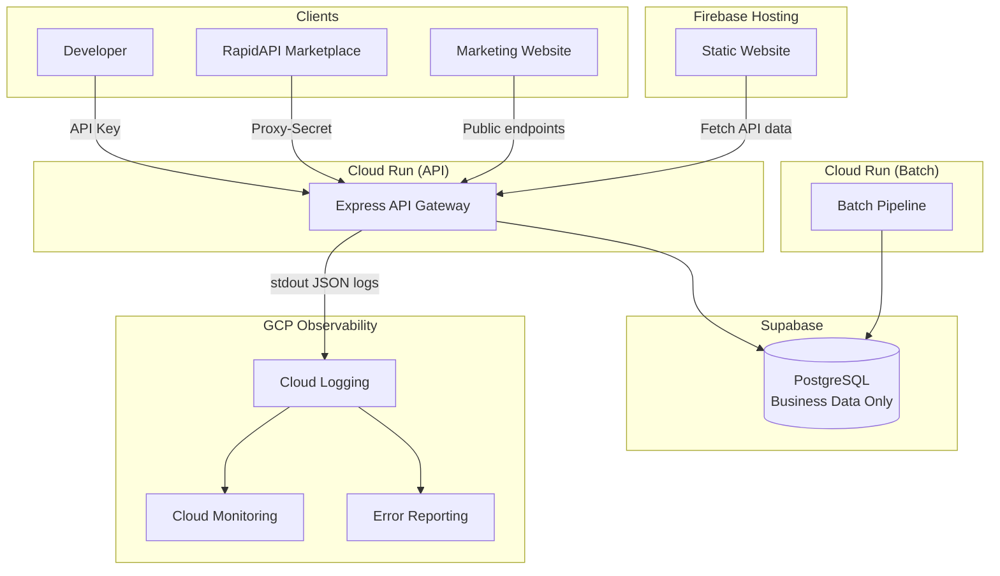
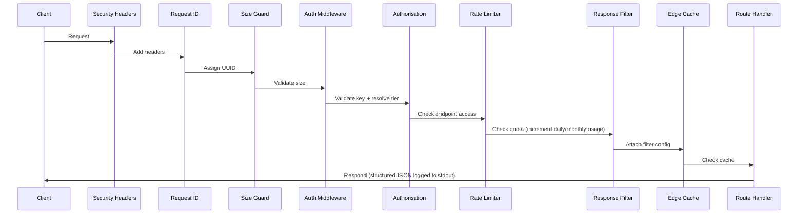
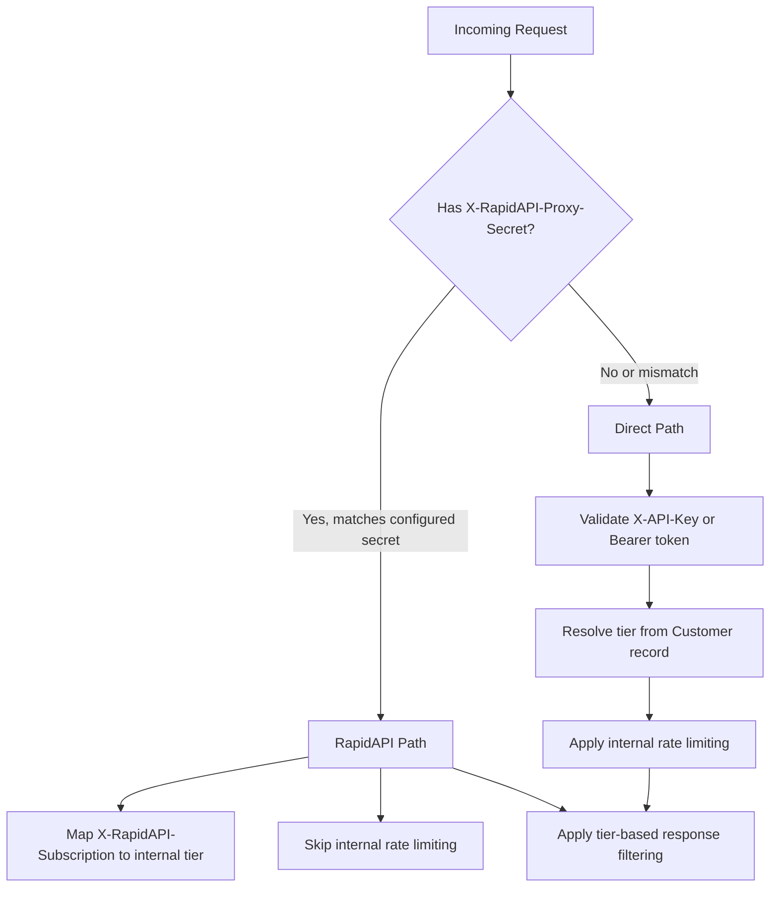
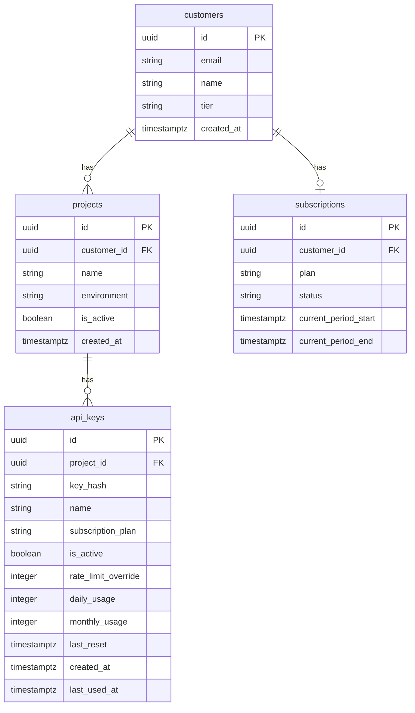

# Design Document: Commercial API Release

## Overview

This design transforms the Financial Intelligence Platform from an unauthenticated internal API into a production-ready commercial API. The architecture preserves the existing batch-driven pipeline and Express/Cloud Run deployment while layering in authentication, authorisation, tiered response filtering, rate limiting, and developer onboarding features.

The design follows three guiding principles:
1. **Additive-only changes** — the batch pipeline remains untouched; all new functionality is in the API layer
2. **Budget-constrained** — all additions must operate within the existing £50/month ceiling using serverless, scale-to-zero infrastructure
3. **Solo-maintainable** — no additional operational services, no complex orchestration, minimal moving parts

### Key Design Decisions

| Decision | Choice | Rationale |
|----------|--------|-----------|
| Hashing algorithm | Argon2id (via `argon2` npm package) | OWASP-recommended for API key storage; replaces current SHA-256 |
| Rate limit storage | `daily_usage` / `monthly_usage` columns on `api_keys` table | No separate table needed; increment on each request; works until tens of thousands of users |
| API specification | OpenAPI 3.1 static JSON generated at build time | No runtime generation overhead; served as static file |
| Documentation UI | Swagger UI served at `/docs` | Standard, no backend required, powered by OpenAPI spec |
| Marketing website | React + Vite + Tailwind on Firebase Hosting | Static site, free tier, no backend |
| Observability | Cloud Run structured logs → Cloud Logging → Cloud Monitoring | No custom analytics tables; only business data in Postgres |
| RapidAPI integration | Dual-auth: proxy-secret for marketplace, own API keys for direct customers | RapidAPI handles consumer auth + rate limiting; we validate proxy-secret and map subscription tiers |
| Developer onboarding | Anonymous access to GET /v1/forecast/EURUSD | No separate demo endpoint; subset of fields without auth |
| Data model | Customer → Projects → API Keys (Stripe-like) | Developers expect multi-project support; one customer can have multiple applications |

### Implementation Priority

1. Authentication (API keys, customer tiers)
2. Rate limiting
3. Response filtering
4. OpenAPI + Swagger
5. Landing page
6. RapidAPI publication
7. Cloud Monitoring & Logging
8. Customer management
9. Usage analytics
10. CI/CD

**Key principle**: Publish on RapidAPI BEFORE building operational tooling. Early customer feedback > perfect dashboards.

## Architecture

### System Context Diagram



### Middleware Chain (Request Lifecycle)



### Middleware Ordering

The middleware chain executes in this strict order:
1. **Security Headers** — HSTS, X-Content-Type-Options, etc.
2. **Request ID** — Assigns UUID v4, adds X-Request-ID header
3. **Size Guard** — Rejects bodies > 1MB, URLs > 2048 chars
4. **CORS** — Access-Control headers
5. **Auth Middleware** — API key validation, tier/plan resolution (skipped for public routes)
6. **Authorisation Middleware** — Tier-based endpoint access control
7. **Rate Limiter** — Quota enforcement per subscription plan
8. **Response Filter** — Tier-based field stripping (wraps response)
9. **Edge Cache** — In-memory response caching
10. **Route Handler** — Business logic

Public routes (`/health`, `/v1/forecast/EURUSD` anonymous, `/v1/openapi.json`, `/docs`) bypass steps 5-8.

The API emits structured JSON logs to stdout on every request. Cloud Run automatically captures these into Cloud Logging. No custom analytics middleware or database logging is needed.

## RapidAPI Marketplace Integration

### How RapidAPI Works (Provider Perspective)

RapidAPI acts as a proxy between consumers and your API. The request flow is:

```
Consumer → RapidAPI Proxy (Rapid Runtime) → Your Cloud Run API
```

1. Consumer authenticates with RapidAPI using `X-RapidAPI-Key` and `X-RapidAPI-Host` headers
2. RapidAPI validates the consumer, enforces rate limits per plan, handles billing
3. RapidAPI forwards the request to your base URL with additional headers
4. Your API validates the request came from RapidAPI via `X-RapidAPI-Proxy-Secret`

### Headers Received from RapidAPI Proxy

Every request forwarded by the Rapid Runtime includes these headers:

| Header | Purpose | Example Value |
|--------|---------|---------------|
| `X-RapidAPI-Proxy-Secret` | Unique secret per API — validate server-side to confirm request came from RapidAPI | `a1b2c3d4-secret-string` |
| `X-RapidAPI-User` | Username of the subscribing consumer | `john_developer` |
| `X-RapidAPI-Subscription` | Consumer's plan name | `BASIC`, `PRO`, `ULTRA`, `MEGA`, or `CUSTOM` |
| `X-Forwarded-For` | Consumer's IP address (may be comma-separated if proxied) | `184.73.132.126` |
| `X-Forwarded-Host` | The RapidAPI URL called by the consumer | `fx-intelligence.p.rapidapi.com` |

### Dual Authentication Model

The API supports two authentication paths:



**RapidAPI Path** (marketplace consumers):
- Validate `X-RapidAPI-Proxy-Secret` matches the configured secret (stored in Secret Manager)
- Map `X-RapidAPI-Subscription` header to internal CustomerTier
- Skip internal rate limiting (RapidAPI enforces quotas)
- Skip internal API key validation (RapidAPI already authenticated the consumer)
- Apply tier-based response filtering based on mapped tier

**Direct Path** (direct customers via your own API keys):
- Validate API key via Argon2id hash lookup
- Resolve tier from Customer → Project → Key chain
- Apply internal rate limiting
- Apply tier-based response filtering

### RapidAPI Subscription → Internal Tier Mapping

| RapidAPI Plan | Internal CustomerTier | Response Level | Endpoints Available |
|---|---|---|---|
| `BASIC` | RETAIL | Forecast only (6 fields) | /v1/forecast |
| `PRO` | DEVELOPER | + State, Similarity summary | /v1/forecast, /v1/state, /v1/similarity |
| `ULTRA` | RESEARCH | + Historical, Metadata | All public endpoints |
| `MEGA` | RESEARCH | Same as ULTRA | All public endpoints |
| `CUSTOM` | Configurable per agreement | Per agreement | Per agreement |

### RapidAPI Monetization Configuration

Plans configured in RapidAPI's Monetize tab (their recommended structure):

| Plan | Price | Rate Limit (RapidAPI-enforced) | Internal Tier |
|------|-------|-------------------------------|---------------|
| BASIC | Free | 100 requests/day (RapidAPI free plan limit: 1000/hr, 500K/month max) | RETAIL |
| PRO | $29/month | 5,000 requests/month | DEVELOPER |
| ULTRA | $79/month | 25,000 requests/month | RESEARCH |
| MEGA | $149/month | 100,000 requests/month | RESEARCH |

Note: RapidAPI enforces these limits at the proxy layer. Requests that exceed the plan quota receive a 429 from RapidAPI before reaching your API. Your internal rate limiter is only active for direct (non-marketplace) customers.

### What to Configure in RapidAPI Studio

1. **General Tab**: API name, description, category (Finance), logo
2. **Definitions Tab**: Upload OpenAPI 3.1 spec (auto-generates endpoint listing and test interface)
3. **Gateway Tab**: Set base URL to your Cloud Run service URL (e.g., `https://api-<hash>.run.app/v1`)
4. **Security Tab**: No additional auth scheme needed (RapidAPI Auth is sufficient; proxy-secret validates origin)
5. **Monetize Tab**: Configure BASIC/PRO/ULTRA/MEGA plans with quotas and pricing
6. **Docs Tab**: Add Getting Started guide, link to full documentation

### OpenAPI Spec for RapidAPI

The same OpenAPI 3.1 spec served at `/v1/openapi.json` is uploaded to RapidAPI to define endpoints. RapidAPI auto-generates:
- Interactive test interface for each endpoint
- Code samples in multiple languages
- Parameter documentation
- Response schema display

The spec should NOT include `X-RapidAPI-*` headers in its security schemes — RapidAPI adds those automatically. The spec should document the direct-access auth (`X-API-Key` header) for consumers using the API outside the marketplace.

### Implementation Details

```typescript
// Environment variable (stored in Secret Manager)
const RAPIDAPI_PROXY_SECRET = process.env.RAPIDAPI_PROXY_SECRET;

// Subscription-to-tier mapping
const RAPIDAPI_TIER_MAP: Record<string, CustomerTier> = {
  'BASIC': 'RETAIL',
  'PRO': 'DEVELOPER',
  'ULTRA': 'RESEARCH',
  'MEGA': 'RESEARCH',
  'CUSTOM': 'RESEARCH', // Default for custom plans; override per agreement
};

// In auth middleware:
function isRapidApiRequest(req: Request): boolean {
  const proxySecret = req.headers['x-rapidapi-proxy-secret'];
  return proxySecret === RAPIDAPI_PROXY_SECRET;
}

function resolveRapidApiTier(req: Request): CustomerTier {
  const subscription = req.headers['x-rapidapi-subscription'] as string;
  return RAPIDAPI_TIER_MAP[subscription] ?? 'RETAIL'; // Default to RETAIL if unknown
}
```

### Bandwidth Consideration

As of December 2025, each RapidAPI subscription includes 10 GB bandwidth per billing cycle. Beyond that, $1/GB applies. Given that forecast responses are typically < 5 KB, this is unlikely to be a concern unless consumers are polling aggressively.

## Components and Interfaces

### Auth Middleware (`src/api/middleware/auth.ts`)

**Changes from current**: Replace SHA-256 with Argon2id verification. Add Subscription_Plan resolution. Add async usage tracking. Add Key_Store unreachable handling (503). Support anonymous access for GET /v1/forecast/EURUSD.

```typescript
interface AuthMiddlewareOptions {
  supabase: SupabaseClient;
}

// Request augmentation
declare global {
  namespace Express {
    interface Request {
      tier?: CustomerTier;
      subscriptionPlan?: SubscriptionPlan;
      apiKeyId?: string;
      projectId?: string;
      customerId?: string;
      requestId?: string;
      anonymous?: boolean;
      rapidApiUser?: string;         // X-RapidAPI-User header value
      rapidApiSubscription?: string; // X-RapidAPI-Subscription header value
      isMarketplaceRequest?: boolean; // true if validated via proxy-secret
    }
  }
}
```

**Key behaviors:**
- Check for RapidAPI proxy-secret header first — if valid, resolve tier from `X-RapidAPI-Subscription` header mapping and skip API key validation
- For direct requests: extract key from `X-API-Key` header (priority) or `Authorization: Bearer` header
- Verify against Argon2id hash in `api_keys` table
- Resolve `CustomerTier` and `SubscriptionPlan` from the matched record (via project → customer chain)
- Fire-and-forget usage counter update (non-blocking)
- Log `new_ip_detected` events for audit
- Return 503 with `retry_after_seconds` if Supabase is unreachable
- For GET /v1/forecast/EURUSD without auth: set `req.anonymous = true`, skip tier resolution

### Authorisation Middleware (`src/api/middleware/authorisation.ts`) — NEW

```typescript
interface EndpointConfig {
  path: string;
  minimumTier: CustomerTier;
  version: string;
  status: 'active' | 'deprecated' | 'sunset';
  deprecationDate?: string;
  sunsetDate?: string;
  allowAnonymous?: boolean;
}

const ENDPOINT_METADATA: EndpointConfig[] = [
  { path: '/v1/forecast', minimumTier: 'RETAIL', version: '1.0.0', status: 'active', allowAnonymous: true },
  { path: '/v1/state', minimumTier: 'DEVELOPER', version: '1.0.0', status: 'active' },
  { path: '/v1/similarity', minimumTier: 'DEVELOPER', version: '1.0.0', status: 'active' },
];
```

**Tier hierarchy**: `RETAIL < DEVELOPER < RESEARCH < INTERNAL`

**Deny-by-default**: Any endpoint not listed in `ENDPOINT_METADATA` returns 403.

**Anonymous access**: GET /v1/forecast/EURUSD with `allowAnonymous: true` bypasses tier checks but returns a restricted field set (confidence, direction, tradeability only).

### Response Filter (`src/api/middleware/response-filter.ts`)

**Changes from current**: Restructure field sets to align with new tier-based filtering (Requirements 4.1–4.6). Add anonymous response mode that returns only `confidence_final`, `direction_probabilities`, and `tradeability_label`.

```typescript
const ANONYMOUS_FIELDS: string[] = [
  'confidence_final', 'direction_probabilities', 'tradeability_label'
];

const TIER_FIELD_SETS: Record<CustomerTier, string[]> = {
  RETAIL: ['direction_probabilities', 'expected_move_pips', 'confidence_final',
           'tradeability_score', 'tradeability_label', 'forecast_valid_until'],
  DEVELOPER: [/* RETAIL fields + */ 'state_layers', 'layer_breakdown',
              'similarity_matches', 'match_explanation', 'contributing_factors',
              'execution_metrics'],
  RESEARCH: [/* DEVELOPER fields + */ 'historical_distributions',
             'time_series_data', 'research_metadata'],
  INTERNAL: [] // No restrictions — return everything
};

const INTERNAL_ONLY_FIELDS = ['trace_id_internal', 'pipeline_debug', 'raw_engine_logs'];
```

### Rate Limiter (`src/api/middleware/rate-limiter.ts`) — NEW

Simplified design: no separate `request_counts` table, no in-memory cache layer. Usage counters live directly on the `api_keys` table.

```typescript
enum SubscriptionPlan {
  FREE = 'FREE',
  STARTER = 'STARTER',
  PROFESSIONAL = 'PROFESSIONAL',
  ENTERPRISE = 'ENTERPRISE',
}

interface PlanLimits {
  maxRequests: number;
  period: 'day' | 'month';
}

const PLAN_DEFAULTS: Record<SubscriptionPlan, PlanLimits> = {
  FREE: { maxRequests: 100, period: 'day' },
  STARTER: { maxRequests: 5000, period: 'month' },
  PROFESSIONAL: { maxRequests: 25000, period: 'month' },
  ENTERPRISE: { maxRequests: 25000, period: 'month' }, // Overridable via rate_limit_override
};
```

**Implementation strategy:**
- Every request: lookup key → check `daily_usage` or `monthly_usage` column → increment → done
- If `last_reset` is before the current period start (midnight UTC for daily, first-of-month for monthly), reset counters to 0
- Enterprise keys use `rate_limit_override` if set, otherwise default to Professional limit
- RapidAPI marketplace requests (`req.isMarketplaceRequest === true`) bypass the rate limiter entirely — RapidAPI enforces quotas at the proxy layer before requests reach your API
- Return rate limit headers: `X-RateLimit-Limit`, `X-RateLimit-Remaining`, `X-RateLimit-Reset`
- No separate table, no in-memory cache — single UPDATE per request to `api_keys`
- Rate limiting only applies to direct customers (non-marketplace traffic)

### Security Headers Middleware (`src/api/middleware/security.ts`) — NEW

```typescript
function securityHeaders(req: Request, res: Response, next: NextFunction): void {
  res.setHeader('X-Content-Type-Options', 'nosniff');
  res.setHeader('X-Frame-Options', 'DENY');
  res.setHeader('Strict-Transport-Security', 'max-age=31536000; includeSubDomains');
  res.setHeader('X-XSS-Protection', '0');

  // HTTPS enforcement (Cloud Run sets X-Forwarded-Proto)
  if (process.env.NODE_ENV === 'production' && req.headers['x-forwarded-proto'] !== 'https') {
    res.status(403).json({ error: 'https_required', message: 'HTTPS is mandatory.' });
    return;
  }
  next();
}
```

### Request ID Middleware (`src/api/middleware/request-id.ts`) — NEW

```typescript
function requestId(req: Request, res: Response, next: NextFunction): void {
  const id = crypto.randomUUID();
  req.requestId = id;
  res.setHeader('X-Request-ID', id);
  next();
}
```

### Structured Logging (stdout → Cloud Logging)

No custom analytics middleware or database table. The API emits structured JSON to stdout on each request:

```typescript
interface StructuredLogEntry {
  severity: 'INFO' | 'WARNING' | 'ERROR';
  request_id: string;
  method: string;
  path: string;
  status_code: number;
  response_time_ms: number;
  customer_tier: string | null;
  subscription_plan: string | null;
  timestamp: string; // ISO 8601 UTC
}
```

Cloud Run captures stdout automatically into Cloud Logging. From there:
- **Cloud Monitoring**: dashboards, alerting on error rates, latency percentiles
- **Error Reporting**: automatic exception grouping and notification
- No additional infrastructure cost. No custom dashboard to maintain.

### Health Endpoint Enhancement

```typescript
// GET /health
interface HealthResponse {
  status: 'healthy' | 'degraded';
  database: 'connected' | 'disconnected';
  timestamp: string;
}
```

Performs a lightweight `SELECT 1` against Supabase with a 5000ms timeout.

### Anonymous Forecast Access (replaces /v1/demo)

Instead of a separate demo endpoint, GET /v1/forecast/EURUSD works without authentication:

```typescript
// GET /v1/forecast/EURUSD — no auth required (anonymous access)
// Returns subset of fields as marketing tool
interface AnonymousForecastResponse {
  data: {
    confidence_final: number;
    direction_probabilities: { up: number; down: number; flat: number };
    tradeability_label: string;
  };
  meta: {
    request_id: string;
    timestamp: string;
    note: string; // "Authenticate with an API key for full response including tradeability scores, expected moves, and execution metrics."
  };
}
```

- IP-based rate limit of 60 requests/minute using in-memory counter
- Serves as the marketing tool — RapidAPI users can literally try it
- Only EURUSD is available anonymously; other pairs require authentication

### OpenAPI Specification

Generated at build time and served statically at `/v1/openapi.json`. The spec follows OpenAPI 3.1, includes `x-codeSamples` for cURL, JavaScript, and Python, and validates against the JSON Schema.

### Pagination (Similarity Endpoint)

```typescript
interface PaginationParams {
  limit: number;  // 1–100, default 20
  offset: number; // >= 0, default 0
}

interface PaginatedResponse<T> {
  data: T[];
  pagination: {
    total: number;
    limit: number;
    offset: number;
    has_more: boolean;
  };
  meta: { request_id: string; timestamp: string };
}
```

### API Response Envelope

All successful responses follow this structure:

```typescript
interface SuccessResponse<T> {
  data: T;
  meta: {
    request_id: string;
    timestamp: string; // ISO 8601 UTC
  };
}

interface ErrorResponse {
  error: string;      // Machine-readable code
  message: string;    // Human-readable description
  request_id: string;
}
```

### Marketing Website

A separate static site repository/directory using:
- React 18+ with TypeScript
- Vite for bundling
- Tailwind CSS for styling
- Firebase Hosting for deployment

**Product-focused messaging** (not API-focused):
- Headline: "Probabilistic FX Forecasting" / "Real-time Tradeability" / "Historical Similarity Engine"
- Selling intelligence, not endpoints
- REST API, JSON, RapidAPI, 99.9% uptime as features listed below the fold, not the headline

Pages: Home (hero with live demo preview, value proposition), API Playground, Pricing, Documentation, Status, About, Privacy Policy, and Terms of Service.

The website fetches live data from the anonymous forecast endpoint (confidence, direction, tradeability) with a 3-second timeout and graceful fallback to static placeholders.

## API Versioning Strategy

### Version Policy

- **v1** = supported, stable, production-ready
- URL prefix: all endpoints served under `/v1/`
- Semantic versioning for the API spec: `info.version` uses MAJOR.MINOR.PATCH (starting at 1.0.0)

### Future Versioning

- When breaking changes are needed: introduce `/v2/` endpoints
- `/v1/` continues to work unchanged for the duration of the deprecation window (minimum 12 months)
- Maximum 2 concurrent major versions supported at any time
- Breaking change defined as: removal of endpoint, removal/renaming of response field, data type change, addition of required parameter, or change in auth requirements

### Version Discovery

- OpenAPI spec at `/v1/openapi.json` contains `info.version` for the current minor/patch
- Major version is always in the URL path

## API Deprecation Policy

### Endpoint Lifecycle

Every endpoint follows this lifecycle:

```
Active → Deprecated → Sunset → Removed
```

| Stage | Description | Duration |
|-------|-------------|----------|
| **Active** | Fully supported, no deprecation warnings | Indefinite |
| **Deprecated** | Still works, deprecation headers added, migration guide published | Minimum 12 months |
| **Sunset** | Final 30 days before removal, elevated warnings | 30 days |
| **Removed** | Endpoint returns 410 Gone | Permanent |

### Deprecation Headers

When an endpoint enters the Deprecated stage, every response includes:

```
Deprecation: Sun, 01 Jun 2025 00:00:00 GMT
Sunset: Mon, 01 Jun 2026 00:00:00 GMT
Link: <https://docs.example.com/migration/v2>; rel="successor-version"
```

- `Deprecation` header: date the endpoint was deprecated (RFC 9110 format)
- `Sunset` header: date the endpoint will be removed (RFC 9110 format)
- `Link` header: URL to migration guide

### Communication

- Deprecations announced via: CHANGELOG.md in repo, GitHub Releases, marketing website
- Migration guide published within 5 business days of deprecation announcement
- Enterprise customers notified directly via email

## Database Migration Strategy

### Principles

- Every schema change → Supabase migration file → committed to Git → never edit production manually
- Migrations are forward-only in production; no manual DDL against live database
- All migrations reviewed in PR before merge

### Workflow

```bash
# Create a new migration
supabase migration new add_customer_projects

# Edit the generated SQL file in supabase/migrations/
# Test locally
supabase db reset

# Push to production
supabase db push
```

### Conventions

- Migration files use timestamps: `20250115120000_add_customer_projects.sql`
- Each migration is idempotent where possible (use `IF NOT EXISTS`, `CREATE OR REPLACE`)
- Destructive changes (DROP COLUMN, DROP TABLE) require explicit comment explaining why
- Seed data for development in `supabase/seed.sql`

## Data Models

### Entity Relationship



### `customers` Table — NEW

```sql
CREATE TABLE customers (
  id UUID PRIMARY KEY DEFAULT gen_random_uuid(),
  email VARCHAR(255) NOT NULL UNIQUE,
  name VARCHAR(128) NOT NULL,
  tier VARCHAR(20) NOT NULL DEFAULT 'RETAIL',
  created_at TIMESTAMPTZ NOT NULL DEFAULT now(),
  updated_at TIMESTAMPTZ NOT NULL DEFAULT now()
);
```

### `projects` Table — NEW

```sql
CREATE TABLE projects (
  id UUID PRIMARY KEY DEFAULT gen_random_uuid(),
  customer_id UUID NOT NULL REFERENCES customers(id),
  name VARCHAR(64) NOT NULL,
  environment VARCHAR(20) NOT NULL DEFAULT 'development', -- development, staging, production
  is_active BOOLEAN NOT NULL DEFAULT true,
  created_at TIMESTAMPTZ NOT NULL DEFAULT now(),
  UNIQUE (customer_id, name) WHERE is_active = true
);

CREATE INDEX idx_projects_customer ON projects (customer_id) WHERE is_active = true;
```

### Updated `api_keys` Table

```sql
CREATE TABLE api_keys (
  id UUID PRIMARY KEY DEFAULT gen_random_uuid(),
  project_id UUID NOT NULL REFERENCES projects(id),
  key_hash TEXT NOT NULL,             -- Argon2id hash
  name VARCHAR(64) NOT NULL,          -- Human-readable name (e.g., "Production Key 1")
  description VARCHAR(256),           -- Optional description
  subscription_plan VARCHAR(20) NOT NULL DEFAULT 'FREE',
  is_active BOOLEAN NOT NULL DEFAULT true,
  rate_limit_override INTEGER,        -- Enterprise custom limit (requests per period)
  daily_usage INTEGER NOT NULL DEFAULT 0,
  monthly_usage INTEGER NOT NULL DEFAULT 0,
  last_reset TIMESTAMPTZ NOT NULL DEFAULT now(),
  created_at TIMESTAMPTZ NOT NULL DEFAULT now(),
  last_used_at TIMESTAMPTZ,
  UNIQUE (project_id, name) WHERE is_active = true
);

-- Max 20 active keys per project enforced via partial index + application logic
CREATE INDEX idx_api_keys_project_active ON api_keys (project_id) WHERE is_active = true;
CREATE INDEX idx_api_keys_hash ON api_keys (key_hash);
```

### `subscriptions` Table (Reserved for Future)

```sql
-- Lightweight for MVP — tracks which plan a customer is on
CREATE TABLE subscriptions (
  id UUID PRIMARY KEY DEFAULT gen_random_uuid(),
  customer_id UUID NOT NULL REFERENCES customers(id) UNIQUE,
  plan VARCHAR(20) NOT NULL DEFAULT 'FREE',
  status VARCHAR(20) NOT NULL DEFAULT 'active', -- active, cancelled, past_due
  current_period_start TIMESTAMPTZ NOT NULL DEFAULT now(),
  current_period_end TIMESTAMPTZ NOT NULL DEFAULT (now() + interval '1 month'),
  created_at TIMESTAMPTZ NOT NULL DEFAULT now()
);
```

### Architecture Note: Customer → Projects → API Keys

This follows the Stripe model that developers expect:
- **Customer** (Phil) → has a subscription (Professional plan)
- **Projects** ("Production", "Development", "Testing") → logical groupings for different applications
- **API Keys** → one or more per project, each with its own name and usage counters

Example:
```
Phil (Customer, Professional tier)
├── Project "Production"   → Key "prod-main", Key "prod-backup"
├── Project "Development"  → Key "dev-local"
└── Project "Testing"      → Key "ci-runner"
```

The tier (RETAIL, DEVELOPER, RESEARCH, INTERNAL) comes from the customer record. The subscription plan (FREE, STARTER, PROFESSIONAL, ENTERPRISE) determines rate limits. Keys inherit their customer's tier but each project can have different key configurations.

### SubscriptionPlan Enum

```typescript
export const SubscriptionPlan = {
  FREE: 'FREE',
  STARTER: 'STARTER',
  PROFESSIONAL: 'PROFESSIONAL',
  ENTERPRISE: 'ENTERPRISE',
} as const;
export type SubscriptionPlan = (typeof SubscriptionPlan)[keyof typeof SubscriptionPlan];
```

### What's NOT in Postgres

The following data is NOT stored in the database (handled by GCP infrastructure):
- Request logs → stdout → Cloud Logging (automatic)
- Metrics/analytics → Cloud Monitoring (dashboards built from Cloud Logging)
- Error tracking → Error Reporting (automatic from structured logs)

Only business data lives in Supabase: customers, projects, API keys, subscriptions, forecasts, similarity results.


## Correctness Properties

*A property is a characteristic or behavior that should hold true across all valid executions of a system — essentially, a formal statement about what the system should do. Properties serve as the bridge between human-readable specifications and machine-verifiable correctness guarantees.*

### Property 1: API Key Verification Round-Trip

*For any* randomly generated API key string, creating a key (storing the Argon2id hash) and then verifying the original plaintext against that hash should succeed, and verifying any different string should fail.

**Validates: Requirements 1.3, 2.1**

### Property 2: Valid Key Resolves Tier and Plan

*For any* valid API key record with any combination of CustomerTier and SubscriptionPlan, the auth middleware should resolve the correct tier (from the customer record) and plan values, attaching them to the request context after successful validation.

**Validates: Requirements 1.5**

### Property 3: Tier Hierarchy Authorisation

*For any* combination of CustomerTier and endpoint with a defined minimum tier, access should be granted if and only if the caller's tier is at or above the minimum tier in the hierarchy (RETAIL < DEVELOPER < RESEARCH < INTERNAL). For any endpoint not defined in ENDPOINT_METADATA, access should be denied regardless of tier.

**Validates: Requirements 3.1, 3.2, 3.5**

### Property 4: Forbidden Response Does Not Leak Tier Requirements

*For any* authorisation denial (HTTP 403), the response body should not contain the string value of the minimum required tier for the requested endpoint.

**Validates: Requirements 3.3**

### Property 5: Tier-Based Response Filtering

*For any* full response object and any CustomerTier, the response filter should return exactly the fields authorised for that tier. Specifically: RETAIL receives only {direction_probabilities, expected_move_pips, confidence_final, tradeability_score, tradeability_label, forecast_valid_until}, DEVELOPER receives RETAIL fields plus {state_layers, layer_breakdown, similarity_matches, match_explanation, contributing_factors, execution_metrics}, RESEARCH receives DEVELOPER fields plus {historical_distributions, time_series_data, research_metadata} minus {trace_id_internal, pipeline_debug, raw_engine_logs}, and INTERNAL receives the complete unfiltered payload. When no recognised tier is present, RETAIL filtering applies. When the request is anonymous, only {confidence_final, direction_probabilities, tradeability_label} are returned.

**Validates: Requirements 4.1, 4.2, 4.3, 4.4, 4.5, 4.6**

### Property 6: Rate Limiter Enforces Plan Quotas

*For any* SubscriptionPlan and any number of requests N, the rate limiter should allow requests when the usage counter is below the plan's configured limit and reject with HTTP 429 when the counter reaches or exceeds the limit. The limits are: FREE=100/day, STARTER=5000/month, PROFESSIONAL=25000/month, ENTERPRISE=rate_limit_override or 25000/month if override is null.

**Validates: Requirements 5.1, 5.2, 5.3, 5.4, 5.5**

### Property 7: Rate Limit Scope Isolation

*For any* two distinct API key identifiers, incrementing the usage counter for one key should have no effect on the remaining quota of the other key.

**Validates: Requirements 5.7**

### Property 8: RapidAPI Proxy Bypass

*For any* request bearing a valid X-RapidAPI-Proxy-Secret header matching the configured secret, the rate limiter should allow the request regardless of the key's current quota consumption.

**Validates: Requirements 5.8**

### Property 9: Response Envelope Consistency

*For any* successful API response (HTTP 200), the JSON body should contain a "data" field, and a "meta" field containing "request_id" (valid UUID v4) and "timestamp" (valid ISO 8601 UTC). For any error response (HTTP 4xx or 5xx), the JSON body should contain "error" (non-empty string), "message" (non-empty string), and "request_id" (valid UUID v4).

**Validates: Requirements 6.2, 6.3**

### Property 10: Pagination Correctness

*For any* valid limit (1–100) and offset (≥0) applied to a dataset of size T, the similarity endpoint should return at most `min(limit, T - offset)` items, and the pagination metadata should satisfy: `total == T`, `has_more == (offset + limit < T)`, and the returned items correspond to the slice `[offset, offset + limit)`.

**Validates: Requirements 6.5**

### Property 11: Invalid Pagination Rejection

*For any* limit value that is not a valid integer in [1, 100] or any offset value that is not a valid non-negative integer, the similarity endpoint should return HTTP 400 with error code "invalid_parameter" specifying the invalid parameter name.

**Validates: Requirements 6.6**

### Property 12: Key Creation Constraints

*For any* project that already has 20 active API keys, attempting to create an additional key should be rejected. For any project with an active key named N, attempting to create another key with name N should be rejected with a duplicate name error.

**Validates: Requirements 2.5, 2.6**

### Property 13: Security Headers Present on All Responses

*For any* HTTP response from the API (success or error, authenticated or unauthenticated), the response headers should include X-Content-Type-Options: nosniff, X-Frame-Options: DENY, Strict-Transport-Security with max-age ≥ 31536000, and X-XSS-Protection: 0.

**Validates: Requirements 15.1**

### Property 14: Request Size Rejection

*For any* request with a body larger than 1MB, the API should return HTTP 413 with error code "payload_too_large". For any request URL longer than 2048 characters or any query parameter value longer than 512 characters, the API should return HTTP 414 with error code "uri_too_long".

**Validates: Requirements 15.2, 15.5**

### Property 15: Rate Limit Headers on Authenticated Responses

*For any* authenticated request (regardless of tier or plan), the response should include X-RateLimit-Limit (positive integer), X-RateLimit-Remaining (non-negative integer ≤ limit), and X-RateLimit-Reset (valid Unix epoch seconds in the future).

**Validates: Requirements 13.4**

### Property 16: Unsupported Asset Error

*For any* asset string not in the supported assets list, the API should return HTTP 400 with error code "asset_not_supported" and the response should include the list of supported assets.

**Validates: Requirements 14.1**

### Property 17: Internal Error Sanitisation

*For any* response with HTTP 500 status, the response body should not contain file paths (matching common path patterns), stack traces (lines with "at " prefix), database query strings, or internal network addresses.

**Validates: Requirements 14.2**

### Property 18: Unsupported HTTP Method Rejection

*For any* endpoint and any HTTP method not supported by that endpoint, the API should return HTTP 405 with error code "method_not_allowed" and an Allow header listing the supported methods for that endpoint.

**Validates: Requirements 14.5**

### Property 19: Deprecated Endpoint Headers

*For any* endpoint marked as deprecated in ENDPOINT_METADATA, every response from that endpoint should include a Sunset header with the removal date and a Deprecation header with the deprecation date, both in RFC 9110 date format.

**Validates: Requirements 12.2**

### Property 20: Anonymous Forecast Returns Restricted Fields

*For any* request to GET /v1/forecast/EURUSD without authentication, the response should contain only {confidence_final, direction_probabilities, tradeability_label} and no other fields from the full forecast response.

**Validates: Requirements 13.1, 13.2**

### Property 21: RapidAPI Subscription Tier Mapping

*For any* request with a valid X-RapidAPI-Proxy-Secret header, the resolved CustomerTier should match the mapping: BASIC→RETAIL, PRO→DEVELOPER, ULTRA→RESEARCH, MEGA→RESEARCH. For any unknown subscription value, the tier should default to RETAIL. The response filtering should use the mapped tier.

**Validates: Requirements 5.8, 4.1, 4.2, 4.3**

## Error Handling

### Error Response Strategy

All errors follow the consistent envelope format:

```json
{
  "error": "machine_readable_code",
  "message": "Human-readable description with actionable guidance.",
  "request_id": "uuid-v4"
}
```

### Error Code Catalogue

| HTTP Status | Error Code | Trigger | Additional Fields |
|-------------|-----------|---------|-------------------|
| 400 | `asset_not_supported` | Unknown asset requested | `supported_assets: string[]` |
| 400 | `invalid_parameter` | Bad query params | `parameters: {name, accepted}[]` |
| 401 | `unauthorized` | Missing/invalid/revoked key | — |
| 403 | `forbidden` | Tier below minimum | — |
| 403 | `https_required` | HTTP in production | — |
| 405 | `method_not_allowed` | Wrong HTTP method | `Allow` header |
| 413 | `payload_too_large` | Body > 1MB | `max_bytes: 1048576` |
| 414 | `uri_too_long` | URL > 2048 or param > 512 | `max_url_length: 2048` |
| 429 | `rate_limit_exceeded` | Quota exceeded | `limit, reset, retry_after_seconds` |
| 500 | `internal_error` | Unhandled exception | — (no internals exposed) |
| 503 | `service_unavailable` | DB unreachable | `retry_after_seconds: number` |

### Error Handling Principles

1. **Never expose internals** — stack traces, file paths, queries, and internal addresses are stripped from all error responses
2. **Always include request_id** — enables support debugging without exposing server state
3. **Actionable messages** — error messages tell the developer what to do next
4. **Consistent shape** — every error, regardless of origin middleware, uses the same JSON structure
5. **Fail-safe defaults** — unrecognised tiers default to RETAIL; unrecognised endpoints are denied

### Global Error Handler

A final Express error handler catches any unhandled exceptions and produces a sanitised 500 response:

```typescript
app.use((err: Error, req: Request, res: Response, _next: NextFunction) => {
  const requestId = req.requestId ?? crypto.randomUUID();
  // Structured log to stdout — captured by Cloud Logging
  console.error(JSON.stringify({
    severity: 'ERROR',
    request_id: requestId,
    error: err.message,
    stack: err.stack, // logged server-side only (visible in Cloud Logging, not in response)
    timestamp: new Date().toISOString(),
  }));

  res.status(500).json({
    error: 'internal_error',
    message: 'An unexpected error occurred. Please try again or contact support.',
    request_id: requestId,
  });
});
```

## Testing Strategy

### Dual Testing Approach

This feature uses both example-based unit tests and property-based tests for comprehensive coverage.

### Property-Based Testing Scope

**Library**: `fast-check` (already in devDependencies)
**Runner**: `vitest` (already configured)
**Minimum iterations**: 100 per property

Property-based testing is used **only for deterministic pure logic**:
- ✅ Hashing / key verification round-trips
- ✅ Response filtering (field stripping by tier)
- ✅ Similarity search filtering and pagination
- ✅ Rate limit counter logic (given count + limit → allow/reject)
- ✅ Security header presence
- ✅ Size guard boundary checks
- ✅ Error sanitisation

For middleware integration, use normal unit/integration tests instead of PBT. This halves the testing effort while keeping the 20 correctness properties as specifications.

Each property test references its design property with a tag comment:
```typescript
// Feature: commercial-api-release, Property N: <property text>
```

**Properties implemented with PBT** (pure logic only):

| Property | Test Target | Generator Strategy |
|----------|------------|-------------------|
| 1 (Key Round-Trip) | `hashApiKey` / `verifyApiKey` functions | Random strings (1-256 chars, all byte values) |
| 5 (Response Filter) | `filterResponse` function | Random objects with arbitrary field sets × all tiers + anonymous |
| 6 (Rate Limiter) | Rate limit decision function | Random plan × usage count |
| 7 (Scope Isolation) | Rate limit counter logic | Pairs of random key IDs with independent counters |
| 10 (Pagination) | Pagination slice logic | Random dataset sizes (0-500), limit (1-100), offset (0-500) |
| 11 (Invalid Pagination) | Pagination validation | Invalid limit/offset values (negative, float, string, >100) |
| 13 (Security Headers) | Security middleware | Random request methods and paths |
| 14 (Size Rejection) | Size guard middleware | Random bodies near and above 1MB boundary |
| 16 (Unsupported Asset) | Asset validation function | Random non-supported asset strings |
| 17 (Error Sanitisation) | Error response builder | Errors containing paths, stack traces, queries |

**Properties validated with normal unit/integration tests** (middleware, DB interactions):

| Property | Test Approach |
|----------|--------------|
| 2 (Tier Resolution) | Unit tests with mocked Supabase responses |
| 3 (Tier Hierarchy) | Unit tests covering all tier × endpoint combinations |
| 4 (No Tier Leak) | Unit tests asserting 403 responses don't contain tier strings |
| 8 (RapidAPI Bypass) | Integration test with proxy-secret header |
| 9 (Envelope) | Unit tests verifying response wrapper shape |
| 12 (Key Constraints) | Integration tests with mocked DB for 20-key limit and name uniqueness |
| 15 (Rate Limit Headers) | Unit tests verifying header presence on authenticated responses |
| 18 (Method Rejection) | Unit tests per endpoint with unsupported methods |
| 19 (Deprecation Headers) | Unit tests for deprecated endpoint responses |
| 20 (Anonymous Forecast) | Unit test verifying restricted field set |
| 21 (RapidAPI Tier Mapping) | Unit tests mapping BASIC→RETAIL, PRO→DEVELOPER, ULTRA/MEGA→RESEARCH, unknown→RETAIL |

### Example-Based Unit Tests

For specific scenarios not covered by PBT:

- Missing API key → 401 (Req 1.1)
- Revoked key → 401 (Req 1.4)
- X-API-Key priority over Bearer (Req 1.8)
- Database unreachable → 503 (Req 1.7, 14.3)
- Health endpoint with connected/disconnected DB (Req 10.3)
- Anonymous forecast response shape (Req 13.1, 13.2)
- Slow request logging (Req 10.5)
- HTTPS enforcement (Req 15.3)
- Anonymous forecast IP rate limit (Req 13.5)
- Customer → Project → Key hierarchy resolution
- Usage counter reset on period boundary

### Integration Tests

- Full middleware chain execution order verification
- End-to-end authenticated request through all middleware layers
- RapidAPI marketplace request end-to-end (proxy-secret → tier mapping → response filtering → no rate limit hit)
- Rate limit counter persistence and reset across requests
- Key creation and revocation workflow
- Customer and project creation
- Anonymous forecast end-to-end

### Test Organisation

```
tests/
├── unit/
│   ├── auth-middleware.test.ts
│   ├── authorisation-middleware.test.ts
│   ├── rate-limiter.test.ts
│   ├── response-filter.test.ts
│   ├── response-envelope.test.ts
│   ├── pagination.test.ts
│   ├── security-headers.test.ts
│   ├── size-guard.test.ts
│   ├── anonymous-forecast.test.ts
│   └── deprecation-headers.test.ts
├── property/
│   ├── auth-key-roundtrip.property.test.ts
│   ├── response-filter.property.test.ts
│   ├── rate-limiter.property.test.ts
│   ├── pagination.property.test.ts
│   ├── security-headers.property.test.ts
│   ├── size-guard.property.test.ts
│   ├── asset-validation.property.test.ts
│   └── error-sanitisation.property.test.ts
├── integration/
│   ├── full-middleware-chain.test.ts
│   ├── rapidapi-integration.test.ts
│   ├── key-management.test.ts
│   ├── customer-projects.test.ts
│   └── anonymous-access.test.ts
```
