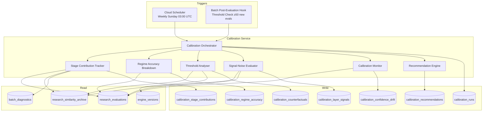
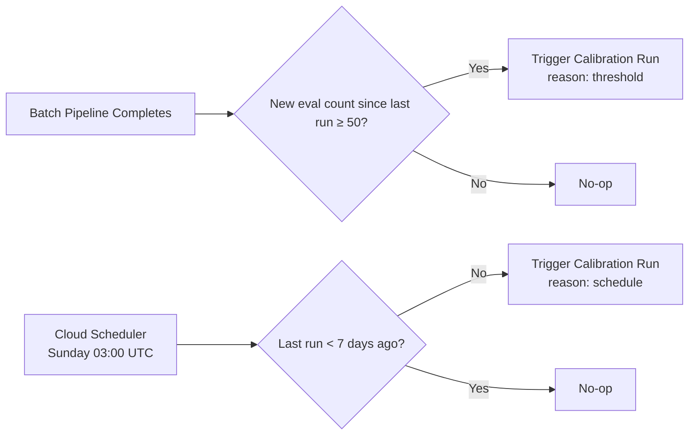

# Design Document: Continuous Learning Pipeline

## Overview

The Continuous Learning Pipeline adds a calibration system that systematically evaluates and recommends adjustments to the deterministic engine parameters across the 14-stage batch pipeline. While the ML model gets retrained independently, the fixed parameters (FLAT_THRESHOLD, TOPOLOGY_SIMILARITY_WEIGHT, regime weight matrices, confidence calibration parameters) currently remain static after initial development. This system closes that gap by:

1. Decomposing evaluated forecasts into per-stage contribution scores
2. Computing regime-specific accuracy breakdowns
3. Running counterfactual "what-if" analyses against archived data
4. Measuring per-layer signal-to-noise ratios
5. Monitoring confidence calibration drift
6. Synthesising findings into ranked, evidence-based parameter adjustment recommendations

The calibration system operates as a new `src/calibration/` namespace — peer to the existing `src/research/` namespace — triggered by a Cloud Scheduler job or an evaluation-count threshold check embedded in the existing batch pipeline's post-evaluation hook.

### Design Decisions

- **Separate namespace (`src/calibration/`)** rather than extending `src/research/`: The calibration system reads from research tables but has distinct write concerns (recommendations, counterfactuals). Separation preserves the research namespace's immutability guarantees and keeps the dependency direction clean: `calibration → research/engines/types` (never reverse).
- **Pure-function analysis engines**: All computation components (contribution tracker, threshold analyser, signal evaluator, calibration monitor, recommendation engine) are pure functions accepting data and returning results. Database reads and writes are handled at the orchestration layer, matching the platform's existing engine pattern.
- **Database advisory lock for concurrency**: Rather than introducing distributed locking infrastructure, we use Postgres `pg_advisory_xact_lock` to ensure single-execution semantics — lightweight and already available through Supabase.
- **Cloud Scheduler trigger + in-process threshold check**: A weekly Cloud Scheduler job guarantees the 7-day maximum cadence. The 50-evaluation threshold is checked at the end of each batch run's evaluation phase, avoiding an extra scheduled job while preserving responsiveness.

## Architecture



### Data Flow

1. **Trigger**: Cloud Scheduler or batch post-eval hook invokes the Calibration Orchestrator
2. **Lock acquisition**: Orchestrator acquires `pg_advisory_xact_lock(calibration_run_lock_id)`
3. **Data collection**: Orchestrator queries `research_evaluations` for unprocessed records since last run
4. **Parallel analysis**: Stage Contribution Tracker, Regime Accuracy Breakdown, Signal-Noise Evaluator, and Calibration Monitor execute in parallel (all are read-only against source data)
5. **Sequential analysis**: Threshold Analyser runs after stage contributions complete (uses contribution data to prioritise which parameters to test)
6. **Synthesis**: Recommendation Engine combines all analysis outputs into ranked recommendations
7. **Persistence**: All results persisted to calibration tables; run metadata recorded in `calibration_runs`

## Components and Interfaces

### CalibrationOrchestrator

The top-level coordinator that manages the full calibration run lifecycle.

```typescript
interface CalibrationRunConfig {
  trigger_reason: 'threshold' | 'schedule';
  evaluation_count: number;
  since_evaluation_id?: string; // last processed evaluation
}

interface CalibrationRunResult {
  run_id: string;
  started_at: string;
  completed_at: string | null;
  trigger_reason: 'threshold' | 'schedule';
  evaluation_count: number;
  status: 'completed' | 'partial' | 'failed';
  failed_stage?: string;
  error_detail?: string;
  recommendations_generated: number;
}

interface CalibrationOrchestrator {
  runCalibration(config: CalibrationRunConfig): Promise<CalibrationRunResult>;
  shouldTrigger(newEvalCount: number, lastRunAt: string | null): boolean;
}
```

### StageContributionTracker

Decomposes evaluated forecasts into per-stage influence scores.

```typescript
interface StageContribution {
  evaluation_id: string;
  batch_id: string;
  asset: string;
  regime: string;
  stage_name: string;
  contribution_score: number;      // [-1, 1] correlation with accuracy
  layer_dominant?: string;         // L1-L5, for similarity stage only
  marginal_accuracy_delta?: number; // for macro/sentiment stages
  is_low_confidence: boolean;
  created_at: string;
}

interface StageContributionTracker {
  computeContributions(
    evaluations: EvaluationWithContext[],
    similarityRecords: SimilarityArchiveRecord[],
  ): StageContribution[];
}
```

### RegimeAccuracyBreakdown

Computes direction accuracy per regime-asset-direction combination.

```typescript
interface RegimeAccuracyResult {
  run_id: string;
  regime: string;             // one of 9 regime types
  asset: string;              // EURUSD | GBPUSD
  direction: 'up' | 'down' | 'flat';
  accuracy_pct: number;       // 0-100
  sample_count: number;
  is_significant: boolean;    // sample_count >= 30
  is_underperforming: boolean; // accuracy_pct < 40
  accuracy_delta: number | null; // vs previous run
  created_at: string;
}

interface RegimeAccuracyAnalyser {
  computeRegimeAccuracy(
    evaluations: EvaluationWithContext[],
    previousResults: RegimeAccuracyResult[] | null,
  ): RegimeAccuracyResult[];
}
```

### ThresholdAnalyser

Runs counterfactual scenarios against archived forecast data.

```typescript
interface CounterfactualRequest {
  parameter_name: 'FLAT_THRESHOLD' | 'TOPOLOGY_SIMILARITY_WEIGHT' | string; // regime weight key
  baseline_value: number;
  alternative_value: number;
}

interface CounterfactualResult {
  run_id: string;
  parameter_name: string;
  baseline_value: number;
  alternative_value: number;
  baseline_accuracy: number;
  alternative_accuracy: number;
  accuracy_delta: number;
  baseline_brier: number;
  alternative_brier: number;
  brier_delta: number;
  baseline_ece: number;
  alternative_ece: number;
  ece_delta: number;
  sample_size: number;
  created_at: string;
}

interface ThresholdAnalyser {
  runCounterfactual(
    request: CounterfactualRequest,
    archiveRecords: SimilarityArchiveWithOutcome[],
  ): CounterfactualResult;

  validateRegimeWeights(weights: Record<string, number>): ValidationResult;

  generateAlternatives(parameterName: string, currentValue: number): number[];
}
```

### SignalNoiseEvaluator

Computes correlation between fingerprint layer similarity and outcome accuracy.

```typescript
interface LayerSignalResult {
  run_id: string;
  layer_name: string;          // L1-L5
  regime: string;
  asset: string;
  correlation_coefficient: number; // Pearson r
  sample_size: number;
  classification: 'high-signal' | 'low-signal' | 'neutral';
  created_at: string;
}

interface SignalNoiseEvaluator {
  computeLayerSignals(
    archiveRecords: SimilarityArchiveWithOutcome[],
  ): LayerSignalResult[];
}
```

### CalibrationMonitor

Monitors confidence calibration drift over rolling windows.

```typescript
interface BucketCalibration {
  bucket: string;              // "0.0-0.1" through "0.9-1.0"
  nominal_midpoint: number;
  observed_accuracy: number;
  sample_count: number;
  is_miscalibrated: boolean;   // |midpoint - observed| > 0.15
}

interface CalibrationDriftResult {
  run_id: string;
  window_start: string;
  window_end: string;
  buckets: BucketCalibration[];
  ece: number;                 // Expected Calibration Error
  miscalibrated_count: number;
  alert_severity: 'none' | 'low' | 'high'; // high if ≥3 buckets or ECE > 0.10
  created_at: string;
}

interface CalibrationMonitor {
  computeCalibrationDrift(
    evaluations: EvaluationRecord[],
    windowDays: number,
  ): CalibrationDriftResult;
}
```

### RecommendationEngine

Synthesises analysis outputs into ranked recommendations.

```typescript
interface ParameterRecommendation {
  run_id: string;
  parameter_name: string;
  current_value: number;
  recommended_value: number;
  sample_size: number;
  projected_accuracy_improvement: number; // percentage points
  confidence_level: 'low' | 'medium' | 'high';
  explanation: string;
  status: 'pending' | 'applied' | 'rejected';
  created_at: string;
}

interface RecommendationEngine {
  synthesiseRecommendations(
    contributions: StageContribution[],
    regimeAccuracy: RegimeAccuracyResult[],
    counterfactuals: CounterfactualResult[],
    layerSignals: LayerSignalResult[],
    calibrationDrift: CalibrationDriftResult,
  ): ParameterRecommendation[];

  validateRecommendation(rec: ParameterRecommendation): ValidationResult;
}
```

### Parameter Validation Bounds

```typescript
const PARAMETER_BOUNDS = {
  FLAT_THRESHOLD: { min: 1, max: 5 },
  TOPOLOGY_SIMILARITY_WEIGHT: { min: 0.0, max: 0.30 },
  REGIME_WEIGHT_VALUE: { min: 0.0, max: 1.0 },
  REGIME_WEIGHT_SUM: { target: 1.0, tolerance: 0.001 },
} as const;
```

## Data Models

### New Database Tables

#### `calibration_runs`

Tracks each calibration analysis run.

```sql
CREATE TABLE IF NOT EXISTS calibration_runs (
    id UUID PRIMARY KEY DEFAULT gen_random_uuid(),
    started_at TIMESTAMPTZ NOT NULL DEFAULT NOW(),
    completed_at TIMESTAMPTZ,
    trigger_reason VARCHAR(20) NOT NULL CHECK (trigger_reason IN ('threshold', 'schedule')),
    evaluation_count INTEGER NOT NULL,
    status VARCHAR(20) NOT NULL DEFAULT 'running'
        CHECK (status IN ('running', 'completed', 'partial', 'failed')),
    failed_stage VARCHAR(50),
    error_detail TEXT,
    recommendations_generated INTEGER DEFAULT 0,
    created_at TIMESTAMPTZ NOT NULL DEFAULT NOW()
);

CREATE INDEX idx_cr_status ON calibration_runs (status, started_at DESC);
```

#### `calibration_stage_contributions`

Per-stage contribution scores for evaluated forecasts.

```sql
CREATE TABLE IF NOT EXISTS calibration_stage_contributions (
    id UUID PRIMARY KEY DEFAULT gen_random_uuid(),
    run_id UUID NOT NULL REFERENCES calibration_runs(id),
    evaluation_id UUID NOT NULL REFERENCES research_evaluations(id),
    batch_id UUID NOT NULL,
    asset VARCHAR(10) NOT NULL,
    regime VARCHAR(30) NOT NULL,
    stage_name VARCHAR(30) NOT NULL,
    contribution_score NUMERIC(6, 4) NOT NULL,
    layer_dominant VARCHAR(5),
    marginal_accuracy_delta NUMERIC(6, 4),
    is_low_confidence BOOLEAN NOT NULL DEFAULT false,
    created_at TIMESTAMPTZ NOT NULL DEFAULT NOW()
);

CREATE INDEX idx_csc_run ON calibration_stage_contributions (run_id);
CREATE INDEX idx_csc_stage_regime ON calibration_stage_contributions (stage_name, regime, asset);
```

#### `calibration_regime_accuracy`

Direction accuracy per regime-asset-direction combination.

```sql
CREATE TABLE IF NOT EXISTS calibration_regime_accuracy (
    id UUID PRIMARY KEY DEFAULT gen_random_uuid(),
    run_id UUID NOT NULL REFERENCES calibration_runs(id),
    regime VARCHAR(30) NOT NULL,
    asset VARCHAR(10) NOT NULL,
    direction VARCHAR(5) NOT NULL CHECK (direction IN ('up', 'down', 'flat')),
    accuracy_pct NUMERIC(5, 2) NOT NULL,
    sample_count INTEGER NOT NULL,
    is_significant BOOLEAN NOT NULL,
    is_underperforming BOOLEAN NOT NULL,
    accuracy_delta NUMERIC(5, 2),
    created_at TIMESTAMPTZ NOT NULL DEFAULT NOW()
);

CREATE INDEX idx_cra_run ON calibration_regime_accuracy (run_id);
CREATE INDEX idx_cra_regime_asset ON calibration_regime_accuracy (regime, asset, created_at DESC);
```

#### `calibration_counterfactuals`

Results of counterfactual "what-if" parameter analyses.

```sql
CREATE TABLE IF NOT EXISTS calibration_counterfactuals (
    id UUID PRIMARY KEY DEFAULT gen_random_uuid(),
    run_id UUID NOT NULL REFERENCES calibration_runs(id),
    parameter_name VARCHAR(50) NOT NULL,
    baseline_value NUMERIC(8, 4) NOT NULL,
    alternative_value NUMERIC(8, 4) NOT NULL,
    baseline_accuracy NUMERIC(5, 2) NOT NULL,
    alternative_accuracy NUMERIC(5, 2) NOT NULL,
    accuracy_delta NUMERIC(5, 2) NOT NULL,
    baseline_brier NUMERIC(7, 6) NOT NULL,
    alternative_brier NUMERIC(7, 6) NOT NULL,
    brier_delta NUMERIC(7, 6) NOT NULL,
    baseline_ece NUMERIC(7, 6) NOT NULL,
    alternative_ece NUMERIC(7, 6) NOT NULL,
    ece_delta NUMERIC(7, 6) NOT NULL,
    sample_size INTEGER NOT NULL,
    created_at TIMESTAMPTZ NOT NULL DEFAULT NOW()
);

CREATE INDEX idx_ccf_run ON calibration_counterfactuals (run_id);
CREATE INDEX idx_ccf_param ON calibration_counterfactuals (parameter_name, accuracy_delta DESC);
```

#### `calibration_layer_signals`

Per-layer signal-to-noise correlation results.

```sql
CREATE TABLE IF NOT EXISTS calibration_layer_signals (
    id UUID PRIMARY KEY DEFAULT gen_random_uuid(),
    run_id UUID NOT NULL REFERENCES calibration_runs(id),
    layer_name VARCHAR(5) NOT NULL,
    regime VARCHAR(30) NOT NULL,
    asset VARCHAR(10) NOT NULL,
    correlation_coefficient NUMERIC(6, 4) NOT NULL,
    sample_size INTEGER NOT NULL,
    classification VARCHAR(15) NOT NULL
        CHECK (classification IN ('high-signal', 'low-signal', 'neutral')),
    created_at TIMESTAMPTZ NOT NULL DEFAULT NOW()
);

CREATE INDEX idx_cls_run ON calibration_layer_signals (run_id);
CREATE INDEX idx_cls_layer_regime ON calibration_layer_signals (layer_name, regime, asset);
```

#### `calibration_confidence_drift`

Confidence calibration monitoring results.

```sql
CREATE TABLE IF NOT EXISTS calibration_confidence_drift (
    id UUID PRIMARY KEY DEFAULT gen_random_uuid(),
    run_id UUID NOT NULL REFERENCES calibration_runs(id),
    window_start TIMESTAMPTZ NOT NULL,
    window_end TIMESTAMPTZ NOT NULL,
    bucket_accuracy JSONB NOT NULL,   -- array of { bucket, nominal_midpoint, observed_accuracy, sample_count, is_miscalibrated }
    ece NUMERIC(7, 6) NOT NULL,
    miscalibrated_count INTEGER NOT NULL,
    alert_severity VARCHAR(10) NOT NULL CHECK (alert_severity IN ('none', 'low', 'high')),
    created_at TIMESTAMPTZ NOT NULL DEFAULT NOW()
);

CREATE INDEX idx_ccd_run ON calibration_confidence_drift (run_id);
CREATE INDEX idx_ccd_severity ON calibration_confidence_drift (alert_severity, created_at DESC);
```

#### `calibration_recommendations`

Parameter adjustment recommendations with status tracking.

```sql
CREATE TABLE IF NOT EXISTS calibration_recommendations (
    id UUID PRIMARY KEY DEFAULT gen_random_uuid(),
    run_id UUID NOT NULL REFERENCES calibration_runs(id),
    parameter_name VARCHAR(50) NOT NULL,
    current_value NUMERIC(8, 4) NOT NULL,
    recommended_value NUMERIC(8, 4) NOT NULL,
    sample_size INTEGER NOT NULL,
    projected_accuracy_improvement NUMERIC(5, 2) NOT NULL,
    confidence_level VARCHAR(10) NOT NULL CHECK (confidence_level IN ('low', 'medium', 'high')),
    explanation TEXT NOT NULL,
    status VARCHAR(10) NOT NULL DEFAULT 'pending'
        CHECK (status IN ('pending', 'applied', 'rejected')),
    applied_at TIMESTAMPTZ,
    created_at TIMESTAMPTZ NOT NULL DEFAULT NOW()
);

CREATE INDEX idx_crec_run ON calibration_recommendations (run_id);
CREATE INDEX idx_crec_status ON calibration_recommendations (status, created_at DESC);
CREATE INDEX idx_crec_param ON calibration_recommendations (parameter_name, status);
```

### Counterfactual Analysis: How It Works

The Threshold Analyser re-evaluates historical forecasts with alternative parameter values:

1. **FLAT_THRESHOLD counterfactual**: For each archived forecast that has a realised outcome, re-classify the outcome direction using the alternative threshold. Recompute direction accuracy across the sample set.

2. **TOPOLOGY_SIMILARITY_WEIGHT counterfactual**: For each archived similarity match set, recompute composite similarity scores with the alternative topology weight. Re-rank matches, derive new top-50, recompute outcome distribution and direction probabilities.

3. **Regime weight matrix counterfactual**: For a specific regime, recompute the weighted combination of per-layer similarities using alternative layer weights. Re-rank, derive new match set, recompute outcomes.

All counterfactuals use the same evaluation metrics: direction accuracy, Brier score, and ECE — enabling direct comparison with baseline.

### Scheduling Mechanism



The threshold check is a lightweight query embedded in the batch pipeline's post-evaluation phase:

```typescript
async function checkCalibrationThreshold(supabase: SupabaseClient): Promise<boolean> {
  const { data: lastRun } = await supabase
    .from('calibration_runs')
    .select('id, started_at')
    .order('started_at', { ascending: false })
    .limit(1)
    .single();

  const since = lastRun?.started_at ?? '1970-01-01T00:00:00Z';

  const { count } = await supabase
    .from('research_evaluations')
    .select('id', { count: 'exact', head: true })
    .gt('created_at', since);

  return (count ?? 0) >= 50;
}
```


## Correctness Properties

*A property is a characteristic or behavior that should hold true across all valid executions of a system — essentially, a formal statement about what the system should do. Properties serve as the bridge between human-readable specifications and machine-verifiable correctness guarantees.*

### Property 1: Contribution scores are bounded and complete

*For any* set of evaluated forecasts with stage outputs, the Stage Contribution Tracker SHALL produce exactly one contribution score per pipeline stage per evaluation, and every contribution score SHALL be in the range [-1, 1].

**Validates: Requirements 1.1**

### Property 2: Layer dominant identification correctness

*For any* similarity archive record with a valid layer_breakdown containing all 5 layer scores, the identified layer_dominant SHALL be the layer with the maximum breakdown value. In the case of ties, the layer with the lowest index (L1 < L2 < ... < L5) wins.

**Validates: Requirements 1.2**

### Property 3: Marginal accuracy delta correctness

*For any* set of evaluated forecasts partitioned into those with macro/sentiment data present and those without, the marginal_accuracy_delta SHALL equal the difference between the mean direction accuracy of the "with" group and the mean direction accuracy of the "without" group.

**Validates: Requirements 1.3**

### Property 4: Low-confidence marking threshold

*For any* asset and regime combination, contribution results SHALL have is_low_confidence set to true if and only if the evaluated forecast count for that (asset, regime) pair is fewer than 10.

**Validates: Requirements 1.5**

### Property 5: Direction accuracy computation

*For any* non-empty group of evaluations sharing the same (regime, asset, direction) combination, the computed accuracy_pct SHALL equal (count of direction_accuracy === 1) / (total count) × 100, rounded to 2 decimal places.

**Validates: Requirements 2.1**

### Property 6: Statistical significance classification

*For any* regime-asset accuracy result, is_significant SHALL be true if and only if sample_count >= 30.

**Validates: Requirements 2.2**

### Property 7: Underperforming classification

*For any* regime-asset accuracy result, is_underperforming SHALL be true if and only if accuracy_pct < 40.

**Validates: Requirements 2.3**

### Property 8: Accuracy delta computation

*For any* regime-asset combination present in both the current run and the previous run, accuracy_delta SHALL equal current_accuracy_pct minus previous_accuracy_pct. If the combination is absent from the previous run, accuracy_delta SHALL be null.

**Validates: Requirements 2.5**

### Property 9: Counterfactual parameter isolation

*For any* counterfactual analysis where a single parameter is modified, all other parameters used in the re-evaluation SHALL remain identical to the baseline values. The only difference between baseline and alternative evaluation paths SHALL be the specified parameter.

**Validates: Requirements 3.1**

### Property 10: Parameter validation bounds

*For any* counterfactual request, the Threshold Analyser SHALL accept alternative_value only when: FLAT_THRESHOLD is within [1, 5], TOPOLOGY_SIMILARITY_WEIGHT is within [0.0, 0.30], individual regime weights are within [0.0, 1.0], and the full regime weight vector sums to 1.0 within 0.001 tolerance. All values outside these bounds SHALL be rejected.

**Validates: Requirements 3.2, 3.5**

### Property 11: Counterfactual completeness filter

*For any* set of archive records passed to counterfactual analysis, only records where layer_breakdown contains values for all 5 layers (L1 through L5) SHALL be included in the computation. Records with incomplete breakdowns SHALL be excluded.

**Validates: Requirements 3.4**

### Property 12: Pearson correlation correctness

*For any* set of (layer_score, direction_accuracy) pairs with at least 2 distinct values in each dimension, the computed correlation_coefficient SHALL equal the standard Pearson product-moment correlation coefficient within floating-point tolerance (1e-10).

**Validates: Requirements 4.1**

### Property 13: Signal classification thresholds

*For any* layer signal result with sample_size >= 50: if correlation_coefficient < 0.05, classification SHALL be 'low-signal'; if correlation_coefficient > 0.20, classification SHALL be 'high-signal'; otherwise classification SHALL be 'neutral'. If sample_size < 50, classification SHALL be 'neutral' regardless of coefficient.

**Validates: Requirements 4.2, 4.3**

### Property 14: Per-regime-asset grouping completeness

*For any* input set of archive records spanning N unique (regime, asset) combinations and 5 layers, the Signal Noise Evaluator SHALL produce exactly N × 5 layer signal results — one per (layer, regime, asset) triple present in the data.

**Validates: Requirements 4.4**

### Property 15: Bucket accuracy computation

*For any* set of evaluations within a time window, the observed accuracy for each confidence bucket SHALL equal the mean of direction_accuracy values for evaluations falling in that bucket.

**Validates: Requirements 5.1**

### Property 16: Miscalibration detection

*For any* confidence bucket result, is_miscalibrated SHALL be true if and only if |nominal_midpoint - observed_accuracy| > 0.15.

**Validates: Requirements 5.2**

### Property 17: Expected Calibration Error (ECE) computation

*For any* set of bucket results with total sample count > 0, ECE SHALL equal the sum of (sample_count_i / total_samples) × |nominal_midpoint_i - observed_accuracy_i| for all buckets, within floating-point tolerance (1e-10).

**Validates: Requirements 5.4**

### Property 18: Alert severity determination

*For any* calibration drift result, alert_severity SHALL be 'high' when miscalibrated_count >= 3 OR ece > 0.10; alert_severity SHALL be 'low' when miscalibrated_count is 1-2 AND ece <= 0.10; alert_severity SHALL be 'none' when miscalibrated_count is 0 AND ece <= 0.10.

**Validates: Requirements 5.3, 5.5**

### Property 19: Confidence level assignment

*For any* recommendation, confidence_level SHALL be 'low' when sample_size < 30, 'medium' when sample_size is 30-99, and 'high' when sample_size >= 100.

**Validates: Requirements 6.3, 6.4, 6.5**

### Property 20: Recommendation output completeness

*For any* recommendation generated by the Recommendation Engine, it SHALL contain non-null values for: parameter_name, current_value, recommended_value, sample_size (> 0), projected_accuracy_improvement, confidence_level, and explanation (non-empty string).

**Validates: Requirements 6.2, 6.8**

### Property 21: Recommendation bounds enforcement

*For any* recommendation produced by the Recommendation Engine, the recommended_value SHALL satisfy: if parameter_name is FLAT_THRESHOLD, then 1 <= value <= 5; if parameter_name is TOPOLOGY_SIMILARITY_WEIGHT, then 0.0 <= value <= 0.30; if parameter_name is a regime weight, then 0.0 <= value <= 1.0.

**Validates: Requirements 6.6**

### Property 22: Trigger condition correctness

*For any* invocation of shouldTrigger(newEvalCount, lastRunAt), the function SHALL return true if newEvalCount >= 50 OR if the elapsed time since lastRunAt exceeds 7 calendar days. It SHALL return false otherwise. If lastRunAt is null, it SHALL return true.

**Validates: Requirements 7.1, 7.2**

### Property 23: Accuracy trend computation

*For any* sequence of calibration run results where at least 2 runs exist, the platform-level accuracy trend SHALL equal the current run's aggregate direction accuracy minus the mean of the previous runs' aggregate direction accuracies (up to 5 previous runs).

**Validates: Requirements 8.2**

### Property 24: Post-application accuracy delta

*For any* applied recommendation with evaluations available in both the 30-day window before and after application, the tracked accuracy_delta SHALL equal mean(direction_accuracy in 30 days after applied_at) minus mean(direction_accuracy in 30 days before applied_at).

**Validates: Requirements 8.4**

## Error Handling

### Failure Modes and Recovery

| Component | Failure Mode | Recovery Strategy |
|-----------|-------------|-------------------|
| Orchestrator | Advisory lock unavailable | Return immediately with "already_running" status; do not queue |
| Orchestrator | Stage throws during analysis | Catch error, persist partial results from completed stages, record failed_stage and error_detail in calibration_runs |
| Stage Contribution Tracker | Missing batch_diagnostics FK | Log warning, skip that evaluation, continue with remaining |
| Threshold Analyser | Incomplete layer_breakdown | Filter out record (per Req 3.4), continue with remaining |
| Threshold Analyser | Weight sum validation fails | Return ValidationError result, do not persist invalid counterfactual |
| Signal-Noise Evaluator | Insufficient sample (< 2 data points for Pearson) | Return correlation = 0, classification = 'neutral', sample_size = actual count |
| Calibration Monitor | No evaluations in 30-day window | Return ECE = 0, miscalibrated_count = 0, alert_severity = 'none' |
| Recommendation Engine | No significant findings from any sub-analysis | Return empty recommendations array, log that no action was indicated |
| DB persistence | Insert failure (non-duplicate) | Retry once with exponential backoff; if still failing, mark run as 'partial', record error |
| DB persistence | Duplicate key (23505) | Log and continue — idempotent by design |

### Validation Rules

- All contribution scores clamped to [-1, 1] before persistence
- All accuracy percentages clamped to [0, 100]
- All correlation coefficients clamped to [-1, 1]
- ECE clamped to [0, 1]
- Recommendation values validated against PARAMETER_BOUNDS before persistence
- Timestamps validated as valid ISO-8601 UTC strings

## Testing Strategy

### Property-Based Tests (fast-check)

Property-based testing is appropriate for this feature because the calibration engines are pure functions with clear input/output behaviour, universal properties that hold across wide input spaces, and mathematical computations (Pearson r, ECE, accuracy percentages) that benefit from exhaustive random testing.

**Library**: fast-check (already used across 35+ test files in the project)
**Minimum iterations**: 100 per property test
**Tag format**: `Feature: continuous-learning-pipeline, Property {N}: {title}`

Each of the 24 correctness properties above maps to one property-based test. Tests will be organised in:

```
tests/calibration/
├── stage-contribution.property.test.ts    (Properties 1-4)
├── regime-accuracy.property.test.ts       (Properties 5-8)
├── threshold-analyser.property.test.ts    (Properties 9-11)
├── signal-noise.property.test.ts          (Properties 12-14)
├── calibration-monitor.property.test.ts   (Properties 15-18)
├── recommendation-engine.property.test.ts (Properties 19-21)
├── scheduler-trigger.property.test.ts     (Property 22)
└── trend-tracking.property.test.ts        (Properties 23-24)
```

### Unit Tests (example-based)

Unit tests cover specific examples, edge cases, and error handling:

- **Edge cases**: Empty evaluation sets, single evaluation, exactly-at-threshold values (10, 30, 50, 100)
- **Error paths**: Missing FKs, incomplete layer breakdowns, concurrent lock failures, partial persistence failures
- **Specific scenarios**: Known counterfactual results with hand-calculated expected values, regime weight vectors that sum to exactly 1.001 (reject) and 0.999 (accept)

### Integration Tests

Integration tests verify database interaction patterns:

- Calibration run lifecycle (start → sub-analyses → persist → complete)
- Advisory lock prevents concurrent execution
- Foreign key constraints are respected
- Partial failure persistence (stage fails, earlier results preserved)
- Threshold trigger embedded in batch post-evaluation hook fires correctly
- Query interface filtering (by asset, regime, date range, run_id)

### Test Data Generation

Custom fast-check arbitraries will be created for:

```typescript
// Example arbitrary definitions
const arbLayerBreakdown = fc.record({
  L1: fc.float({ min: 0, max: 1, noNaN: true }),
  L2: fc.float({ min: 0, max: 1, noNaN: true }),
  L3: fc.float({ min: 0, max: 1, noNaN: true }),
  L4: fc.float({ min: 0, max: 1, noNaN: true }),
  L5: fc.float({ min: 0, max: 1, noNaN: true }),
});

const arbRegime = fc.constantFrom(
  'LOW_RANGING', 'LOW_BULLISH', 'LOW_BEARISH',
  'HIGH_BULLISH', 'HIGH_BEARISH', 'HIGH_RANGING',
  'NORMAL_BULLISH', 'NORMAL_BEARISH', 'NORMAL_RANGING',
);

const arbAsset = fc.constantFrom('EURUSD', 'GBPUSD');

const arbDirection = fc.constantFrom('up', 'down', 'flat');

const arbEvaluationRecord = fc.record({
  evaluation_id: fc.uuid(),
  direction_accuracy: fc.constantFrom(0, 1) as fc.Arbitrary<0 | 1>,
  calibration_bucket: fc.constantFrom(
    '0.0-0.1', '0.1-0.2', '0.2-0.3', '0.3-0.4', '0.4-0.5',
    '0.5-0.6', '0.6-0.7', '0.7-0.8', '0.8-0.9', '0.9-1.0',
  ),
  confidence_final: fc.float({ min: 0, max: 1, noNaN: true }),
  brier_score: fc.float({ min: 0, max: 1, noNaN: true }),
});

const arbRegimeWeightVector = fc.tuple(
  fc.float({ min: 0, max: 1, noNaN: true }),
  fc.float({ min: 0, max: 1, noNaN: true }),
  fc.float({ min: 0, max: 1, noNaN: true }),
  fc.float({ min: 0, max: 1, noNaN: true }),
  fc.float({ min: 0, max: 1, noNaN: true }),
).map(([a, b, c, d, e]) => {
  const sum = a + b + c + d + e;
  // Normalise to sum to 1.0
  return { market_structure: a/sum, volatility: b/sum, liquidity: c/sum, macro: d/sum, sentiment: e/sum };
});
```
