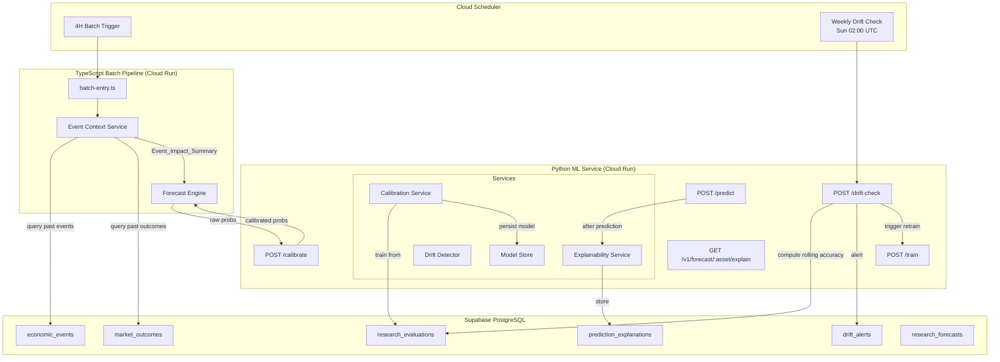
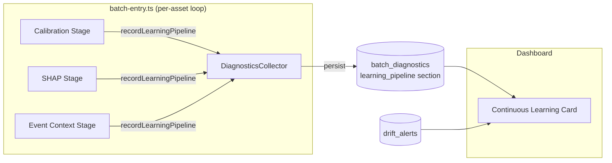

# Design Document: Continuous Learning Pipeline

## Overview

This design implements Tier 5 of the Enhancement Plan: four capabilities that transform the Financial Intelligence Platform from a static prediction system into a self-improving, explainable forecasting engine. The four subsystems are:

1. **Probability Calibration** — Isotonic regression maps raw XGBoost/ensemble probabilities to historically accurate probabilities, so "70% up" means the market actually moves up ~70% of the time.
2. **SHAP Explainability** — Per-prediction feature attribution via TreeExplainer, stored for audit and exposed via API.
3. **Drift Detection & Auto-Retraining** — Rolling accuracy tracking per regime with automatic model refresh when performance degrades beyond 2σ.
4. **RAG-Enhanced Event Context** — Historical event impact retrieval enriches predictions when high-impact macro events are imminent.

All four integrate into the existing architecture without disrupting the current 4H batch cycle. The ML service gains three new routers; the TypeScript batch pipeline gains one new service module; two new database tables are created.

## Architecture



### Integration Flow

1. **Every 4H batch cycle**: The batch pipeline calls `Event Context Service` → retrieves historical event impacts → passes summary to Forecast Engine → Forecast Engine calls ML service `/predict` → ML service computes SHAP values (async, non-blocking) → raw ensemble probs sent to `/calibrate` → calibrated probs returned → final forecast persisted.

2. **Weekly (Sunday 02:00 UTC)**: Cloud Scheduler triggers `POST /drift-check` → Drift Detector computes rolling accuracy per regime from `research_evaluations` → if any regime drops below baseline by >2σ → inserts alert into `drift_alerts` → triggers `POST /train` for automatic retraining.

3. **On-demand**: Operator can manually trigger `POST /train` (retrain), call `GET /v1/forecast/:asset/explain` (get latest explanation), or query `prediction_explanations` / `drift_alerts` tables directly.

## Components and Interfaces

### Python ML Service — New Components

#### 1. Calibration Service (`ml_service/app/services/calibration.py`)

Responsible for training, persisting, loading, and applying isotonic regression.

```python
class CalibrationService:
    """Manages isotonic regression calibration model."""
    
    async def train(self) -> CalibrationTrainResult:
        """
        Fetch research_evaluations, train isotonic regression.
        Returns metrics: sample_count, pre_calibration_error, post_calibration_error.
        Raises InsufficientDataError if < 50 evaluation records.
        """
    
    def calibrate(self, probs: ProbabilityVector) -> ProbabilityVector:
        """
        Apply isotonic regression to raw [up, down, flat] probabilities.
        Renormalises output to sum to 1.0.
        Returns raw probs unchanged if no calibration model loaded.
        """
    
    def is_loaded(self) -> bool:
        """Whether a calibration model is available."""
    
    def load_if_available(self) -> None:
        """Load persisted calibration model from disk on startup."""
    
    def save(self) -> None:
        """Persist calibration model to disk."""
```

#### 2. Explainability Service (`ml_service/app/services/explainability.py`)

Computes and stores SHAP values per prediction.

```python
class ExplainabilityService:
    """Computes SHAP values for XGBoost predictions."""
    
    async def compute_and_store(
        self, 
        features: np.ndarray, 
        forecast_id: str, 
        asset: str,
        model_version: str,
    ) -> Optional[ExplanationResult]:
        """
        Compute TreeExplainer SHAP values, store to prediction_explanations.
        Returns None on failure (non-blocking — prediction proceeds).
        Must complete within 5 seconds.
        """
    
    async def get_latest(self, asset: str) -> Optional[ExplanationResult]:
        """Retrieve most recent explanation for an asset."""
```

#### 3. Drift Detector (`ml_service/app/services/drift_detector.py`)

Monitors rolling accuracy and triggers retraining.

```python
class DriftDetector:
    """Detects model performance drift and triggers retraining."""
    
    async def check_all_regimes(self) -> DriftCheckResult:
        """
        For each regime:
        - Compute rolling 30-forecast accuracy
        - Compute baseline (100-forecast) mean and sigma
        - Flag drift if rolling < baseline - 2*sigma
        Returns per-regime status.
        """
    
    async def handle_drift(self, regime: str, metrics: DriftMetrics) -> None:
        """
        Insert drift_alerts record, trigger POST /train.
        Log outcome (success/failure) to drift alert.
        """
```

#### 4. New Routers

| Router | File | Endpoints |
|--------|------|-----------|
| Calibration | `ml_service/app/routers/calibration.py` | `POST /calibrate`, `POST /calibrate/train` |
| Explainability | `ml_service/app/routers/explainability.py` | `GET /v1/forecast/{asset}/explain` |
| Drift | `ml_service/app/routers/drift.py` | `POST /drift-check` |

### TypeScript Batch Pipeline — New Component

#### Event Context Service (`src/services/pipeline/event-context-service.ts`)

Retrieves historical event impacts for upcoming high-impact events.

```typescript
interface EventImpactSummary {
  event_type: string;
  median_move_pips: number;
  direction_skew: number;     // 0..1 (proportion of up moves)
  vol_expansion_ratio: number; // avg post-event ATR / pre-event ATR
  instance_count: number;
}

interface EventContextService {
  /**
   * Query upcoming events within 8 hours, find historical instances,
   * compute impact summary.
   * Returns null if no upcoming high-impact event or < 3 historical instances.
   */
  getEventContext(asset: string, currentTime: Date): Promise<EventImpactSummary | null>;
}
```

### API Endpoint Specifications

#### `POST /calibrate`

Applies calibration to raw probability vector.

**Request:**
```json
{
  "up": 0.65,
  "down": 0.20,
  "flat": 0.15
}
```

**Response (200):**
```json
{
  "up": 0.58,
  "down": 0.24,
  "flat": 0.18,
  "calibrated": true,
  "model_version": "cal-v1-2026-07-20"
}
```

**Response (200, no model loaded):**
```json
{
  "up": 0.65,
  "down": 0.20,
  "flat": 0.15,
  "calibrated": false,
  "model_version": null
}
```

#### `POST /calibrate/train`

Trains calibration model from research_evaluations.

**Request:** (empty body or `{}`)

**Response (200):**
```json
{
  "status": "trained",
  "sample_count": 312,
  "pre_calibration_error": 0.12,
  "post_calibration_error": 0.04,
  "model_version": "cal-v1-2026-07-20"
}
```

**Response (400):**
```json
{
  "detail": "Insufficient evaluation data: 23 records (minimum 50 required)"
}
```

#### `GET /v1/forecast/{asset}/explain`

Returns SHAP explanation for most recent prediction.

**Response (200):**
```json
{
  "forecast_id": "abc123",
  "asset": "EURUSD",
  "timestamp_utc": "2026-07-20T12:02:00Z",
  "base_value": 0.33,
  "shap_values": {
    "l1_mean": 0.05,
    "sent_aggregate": -0.12,
    "macro_event_proximity": 0.08,
    "...": "..."
  },
  "top_features": [
    { "feature": "sent_aggregate", "shap_value": -0.12 },
    { "feature": "macro_event_proximity", "shap_value": 0.08 },
    { "feature": "l1_mean", "shap_value": 0.05 },
    { "feature": "ext_atr_percentile", "shap_value": 0.04 },
    { "feature": "session_london", "shap_value": 0.03 }
  ],
  "model_version": "a1b2c3d4"
}
```

**Response (404):**
```json
{
  "detail": "No explanation available for asset EURUSD"
}
```

**Response (400):**
```json
{
  "detail": "Unsupported asset: GBPJPY. Supported: EURUSD"
}
```

#### `POST /drift-check`

Executes drift detection for all regimes.

**Response (200, no drift):**
```json
{
  "status": "healthy",
  "regimes": {
    "HIGH": { "rolling_accuracy": 0.60, "baseline_accuracy": 0.58, "sigma": 0.05, "drift": false },
    "LOW": { "rolling_accuracy": 0.55, "baseline_accuracy": 0.54, "sigma": 0.04, "drift": false },
    "NORMAL": { "rolling_accuracy": 0.57, "baseline_accuracy": 0.56, "sigma": 0.06, "drift": false }
  },
  "retrain_triggered": false
}
```

**Response (200, drift detected):**
```json
{
  "status": "drift_detected",
  "regimes": {
    "HIGH": { "rolling_accuracy": 0.42, "baseline_accuracy": 0.58, "sigma": 0.05, "drift": true, "deviation_sigmas": 3.2 },
    "LOW": { "rolling_accuracy": 0.55, "baseline_accuracy": 0.54, "sigma": 0.04, "drift": false }
  },
  "retrain_triggered": true,
  "retrain_outcome": { "status": "trained", "accuracy": 0.61 }
}
```

### Cloud Scheduler — Drift Check Job

```yaml
- name: fip-ml-drift-check-weekly
  description: "Weekly drift check + conditional retraining (Sundays 02:00 UTC)"
  schedule: "0 2 * * 0"
  timeZone: "UTC"
  httpTarget:
    uri: "https://fip-ml-HASH-REGION.a.run.app/drift-check"
    httpMethod: POST
    headers:
      Content-Type: "application/json"
    body: '{}'
    oidcToken:
      serviceAccountEmail: "fip-scheduler@PROJECT_ID.iam.gserviceaccount.com"
  retryConfig:
    retryCount: 3
    maxRetryDuration: "300s"
    minBackoffDuration: "30s"
    maxBackoffDuration: "120s"
  attemptDeadline: "600s"
```

## Data Models

### New Table: `prediction_explanations`

```sql
CREATE TABLE prediction_explanations (
    id UUID PRIMARY KEY DEFAULT gen_random_uuid(),
    forecast_id UUID NOT NULL REFERENCES research_forecasts(id),
    asset TEXT NOT NULL,
    timestamp_utc TIMESTAMPTZ NOT NULL DEFAULT NOW(),
    shap_values JSONB NOT NULL,           -- { "feature_name": shap_value, ... }
    top_features JSONB NOT NULL,          -- [{ "feature": "name", "shap_value": 0.12 }, ...]
    base_value DOUBLE PRECISION NOT NULL,
    model_version TEXT NOT NULL
);

CREATE INDEX idx_prediction_explanations_asset_ts 
    ON prediction_explanations (asset, timestamp_utc DESC);
```

### New Table: `drift_alerts`

```sql
CREATE TABLE drift_alerts (
    id UUID PRIMARY KEY DEFAULT gen_random_uuid(),
    regime TEXT NOT NULL,
    detected_at TIMESTAMPTZ NOT NULL DEFAULT NOW(),
    rolling_accuracy DOUBLE PRECISION NOT NULL,
    baseline_accuracy DOUBLE PRECISION NOT NULL,
    sigma DOUBLE PRECISION NOT NULL,
    deviation_sigmas DOUBLE PRECISION NOT NULL,
    retrain_triggered BOOLEAN NOT NULL DEFAULT false,
    retrain_outcome JSONB,                -- null until retrain completes
    resolved_at TIMESTAMPTZ              -- set when accuracy recovers post-retrain
);

CREATE INDEX idx_drift_alerts_regime_detected 
    ON drift_alerts (regime, detected_at DESC);
```

### Calibration Model Persistence

The calibration model is serialised using `joblib` alongside the XGBoost model:

- **Path**: `/tmp/fip_calibration_model.joblib`
- **Metadata path**: `/tmp/fip_calibration_meta.json`

```json
{
  "version": "cal-v1-2026-07-20",
  "trained_at": "2026-07-20T02:15:00Z",
  "sample_count": 312,
  "calibration_error": 0.04
}
```

### Updated `ml_service/requirements.txt` (additions)

```
shap==0.46.0
joblib==1.4.2
```

### Event Context Service — Data Flow

The Event Context Service queries existing tables (no new tables needed):

1. Query `economic_events` WHERE `event_time` BETWEEN `now()` AND `now() + 8 hours` AND `impact = 'HIGH'`
2. For each upcoming event, query `economic_events` for past instances of same `event_type`
3. Join past event timestamps with `market_outcomes` (via time proximity matching to fingerprints)
4. Compute: `median_move_pips`, `direction_skew`, `vol_expansion_ratio`


## Correctness Properties

*A property is a characteristic or behavior that should hold true across all valid executions of a system — essentially, a formal statement about what the system should do. Properties serve as the bridge between human-readable specifications and machine-verifiable correctness guarantees.*

### Property 1: Calibration Training Reduces Error

*For any* dataset of at least 50 (predicted_probability, actual_outcome) pairs drawn from valid ranges (predicted ∈ [0,1], outcome ∈ {0,1}), training isotonic regression on this dataset SHALL produce a post-training calibration error less than or equal to the pre-training calibration error.

**Validates: Requirements 1.3**

### Property 2: Calibration Output is Valid Probability Distribution

*For any* input probability vector [up, down, flat] where each component ∈ [0, 1] and the sum equals 1.0, applying calibration and renormalisation SHALL produce an output vector where each component ∈ [0, 1] and the components sum to 1.0 (within floating-point tolerance of ±1e-9).

**Validates: Requirements 2.1, 2.2**

### Property 3: SHAP Value Count Equals Feature Count

*For any* valid 30-dimensional feature vector and trained XGBoost model, SHAP computation SHALL produce exactly 30 SHAP values — one per input feature.

**Validates: Requirements 3.1**

### Property 4: Top-K Feature Ranking Correctness

*For any* set of SHAP values (mapping feature names to float values), the top 5 features returned SHALL be the 5 features with the highest absolute SHAP values, sorted in descending order of absolute magnitude.

**Validates: Requirements 4.2**

### Property 5: Rolling Accuracy Computation

*For any* sequence of at least 30 (predicted_direction, actual_direction) pairs for a given regime, the rolling 30-forecast accuracy SHALL equal the number of correct predictions in the most recent 30 entries divided by 30.

**Validates: Requirements 5.1**

### Property 6: Baseline Statistics Computation

*For any* sequence of at least 100 (predicted_direction, actual_direction) pairs for a given regime, the baseline accuracy SHALL equal the mean of rolling 30-forecast accuracies computed over the window, and sigma SHALL equal the standard deviation of those rolling accuracies.

**Validates: Requirements 5.3**

### Property 7: Drift Classification Formula

*For any* triple (rolling_accuracy, baseline_accuracy, sigma) where all values are valid floats and sigma > 0, drift SHALL be classified as true if and only if rolling_accuracy < baseline_accuracy - 2 × sigma.

**Validates: Requirements 5.4**

### Property 8: Event Impact Summary Statistics

*For any* array of at least 3 historical event outcome records containing (move_pips, direction, pre_event_atr, post_event_atr), the Event_Impact_Summary SHALL have: median_move_pips equal to the statistical median of absolute move_pips values, direction_skew equal to the count of "up" moves divided by total moves, and vol_expansion_ratio equal to the mean of (post_event_atr / pre_event_atr) across all records.

**Validates: Requirements 8.2**

### Property 9: Feature Vector Augmentation with Event Context

*For any* base feature vector of 30 dimensions and any valid Event_Impact_Summary (median_move_pips, direction_skew, vol_expansion_ratio), the augmented feature vector SHALL have exactly 33 dimensions, with positions 30-32 containing the event context values in order.

**Validates: Requirements 9.1**

### Property 10: Calibration Model Serialisation Round-Trip

*For any* trained calibration model and any valid probability vector, serialising the model to disk and deserialising it SHALL produce a model that returns identical calibrated outputs for the same input vector.

**Validates: Requirements 12.1**

## Error Handling

### Calibration Service

| Scenario | Behaviour |
|----------|-----------|
| Insufficient evaluation data (< 50 records) | Return 400 with descriptive message; do not create model |
| Supabase query failure during training | Return 500 with error details; existing model unchanged |
| No calibration model loaded at prediction time | Return raw probabilities with `calibrated: false` flag |
| Calibration produces NaN/Inf values | Fall back to raw probabilities; log error |
| Model file corrupted on startup load | Log warning; operate in uncalibrated mode |

### Explainability Service

| Scenario | Behaviour |
|----------|-----------|
| SHAP computation timeout (> 5s) | Abort computation; log timeout; prediction proceeds without explanation |
| Model incompatibility (e.g., non-tree model) | Log error; prediction proceeds without explanation |
| Supabase insert failure (prediction_explanations) | Log error; prediction proceeds normally |
| No explanation found for asset (GET endpoint) | Return 404 |
| Unsupported asset parameter | Return 400 with supported asset list |

### Drift Detector

| Scenario | Behaviour |
|----------|-----------|
| Insufficient data for regime (< 30 forecasts) | Skip regime; log insufficient data; continue with other regimes |
| Supabase query failure | Return 500; no alerts generated |
| Retraining triggered but POST /train fails | Log failure; update drift_alert with failure outcome; retain current model |
| All regimes healthy | Return healthy status; skip retraining |
| Division by zero (sigma = 0) | Treat sigma = 0 as "no variability" — skip drift check for that regime |

### Event Context Service

| Scenario | Behaviour |
|----------|-----------|
| No upcoming high-impact events within 8 hours | Return null; forecast uses neutral fill values |
| Fewer than 3 historical instances of event type | Return null; log insufficient history |
| Supabase query failure (economic_events) | Return null; log error; pipeline continues without event context |
| Market_outcomes join returns no matches | Return null for that event type |

### General Principles

- **No subsystem failure halts the batch pipeline**: Calibration, SHAP, and event context are all graceful-degradation features. If any fails, the pipeline continues with the best available data.
- **Drift detection failure does not affect prediction**: Drift check is independent of the prediction path.
- **All errors are logged** with structured context (regime, asset, error type, timestamp).

## Testing Strategy

### Unit Tests (pytest for Python, Vitest for TypeScript)

**Python ML Service:**
- `test_calibration.py` — CalibrationService train/apply logic with mocked Supabase data
- `test_explainability.py` — SHAP computation with a trained test model, top-K ranking
- `test_drift_detector.py` — Rolling accuracy computation, drift threshold logic, edge cases
- `test_event_impact.py` (if any Python utility) — N/A (TypeScript handles this)

**TypeScript Batch Pipeline:**
- `test_event_context_service.ts` — Event impact summary computation, null handling, boundary cases

### Property-Based Tests

**Library**: `hypothesis` for Python (add to dev dependencies), `fast-check` for TypeScript (already in devDependencies).

**Configuration**: Minimum 100 iterations per property test.

**Python properties (pytest + hypothesis):**

| Property | Test File | Tag |
|----------|-----------|-----|
| P1: Calibration reduces error | `tests/test_calibration_props.py` | Feature: continuous-learning-pipeline, Property 1: Calibration training reduces error |
| P2: Valid probability distribution | `tests/test_calibration_props.py` | Feature: continuous-learning-pipeline, Property 2: Calibration output is valid probability distribution |
| P3: SHAP count = feature count | `tests/test_explainability_props.py` | Feature: continuous-learning-pipeline, Property 3: SHAP value count equals feature count |
| P4: Top-K ranking correctness | `tests/test_explainability_props.py` | Feature: continuous-learning-pipeline, Property 4: Top-K feature ranking correctness |
| P5: Rolling accuracy | `tests/test_drift_props.py` | Feature: continuous-learning-pipeline, Property 5: Rolling accuracy computation |
| P6: Baseline statistics | `tests/test_drift_props.py` | Feature: continuous-learning-pipeline, Property 6: Baseline statistics computation |
| P7: Drift classification | `tests/test_drift_props.py` | Feature: continuous-learning-pipeline, Property 7: Drift classification formula |
| P10: Calibration round-trip | `tests/test_calibration_props.py` | Feature: continuous-learning-pipeline, Property 10: Calibration model serialisation round-trip |

**TypeScript properties (Vitest + fast-check):**

| Property | Test File | Tag |
|----------|-----------|-----|
| P8: Event impact summary | `src/services/pipeline/__tests__/event-context.property.test.ts` | Feature: continuous-learning-pipeline, Property 8: Event impact summary statistics |
| P9: Feature vector augmentation | `src/services/pipeline/__tests__/event-context.property.test.ts` | Feature: continuous-learning-pipeline, Property 9: Feature vector augmentation with event context |

### Integration Tests

- **Calibration endpoint**: POST /calibrate with seeded data, verify response shape and calibration effect
- **Explain endpoint**: Seed prediction_explanations, GET /v1/forecast/EURUSD/explain, verify response
- **Drift-check endpoint**: Seed research_evaluations with drift-inducing data, POST /drift-check, verify alert created and retrain triggered
- **Event context in pipeline**: End-to-end batch run with seeded economic_events, verify event context flows to forecast

### Test Dependencies (additions)

**Python (`ml_service/requirements-dev.txt` or test extras):**
```
hypothesis==6.108.0
pytest-asyncio==0.24.0
```

**TypeScript**: Already has `fast-check` and `vitest` in devDependencies.


---

## Requirements 13–14: Pipeline Diagnostics & Dashboard Status Card

### Overview

Requirements 13 and 14 extend the existing observability layer (from the process-observation spec) to cover the continuous learning pipeline components. Requirement 13 adds a `learning_pipeline` section to the `BatchDiagnosticsPayload` and a new `recordLearningPipeline()` method on `DiagnosticsCollector`. Requirement 14 adds a "Continuous Learning" card to the Developer View dashboard that visualises the per-cycle status of calibration, SHAP, event context, and drift detection.

### Architecture Extension



### Components and Interfaces

#### 1. `LearningPipelineDiagnostics` Interface

New interface added to `src/services/observability/diagnostics-types.ts`:

```typescript
/** Learning pipeline stage diagnostics — recorded once per batch cycle per asset. */
export interface LearningPipelineDiagnostics {
  /** Whether calibration was applied this cycle. */
  calibration_applied: boolean;
  /** Version identifier of the calibration model used, or null if not applied. */
  calibration_model_version: string | null;
  /** Raw (pre-calibration) probability vector, recorded when calibration is applied. */
  raw_probabilities: { up: number; down: number; flat: number } | null;
  /** Calibrated probability vector, recorded when calibration is applied. */
  calibrated_probabilities: { up: number; down: number; flat: number } | null;
  /** Whether SHAP values were successfully computed this cycle. */
  shap_computed: boolean;
  /** Top 3 SHAP features by absolute contribution, or null if SHAP not computed. */
  top_shap_features: Array<{ feature: string; shap_value: number }> | null;
  /** Whether event context was applied this cycle. */
  event_context_applied: boolean;
  /** The event type that triggered context retrieval, or null if none. */
  event_type: string | null;
  /** Event impact summary values when event context is applied. */
  event_impact: {
    median_move_pips: number;
    direction_skew: number;
    vol_expansion_ratio: number;
  } | null;
  /** Failure reason if any learning pipeline component failed, or null on success. */
  failure_reason: string | null;
}
```

#### 2. Extended `BatchDiagnosticsPayload`

The existing interface gains a new optional field:

```typescript
export interface BatchDiagnosticsPayload {
  sentiment: SentimentDiagnostics | null;
  macro_context: MacroContextDiagnostics | null;
  ml_service: MLServiceDiagnostics;
  market_context: MarketContextDiagnostics;
  similarity: SimilarityDiagnostics | null;
  outcome: OutcomeDiagnostics | null;
  forecast: ForecastDiagnostics | null;
  gemini: GeminiDiagnostics | null;
  /** Learning pipeline component status for this batch cycle. */
  learning_pipeline: LearningPipelineDiagnostics | null;  // NEW
}
```

#### 3. `recordLearningPipeline()` Method on DiagnosticsCollector

New method added to `src/services/observability/diagnostics-collector.ts`:

```typescript
import type { LearningPipelineDiagnostics } from './diagnostics-types.js';

// New private field:
private learningPipeline: LearningPipelineDiagnostics | null = null;

/** Record learning pipeline diagnostics. Never throws. */
recordLearningPipeline(data: LearningPipelineDiagnostics): void {
  try {
    this.learningPipeline = data;
  } catch (err) {
    console.warn('[DiagnosticsCollector] Error recording learning_pipeline:', err);
  }
}

// Updated buildPayload():
private buildPayload(): BatchDiagnosticsPayload {
  return {
    sentiment: this.sentiment,
    macro_context: this.macroContext,
    ml_service: this.mlService,
    market_context: this.marketContext,
    similarity: this.similarity,
    outcome: this.outcome,
    forecast: this.forecast,
    gemini: this.gemini,
    learning_pipeline: this.learningPipeline,  // NEW
  };
}
```

#### 4. Integration Point in `batch-entry.ts`

The learning pipeline diagnostics are recorded after all learning components have executed (calibration, SHAP, event context), just before the existing `diagnostics.persist()` call:

```typescript
// After calibration, SHAP, and event context stages complete:
diagnostics.recordLearningPipeline({
  calibration_applied: calibrationResult.applied,
  calibration_model_version: calibrationResult.modelVersion ?? null,
  raw_probabilities: calibrationResult.applied
    ? { up: rawProbs.up, down: rawProbs.down, flat: rawProbs.flat }
    : null,
  calibrated_probabilities: calibrationResult.applied
    ? { up: calibratedProbs.up, down: calibratedProbs.down, flat: calibratedProbs.flat }
    : null,
  shap_computed: shapResult.success,
  top_shap_features: shapResult.success
    ? shapResult.topFeatures.slice(0, 3).map(f => ({ feature: f.feature, shap_value: f.shap_value }))
    : null,
  event_context_applied: eventContext !== null,
  event_type: eventContext?.event_type ?? null,
  event_impact: eventContext
    ? {
        median_move_pips: eventContext.median_move_pips,
        direction_skew: eventContext.direction_skew,
        vol_expansion_ratio: eventContext.vol_expansion_ratio,
      }
    : null,
  failure_reason: pipelineError ?? null,
});

// Existing persist call (fire-and-forget):
diagnostics.persist().catch(() => {});
```

#### 5. Dashboard: `renderContinuousLearningCard()` Function

New rendering function added to `dashboard/index.html` within the Developer View tab:

```javascript
async function renderContinuousLearningCard() {
  try {
    // Query latest batch diagnostics for learning_pipeline section
    const diagRows = await supabaseQuery('batch_diagnostics', 'select=asset,batch_id,updated_at,diagnostics&order=updated_at.desc&limit=5');
    // Query most recent drift alert within last 7 days
    const sevenDaysAgo = new Date(Date.now() - 7 * 24 * 60 * 60 * 1000).toISOString();
    const driftRows = await supabaseQuery('drift_alerts', `select=*&detected_at=gte.${sevenDaysAgo}&order=detected_at.desc&limit=1`);

    if (!diagRows || diagRows.length === 0) {
      return '<div class="card grid-full"><h2>Continuous Learning</h2><p class="no-data">No learning pipeline data available</p></div>';
    }

    const latest = diagRows[0]?.diagnostics?.learning_pipeline;
    const driftAlert = driftRows && driftRows.length > 0 ? driftRows[0] : null;

    let html = '<div class="card grid-full"><h2><span class="dot"></span> Continuous Learning</h2>';

    // --- Component Status Grid ---
    html += '<div class="health-grid">';

    // Calibration status
    const calApplied = latest?.calibration_applied ?? false;
    const calDot = calApplied ? 'green' : 'yellow';
    html += `<div class="health-card">`;
    html += `<div class="hc-title">Calibration</div>`;
    html += `<div class="hc-status"><span class="status-dot ${calDot}"></span>${calApplied ? 'Applied' : '⚠️ Not Applied'}</div>`;
    html += `<div class="hc-detail">${latest?.calibration_model_version ?? 'No model'}</div>`;
    html += `</div>`;

    // SHAP status
    const shapOk = latest?.shap_computed ?? false;
    html += `<div class="health-card">`;
    html += `<div class="hc-title">SHAP Explainability</div>`;
    html += `<div class="hc-status"><span class="status-dot ${shapOk ? 'green' : 'yellow'}"></span>${shapOk ? 'Computed' : 'Skipped'}</div>`;
    if (shapOk && latest?.top_shap_features) {
      html += `<div class="hc-detail">Top: ${latest.top_shap_features.map(f => f.feature).join(', ')}</div>`;
    }
    html += `</div>`;

    // Event Context status
    const evtApplied = latest?.event_context_applied ?? false;
    html += `<div class="health-card">`;
    html += `<div class="hc-title">Event Context</div>`;
    html += `<div class="hc-status"><span class="status-dot ${evtApplied ? 'green' : 'yellow'}"></span>${evtApplied ? 'Applied' : 'Not Applied'}</div>`;
    if (evtApplied && latest?.event_type) {
      html += `<div class="hc-detail">${latest.event_type}</div>`;
    }
    html += `</div>`;

    // Drift status
    const driftDetected = !!driftAlert;
    html += `<div class="health-card">`;
    html += `<div class="hc-title">Drift Detection</div>`;
    html += `<div class="hc-status"><span class="status-dot ${driftDetected ? 'red' : 'green'}"></span>${driftDetected ? 'Drift Detected' : 'Healthy'}</div>`;
    if (driftDetected) {
      html += `<div class="hc-detail">Regime: ${driftAlert.regime} · ${driftAlert.deviation_sigmas.toFixed(1)}σ · Retrain: ${driftAlert.retrain_triggered ? 'Yes' : 'No'}</div>`;
    }
    html += `</div>`;

    html += '</div>'; // end health-grid

    // --- Drift Alert Details ---
    if (driftDetected) {
      html += `<div class="alert-bar" style="margin-top:0.75rem">`;
      html += `⚠️ Drift detected in <strong>${driftAlert.regime}</strong> regime — `;
      html += `rolling accuracy ${(driftAlert.rolling_accuracy * 100).toFixed(1)}% vs baseline ${(driftAlert.baseline_accuracy * 100).toFixed(1)}% `;
      html += `(${driftAlert.deviation_sigmas.toFixed(1)}σ deviation). `;
      html += `Retraining ${driftAlert.retrain_triggered ? 'triggered' : 'not triggered'}. `;
      html += `Detected ${timeAgo(driftAlert.detected_at)}.`;
      html += `</div>`;
    }

    // --- Calibration Warning ---
    if (!calApplied) {
      html += `<div class="alert-bar" style="margin-top:0.5rem;background:#ffab0015;border-color:#ffab0040;color:#ffab00">`;
      html += `⚠️ Calibration was not applied in the latest batch cycle. Raw probabilities may not reflect true historical accuracy.`;
      html += `</div>`;
    }

    // --- Timeline: Last 5 Batch Cycles ---
    html += '<div style="margin-top:1rem"><div style="font-size:0.7rem;color:#8b98a5;text-transform:uppercase;letter-spacing:0.03em;margin-bottom:0.5rem">Last 5 Cycles</div>';
    html += '<div class="trace-timeline">';
    for (const row of diagRows.slice(0, 5)) {
      const lp = row.diagnostics?.learning_pipeline;
      const ts = timeAgo(row.updated_at);
      html += `<div class="trace-item">`;
      html += `<span class="name">${row.asset} · ${ts}</span>`;
      html += `<div class="pipeline-stages">`;
      html += `<span class="pipeline-stage ${lp?.calibration_applied ? '' : 'failed'}">CAL</span>`;
      html += `<span class="pipeline-arrow">→</span>`;
      html += `<span class="pipeline-stage ${lp?.shap_computed ? '' : 'failed'}">SHAP</span>`;
      html += `<span class="pipeline-arrow">→</span>`;
      html += `<span class="pipeline-stage ${lp?.event_context_applied ? '' : 'pending'}">EVT</span>`;
      html += `<span class="pipeline-arrow">→</span>`;
      html += `<span class="pipeline-stage ${lp?.failure_reason ? 'failed' : ''}">OK</span>`;
      html += `</div>`;
      html += `</div>`;
    }
    html += '</div></div>';

    html += '</div>'; // end card
    return html;
  } catch (err) {
    return '<div class="card grid-full"><h2>Continuous Learning</h2><p class="no-data">Failed to load learning pipeline data</p></div>';
  }
}
```

The function is invoked inside `renderDeveloperView()` alongside the existing `renderBatchDiagnosticsCard()`:

```javascript
html += await renderBatchDiagnosticsCard();
html += await renderContinuousLearningCard();  // NEW
```

### Error Handling (Requirements 13–14 specific)

| Layer | Error Strategy |
|-------|---------------|
| `recordLearningPipeline()` | `try/catch` → `console.warn`, never throws (consistent with all other `record*()` methods) |
| Pipeline component failure | Captured as `failure_reason` string in diagnostics; pipeline continues |
| Dashboard query failure (batch_diagnostics) | Display "no data available" message |
| Dashboard query failure (drift_alerts) | Display drift status as "Unknown", card still renders |
| Missing `learning_pipeline` section in old data | Graceful fallback — fields treated as null/false |

### Correctness Properties (Requirements 13–14)

### Property 11: Learning Pipeline Diagnostics Shape Completeness

*For any* valid combination of learning pipeline component states (calibration applied or not, SHAP computed or not, event context applied or not) and any valid probability vectors / event impact values, the `learning_pipeline` section in the built diagnostics payload SHALL contain all required fields (`calibration_applied`, `calibration_model_version`, `shap_computed`, `event_context_applied`, `event_type`) with correct types, AND when `calibration_applied` is true the `raw_probabilities` and `calibrated_probabilities` fields SHALL be non-null valid probability vectors, AND when `event_context_applied` is true the `event_impact` fields SHALL be non-null.

**Validates: Requirements 13.1, 13.2, 13.3**

### Property 12: Top-3 SHAP Feature Recording Correctness

*For any* set of SHAP values (mapping feature names to float values) with at least 3 entries, the `top_shap_features` field in the `learning_pipeline` diagnostics section SHALL contain exactly 3 entries that are the 3 features with the highest absolute SHAP values, sorted in descending order of absolute magnitude.

**Validates: Requirements 13.4**

### Property 13: Learning Pipeline Recording Never Throws

*For any* input to `recordLearningPipeline()` (including malformed, null, or unexpected types), the method SHALL catch any error and never propagate it to the caller, consistent with the fire-and-forget guarantee of all `record*()` methods.

**Validates: Requirements 13.5**

### Property 14: Dashboard Renders All Learning Pipeline Component Statuses

*For any* valid `LearningPipelineDiagnostics` object, the `renderContinuousLearningCard()` function SHALL produce HTML output containing status indicators for all four components (calibration, SHAP, event context, drift), AND when provided with an array of 5 or more batch diagnostics records, the timeline section SHALL render exactly 5 entries with pass/fail indicators per component.

**Validates: Requirements 14.1, 14.5**

### Property 15: Dashboard Drift Alert Detail Rendering

*For any* drift alert record with valid regime, rolling_accuracy, baseline_accuracy, deviation_sigmas, and retrain_triggered values detected within the last 7 days, the `renderContinuousLearningCard()` function SHALL produce HTML output containing the regime name, numeric deviation from baseline, and retraining trigger status.

**Validates: Requirements 14.4**

### Testing Strategy (Requirements 13–14 additions)

**TypeScript property tests (Vitest + fast-check):**

| Property | Test File | Tag |
|----------|-----------|-----|
| P11: Shape completeness | `src/services/observability/__tests__/learning-pipeline-diagnostics.property.test.ts` | Feature: continuous-learning-pipeline, Property 11: Learning pipeline diagnostics shape completeness |
| P12: Top-3 SHAP features | `src/services/observability/__tests__/learning-pipeline-diagnostics.property.test.ts` | Feature: continuous-learning-pipeline, Property 12: Top-3 SHAP feature recording correctness |
| P13: Never throws | `src/services/observability/__tests__/learning-pipeline-diagnostics.property.test.ts` | Feature: continuous-learning-pipeline, Property 13: Learning pipeline recording never throws |
| P14: Dashboard render | `dashboard/__tests__/continuous-learning-card.property.test.ts` | Feature: continuous-learning-pipeline, Property 14: Dashboard renders all learning pipeline component statuses |
| P15: Drift alert rendering | `dashboard/__tests__/continuous-learning-card.property.test.ts` | Feature: continuous-learning-pipeline, Property 15: Dashboard drift alert detail rendering |

**Configuration**: Minimum 100 iterations per property test.

**Unit tests:**
- `src/services/observability/__tests__/learning-pipeline-diagnostics.test.ts` — Verify `recordLearningPipeline()` records data correctly, verify `buildPayload()` includes the learning_pipeline section, verify default null state when not called.
- `dashboard/__tests__/continuous-learning-card.test.ts` — Verify warning indicator appears when calibration not applied (Req 14.3), verify card renders gracefully with missing/null data, verify drift alert section hidden when no recent drift.

**Integration tests:**
- Verify end-to-end flow: batch-entry records learning pipeline diagnostics → persist to Supabase → dashboard queries and renders card.
- Verify backward compatibility: old `batch_diagnostics` rows without `learning_pipeline` field render without errors.
