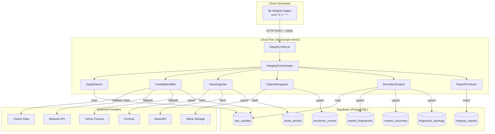
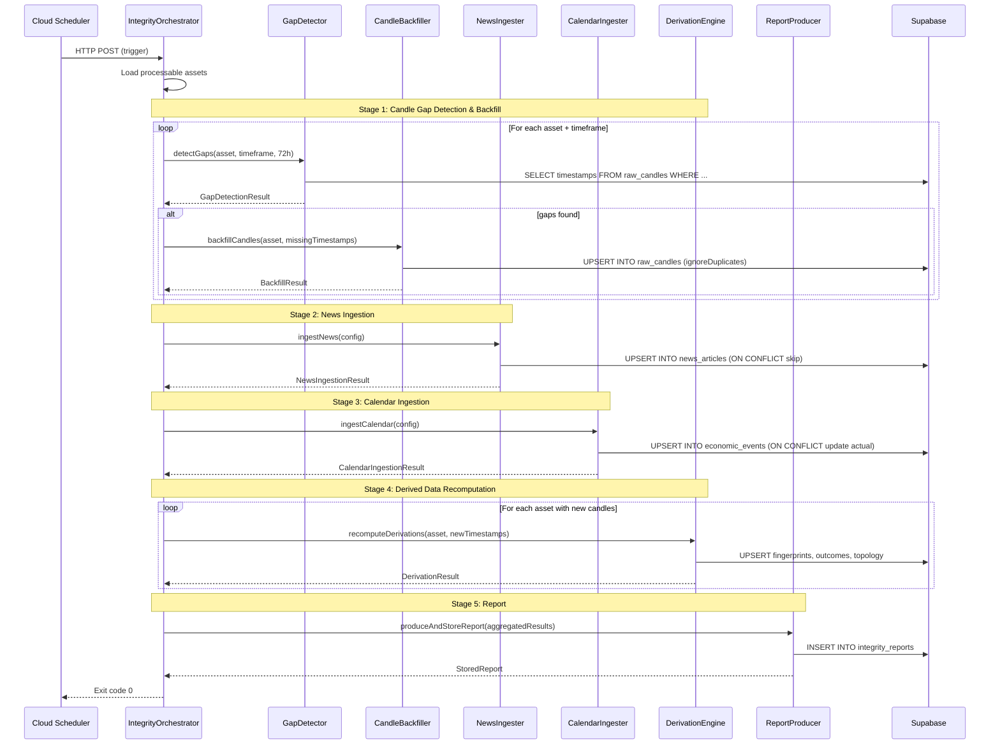

# Design Document: Daily Data Integrity

## Overview

The Daily Data Integrity job is a standalone Cloud Run Job that runs once per day at 01:00 UTC to ensure the platform's PostgreSQL database (Supabase) has no persistent data gaps from batch pipeline failures. It operates independently from the existing 4H batch pipeline and follows a fail-forward strategy across four processing domains:

1. **Candle Gap Detection & Backfill** — Identifies and fills missing 4H candles within a 72-hour lookback window
2. **News Ingestion** — Fetches and stores forex-relevant financial news from Finnhub and NewsAPI
3. **Economic Calendar Ingestion** — Fetches and stores upcoming economic events from Alpha Vantage
4. **Derived Data Recomputation** — Regenerates fingerprints, outcomes, and topology for backfilled candles

The job reuses existing infrastructure patterns (provider fallback chain, rate limiting, batch upserts, idempotent operations) and produces a structured integrity report for observability.

## Architecture



### Positioning Within the Existing System

| Concern | Existing 4H Batch Pipeline | Daily Integrity Job |
|---------|---------------------------|---------------------|
| Trigger | Cloud Scheduler every 4H (6×/day) | Cloud Scheduler at 01:00 UTC (1×/day) |
| Scope | Current candle only (one per cycle) | 72-hour lookback window (up to 18 candles) |
| Data domains | Candles + engines | Candles + news + calendar + derivations |
| Failure mode | Exit code 1, retry next cycle | Fail-forward per domain, partial report |
| Entry point | `src/batch-entry.ts` | `src/integrity-entry.ts` (new) |
| Deploy target | Cloud Run Service (fip-batch) | Cloud Run Job (fip-integrity) |
| Timeout | 15 minutes | 30 minutes |

The integrity job is complementary — it catches what the batch pipeline misses and adds new data domains (news, calendar). It never conflicts with the batch pipeline because candle upserts use `ignoreDuplicates: true`.

## Components and Interfaces

### Module Layout

```
src/
├── integrity-entry.ts                    # Cloud Run Job entry point
├── services/
│   └── integrity/
│       ├── integrity-orchestrator.ts     # Sequencing and fail-forward logic
│       ├── gap-detector.ts              # Scans raw_candles for missing timestamps
│       ├── candle-backfiller.ts         # Fetches missing candles via fallback chain
│       ├── news-ingester.ts            # Fetches and stores financial news
│       ├── calendar-ingester.ts        # Fetches and stores economic events
│       ├── derivation-engine.ts        # Recomputes fingerprints/outcomes/topology
│       ├── report-producer.ts          # Builds and stores integrity report
│       └── types.ts                    # Shared interfaces for the integrity module
deploy/
├── cloud-run-integrity.yaml            # Cloud Run Job definition
└── cloud-scheduler-integrity.yaml      # Scheduler trigger
```

### Component Interfaces

#### IntegrityOrchestrator

```typescript
interface IntegrityOrchestratorConfig {
  supabase: SupabaseClient;
  timeoutMs: number;               // default: 1_800_000 (30 min)
  lookbackHours: number;           // default: 72
  maxArticlesPerSource: number;    // default: 50
  calendarForwardDays: number;     // default: 7
  calendarBackwardDays: number;    // default: 1
}

interface IntegrityRunResult {
  status: 'complete' | 'partial' | 'failed';
  report: IntegrityReport;
  durationMs: number;
}

class IntegrityOrchestrator {
  constructor(config: IntegrityOrchestratorConfig);
  execute(): Promise<IntegrityRunResult>;
}
```

#### GapDetector

```typescript
interface GapDetectionInput {
  asset: ResearchAsset;
  timeframe: string;
  lookbackHours: number;
  referenceTime: Date;             // defaults to now
}

interface GapDetectionResult {
  asset: string;
  timeframe: string;
  missingTimestamps: string[];     // ISO-8601, sorted ascending
  existingCount: number;
  expectedCount: number;
}

function detectGaps(
  supabase: SupabaseClient,
  input: GapDetectionInput
): Promise<GapDetectionResult>;

function generateExpectedGrid(
  startTime: Date,
  endTime: Date,
  marketHours: string
): string[];
```

#### CandleBackfiller

```typescript
interface BackfillInput {
  asset: ResearchAsset;
  timeframe: string;
  missingTimestamps: string[];
}

interface BackfillResult {
  attempted: number;
  filled: number;
  failed: number;
  errors: BackfillError[];
  filledTimestamps: string[];      // timestamps successfully inserted
}

interface BackfillError {
  timestamp: string;
  providers: string[];             // providers attempted
  reason: string;
}

function backfillCandles(
  supabase: SupabaseClient,
  rateLimits: RateLimitRegistry,
  input: BackfillInput
): Promise<BackfillResult>;
```

#### NewsIngester

```typescript
interface NewsIngestionConfig {
  maxArticlesPerSource: number;
  lookbackHours: number;           // default: 24
}

interface NewsArticle {
  source: string;                  // 'finnhub' | 'newsapi'
  headline: string;
  summary: string;
  url: string;
  published_at: string;            // ISO-8601
  category: string;
  sentiment_hint: 'positive' | 'negative' | 'neutral';
  relevance_score: number;         // 0.0 - 1.0
}

interface NewsIngestionResult {
  finnhubCount: number;
  newsapiCount: number;
  totalIngested: number;
  duplicatesSkipped: number;
  errors: string[];
}

function ingestNews(
  supabase: SupabaseClient,
  rateLimits: RateLimitRegistry,
  config: NewsIngestionConfig
): Promise<NewsIngestionResult>;
```

#### CalendarIngester

```typescript
interface CalendarIngestionConfig {
  forwardDays: number;             // default: 7
  backwardDays: number;            // default: 1
}

interface EconomicEvent {
  name: string;
  event_date: string;              // ISO-8601 date
  impact: 'high' | 'medium' | 'low';
  actual: number | null;
  estimate: number | null;
  previous: number | null;
  currency: string;
}

interface CalendarIngestionResult {
  eventsIngested: number;
  eventsUpdated: number;           // existing events with updated actual values
  errors: string[];
}

function ingestCalendar(
  supabase: SupabaseClient,
  rateLimits: RateLimitRegistry,
  config: CalendarIngestionConfig
): Promise<CalendarIngestionResult>;

function classifyEventImpact(eventName: string): 'high' | 'medium' | 'low';
```

#### DerivationEngine

```typescript
interface DerivationInput {
  asset: ResearchAsset;
  timeframe: string;
  newCandleTimestamps: string[];   // timestamps of newly backfilled candles
}

interface DerivationResult {
  fingerprintsGenerated: number;
  outcomesComputed: number;
  topologyComputed: number;
  errors: DerivationError[];
}

interface DerivationError {
  timestamp: string;
  stage: 'fingerprint' | 'outcome' | 'topology';
  reason: string;
}

function recomputeDerivations(
  supabase: SupabaseClient,
  input: DerivationInput
): Promise<DerivationResult>;
```

#### ReportProducer

```typescript
interface IntegrityReport {
  totalGapsDetected: number;
  gapsFilled: number;
  gapsFailedToFill: number;
  newsArticlesIngested: number;
  economicEventsIngested: number;
  derivedRecordsRecomputed: number;
  totalExecutionTimeMs: number;
  errors: string[];
}

interface StoredReport {
  id: string;                      // UUID
  run_date: string;                // ISO-8601 date
  report_json: IntegrityReport;
  status: 'complete' | 'partial' | 'failed';
  created_at: string;
}

function produceAndStoreReport(
  supabase: SupabaseClient,
  report: IntegrityReport
): Promise<StoredReport>;

function classifyReportStatus(report: IntegrityReport): 'complete' | 'partial' | 'failed';
```

## Data Models

### New Tables

#### `news_articles`

| Column | Type | Constraints |
|--------|------|-------------|
| id | uuid | PK, default gen_random_uuid() |
| asset_id | text | NOT NULL |
| source | text | NOT NULL |
| headline | text | NOT NULL |
| summary | text | |
| url | text | NOT NULL |
| published_at | timestamptz | NOT NULL |
| category | text | |
| sentiment_hint | numeric(4,3) | NULLABLE, CHECK (sentiment_hint >= -1 AND sentiment_hint <= 1) |
| relevance_score | numeric(4,3) | NOT NULL, CHECK (relevance_score >= 0 AND relevance_score <= 1) |
| ingested_at | timestamptz | NOT NULL, default now() |
| run_date | date | NOT NULL |

**Unique Constraint:** `UNIQUE(source, url)` — prevents duplicate articles

**Indexes:**
- `idx_news_articles_asset_published` on (asset_id, published_at DESC) — for sentiment engine lookback queries
- `idx_news_articles_run_date` on (run_date) — for maintenance/pruning

**Note:** `sentiment_hint` is a numeric value in [-1, 1] (not text) because the Sentiment Engine uses it as a weighted input to the decay-based aggregation. Providers that supply text labels (positive/negative/neutral) must be mapped to numeric values during ingestion: positive → 0.7, negative → -0.7, neutral → 0.0. Providers that supply numeric scores should be stored directly.

#### `economic_events`

| Column | Type | Constraints |
|--------|------|-------------|
| id | uuid | PK, default gen_random_uuid() |
| name | text | NOT NULL |
| event_date | timestamptz | NOT NULL |
| impact | text | NOT NULL, CHECK (impact IN ('high', 'medium', 'low')) |
| actual | numeric | nullable |
| estimate | numeric | nullable |
| previous | numeric | nullable |
| currency | text | NOT NULL |
| ingested_at | timestamptz | NOT NULL, default now() |
| run_date | date | NOT NULL |

**Unique Constraint:** `UNIQUE(name, event_date)` — enables upsert with selective overwrite on `actual`

**Indexes:**
- `idx_economic_events_currency_date` on (currency, event_date DESC) — for macro context engine lookback queries
- `idx_economic_events_impact_date` on (impact, event_date DESC) WHERE impact = 'high' — for news risk evaluator (fast high-impact lookup)
- `idx_economic_events_run_date` on (run_date) — for maintenance/pruning

**Note:** `event_date` is `timestamptz` (not `date`) because the Macro Context Engine and News Risk Evaluator require hour-level precision for proximity calculations (e.g., "NFP releases at 13:30 UTC").

#### `integrity_reports`

| Column | Type | Constraints |
|--------|------|-------------|
| id | uuid | PK, default gen_random_uuid() |
| run_date | date | NOT NULL |
| report_json | jsonb | NOT NULL |
| status | text | NOT NULL, CHECK (status IN ('complete', 'partial', 'failed')) |
| created_at | timestamptz | NOT NULL, default now() |

**Index:** `idx_integrity_reports_run_date` on `run_date` for lookups by date

### Existing Tables Modified

No schema changes to existing tables. The `raw_candles` table already supports the upsert pattern via its existing unique constraint on `(asset, timeframe, timestamp_utc)`. Backfilled records are distinguished by a `source` metadata field in the existing JSON metadata column.

## Data Flow



## Correctness Properties

*A property is a characteristic or behavior that should hold true across all valid executions of a system — essentially, a formal statement about what the system should do. Properties serve as the bridge between human-readable specifications and machine-verifiable correctness guarantees.*

### Property 1: Gap Detection Correctness

*For any* time window, set of existing candle timestamps, and asset with a given `marketHours` value, the set of detected gaps SHALL equal the expected UTC 4H grid (excluding weekend periods for "24x5" assets) minus the set of existing timestamps, and the output SHALL be sorted in ascending chronological order.

**Validates: Requirements 2.2, 2.3, 2.4**

### Property 2: Provider Fallback Ordering

*For any* candle fetch attempt where the primary provider fails, the system SHALL attempt providers in strict order (Twelve Data → Massive API → Yahoo Finance), advancing to the next only after the current provider fails or times out, and SHALL stop at the first successful response.

**Validates: Requirements 3.2**

### Property 3: Candle Upsert Idempotence

*For any* set of candle records and any number of repeated insertions, the final state of `raw_candles` SHALL be identical to the state after a single insertion — existing records are never overwritten, and no duplicates are created.

**Validates: Requirements 1.5, 3.4, 9.1**

### Property 4: News Article Deduplication

*For any* news article with a given `(source, url)` pair, inserting it multiple times SHALL result in exactly one row in `news_articles` — subsequent inserts are silently skipped without error.

**Validates: Requirements 4.3, 9.2**

### Property 5: News Article Cap

*For any* news source (Finnhub or NewsAPI) in a single daily run, the number of articles stored SHALL be at most 50 — even if the provider returns more than 50 results.

**Validates: Requirements 4.6**

### Property 6: Economic Event Selective Upsert

*For any* economic event with a given `(name, event_date)` pair, re-inserting with a different `actual` value SHALL update only the `actual` column — all other columns (estimate, previous, impact, currency) SHALL remain unchanged.

**Validates: Requirements 5.3, 9.3**

### Property 7: Event Impact Classification

*For any* economic event name containing "NFP", "Non-Farm", "CPI", "GDP", or "Rate Decision" (case-insensitive), `classifyEventImpact` SHALL return "high". For names containing "PMI" or "Retail Sales", it SHALL return "medium". For all other names, it SHALL return "low".

**Validates: Requirements 5.4**

### Property 8: Derivation Completeness and Ordering

*For any* set of newly backfilled candles, the derivation engine SHALL produce fingerprints, outcomes, and topology for each candle, and SHALL process them in strict dependency order: all fingerprints before any outcomes, all outcomes before any topology.

**Validates: Requirements 6.1, 6.2, 6.3, 6.4**

### Property 9: Fail-Forward Error Accumulation

*For any* combination of stage failures across gap detection, news ingestion, calendar ingestion, and derivation, the integrity job SHALL continue executing subsequent stages and the final report SHALL contain every error from every stage.

**Validates: Requirements 3.5, 6.5, 8.5**

### Property 10: Report Status Classification

*For any* integrity report, if the error list is empty and all stages completed, the status SHALL be "complete". If the error list is non-empty, the status SHALL be "partial".

**Validates: Requirements 7.4, 7.5**

### Property 11: Report Field Completeness

*For any* job execution (successful or partial), the produced integrity report SHALL contain all required fields: totalGapsDetected, gapsFilled, gapsFailedToFill, newsArticlesIngested, economicEventsIngested, derivedRecordsRecomputed, totalExecutionTimeMs, and errors — with numeric fields being non-negative integers and errors being an array.

**Validates: Requirements 7.2**

### Property 12: Data Safety — Untouched Records Unchanged

*For any* job run, records in `raw_candles`, `market_fingerprints`, `market_outcomes`, and `fingerprint_topology` that were not inserted or updated during the current run SHALL remain byte-for-byte identical to their pre-run state. The only exception is `economic_events.actual` which may be updated.

**Validates: Requirements 9.5**

## Error Handling

### Strategy: Fail-Forward with Error Accumulation

The integrity job follows the same fail-forward pattern established in the batch pipeline, but elevated to the domain level:

| Level | Behavior |
|-------|----------|
| **Per-provider** | Timeout after 10s, advance to next provider in fallback chain |
| **Per-candle** | If all providers fail, log error and continue to next timestamp |
| **Per-asset** | If gap detection throws, log and continue to next asset |
| **Per-domain** | If entire news/calendar stage fails, log and continue to next domain |
| **Per-derivation** | If fingerprint/outcome/topology fails for a candle, skip and continue |
| **Job-level** | 30-minute timeout triggers graceful shutdown with partial report |

### Error Types

```typescript
type IntegrityErrorCode =
  | 'GAP_DETECTION_FAILED'
  | 'PROVIDER_TIMEOUT'
  | 'ALL_PROVIDERS_FAILED'
  | 'RATE_LIMIT_EXCEEDED'
  | 'NEWS_FETCH_FAILED'
  | 'CALENDAR_FETCH_FAILED'
  | 'DERIVATION_FAILED'
  | 'DB_WRITE_FAILED'
  | 'TIMEOUT';

interface IntegrityError {
  code: IntegrityErrorCode;
  message: string;
  context: {
    asset?: string;
    timestamp?: string;
    provider?: string;
    stage?: string;
  };
  occurredAt: string;              // ISO-8601
}
```

### Timeout Handling

```typescript
// Global timeout with graceful shutdown
const controller = new AbortController();
const timeoutId = setTimeout(() => controller.abort(), INTEGRITY_TIMEOUT_MS);

try {
  await orchestrator.execute({ signal: controller.signal });
} finally {
  clearTimeout(timeoutId);
}
```

When the timeout fires:
1. Current in-flight operation is abandoned
2. Errors accumulated so far are preserved
3. Report is generated with status "failed" and stored
4. Process exits with code 1

### Logging

All operations emit structured logs compatible with Cloud Logging:

```typescript
console.log(JSON.stringify({
  severity: 'INFO' | 'WARNING' | 'ERROR',
  component: 'integrity',
  stage: string,
  asset?: string,
  message: string,
  metadata?: Record<string, unknown>,
}));
```

## Testing Strategy

### Property-Based Testing (fast-check)

The following correctness properties are tested using `fast-check` with a minimum of 100 iterations each. The project already uses `fast-check@4.8.0` with `vitest@3.2.4`.

**Test File Layout:**
```
src/services/integrity/__tests__/
├── gap-detector.property.test.ts       # Properties 1
├── candle-backfiller.property.test.ts   # Properties 2, 3
├── news-ingester.property.test.ts      # Properties 4, 5
├── calendar-ingester.property.test.ts  # Properties 6, 7
├── derivation-engine.property.test.ts  # Property 8
├── integrity-orchestrator.property.test.ts  # Properties 9, 10, 11
├── gap-detector.test.ts               # Example-based unit tests
├── candle-backfiller.test.ts          # Example-based unit tests
├── news-ingester.test.ts             # Example-based unit tests
├── calendar-ingester.test.ts         # Example-based unit tests
├── derivation-engine.test.ts         # Example-based unit tests
└── integrity-orchestrator.test.ts    # Example-based unit tests
```

**Property Test Tagging Convention:**
```typescript
// Feature: daily-data-integrity, Property 1: Gap Detection Correctness
describe('Property 1: Gap Detection Correctness', () => {
  it('detected gaps = expected grid - existing timestamps, sorted ascending', () => {
    fc.assert(fc.property(...), { numRuns: 100 });
  });
});
```

### Unit Tests (Example-Based)

Unit tests cover specific scenarios, edge cases, and integration points:

- **Gap Detector**: Weekend boundary edge cases, DST transitions, empty table, full table
- **Candle Backfiller**: All providers fail, first provider succeeds, rate limit hit mid-batch
- **News Ingester**: Empty response from provider, malformed article data, exactly 50 articles
- **Calendar Ingester**: Updated actual values, new events, Alpha Vantage timeout
- **Derivation Engine**: Zero new candles (skip), single candle, insufficient history for topology
- **Orchestrator**: All stages fail, all stages succeed, timeout mid-execution
- **Report Producer**: Zero errors → complete, one error → partial, timeout → failed

### Integration Tests

Lightweight integration tests run against a test Supabase instance (or mocked client):

- Full orchestrator run with seeded gap data → verify database state
- Idempotency: run orchestrator twice → verify no data changes on second run
- Concurrent execution safety (simulate overlapping job triggers)

### Key Generators for Property Tests

```typescript
/** Generates a valid UTC 4H timestamp within a given range */
function arbCandleTimestamp(start: Date, end: Date): fc.Arbitrary<string>;

/** Generates a subset of the expected 4H grid (simulating existing candles) */
function arbExistingCandles(gridSize: number): fc.Arbitrary<string[]>;

/** Generates a random ResearchAsset with marketHours "24x5" or "24x7" */
function arbAsset(): fc.Arbitrary<ResearchAsset>;

/** Generates a random news article with all required fields */
function arbNewsArticle(): fc.Arbitrary<NewsArticle>;

/** Generates a random economic event */
function arbEconomicEvent(): fc.Arbitrary<EconomicEvent>;

/** Generates a random provider failure pattern */
function arbProviderFailurePattern(): fc.Arbitrary<boolean[]>;
```

## Deployment Configuration

### Cloud Run Job Definition (`deploy/cloud-run-integrity.yaml`)

```yaml
apiVersion: run.googleapis.com/v1
kind: Job
metadata:
  name: fip-integrity
  labels:
    app: financial-intelligence-platform
    component: integrity-job
  annotations:
    run.googleapis.com/description: "Daily data integrity - gap detection, backfill, news/calendar ingestion"
spec:
  template:
    metadata:
      annotations:
        run.googleapis.com/cpu-throttling: "false"
    spec:
      taskCount: 1
      template:
        spec:
          maxRetries: 0
          timeoutSeconds: 1800    # 30-minute timeout
          containers:
            - image: gcr.io/PROJECT_ID/fip-integrity:latest
              resources:
                limits:
                  memory: "512Mi"
                  cpu: "1000m"
              env:
                - name: NODE_ENV
                  value: "production"
                - name: SUPABASE_URL
                  valueFrom:
                    secretKeyRef:
                      name: supabase-url
                      key: latest
                - name: SUPABASE_SERVICE_ROLE_KEY
                  valueFrom:
                    secretKeyRef:
                      name: supabase-service-role-key
                      key: latest
                - name: TWELVE_DATA_API_KEY
                  valueFrom:
                    secretKeyRef:
                      name: twelve-data-api-key
                      key: latest
                - name: MASSIVE_API_KEY
                  valueFrom:
                    secretKeyRef:
                      name: massive-api-key
                      key: latest
                - name: ALPHA_VANTAGE_API_KEY
                  valueFrom:
                    secretKeyRef:
                      name: alpha-vantage-api-key
                      key: latest
                - name: FINNHUB_API_KEY
                  valueFrom:
                    secretKeyRef:
                      name: finnhub-api-key
                      key: latest
                - name: NEWS_API_KEY
                  valueFrom:
                    secretKeyRef:
                      name: news-api-key
                      key: latest
```

### Cloud Scheduler Trigger (`deploy/cloud-scheduler-integrity.yaml`)

```yaml
schedulerJobs:
  - name: fip-integrity-trigger
    description: "Trigger daily data integrity job at 01:00 UTC"
    schedule: "0 1 * * *"
    timeZone: "UTC"
    httpTarget:
      uri: "https://europe-west1-run.googleapis.com/apis/run.googleapis.com/v1/namespaces/PROJECT_ID/jobs/fip-integrity:run"
      httpMethod: POST
      headers:
        Content-Type: "application/json"
      body: '{"trigger":"scheduled","run_type":"daily_integrity"}'
      oauthToken:
        serviceAccountEmail: "fip-scheduler@PROJECT_ID.iam.gserviceaccount.com"
    retryConfig:
      retryCount: 1
      maxRetryDuration: "60s"
    attemptDeadline: "1860s"   # 31 minutes (job timeout + buffer)
```

### Dockerfile (`Dockerfile.integrity`)

Extends the same Node.js 22 base image used by the batch pipeline:

```dockerfile
FROM node:22-slim AS builder
WORKDIR /app
COPY package*.json ./
RUN npm ci --omit=dev
COPY tsconfig.json ./
COPY src/ ./src/
RUN npx tsc

FROM node:22-slim
WORKDIR /app
COPY --from=builder /app/dist ./dist
COPY --from=builder /app/node_modules ./node_modules
COPY package.json ./
CMD ["node", "dist/integrity-entry.js"]
```

### Design Decisions and Rationale

| Decision | Rationale |
|----------|-----------|
| Separate Cloud Run **Job** (not Service) | Jobs are better suited for one-shot executions with defined exit codes. No need to keep a service warm. |
| 01:00 UTC trigger time | After markets close for the day (forex closes Friday 21:00 UTC), minimizes provider API contention with the 4H pipeline (runs at 00:02). |
| 72-hour lookback window | Covers 3 days of potential missed candles while keeping query scope bounded. Handles weekend + 1 workday of failures. |
| Fail-forward across domains | A Finnhub outage shouldn't prevent candle backfill. Each domain is independent. |
| Reuse existing `RateLimitRegistry` | Ensures the integrity job respects the same API rate limits as the batch pipeline. |
| Cloud Run Job `maxRetries: 0` | The job is idempotent; manual re-trigger is preferred over automatic retries to avoid compounding API usage. |
| `ignoreDuplicates: true` on candle upserts | Guarantees the batch pipeline's candles are never overwritten by the integrity job. |
| News capped at 50 per source | Controls storage growth and API costs while providing sufficient context for sentiment analysis. |
| Topology skipped when < 30 preceding candles | Matches existing bootstrap constraint (`MIN_TOPOLOGY_CANDLES = 30`). |
