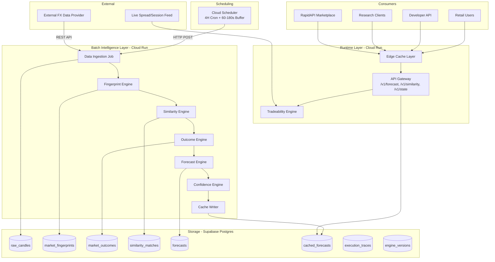
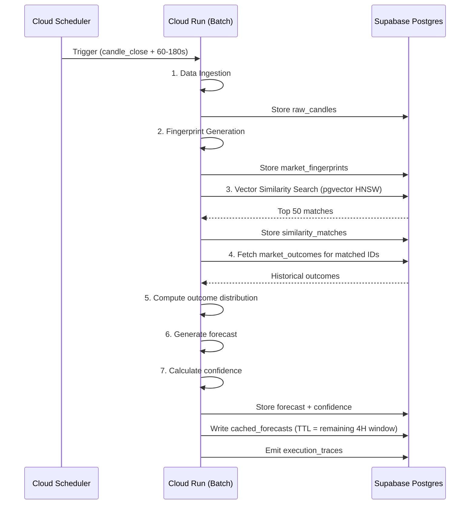

# Design Document: Financial Intelligence Platform

## Overview

The Financial Intelligence Platform is a batch-driven, cost-efficient system for modelling 4-hour FX market behaviour. It produces deterministic market fingerprints, retrieves historically similar states via vector search, computes empirical outcome distributions, generates probabilistic forecasts with calibrated confidence scores, and evaluates real-time tradeability at API request time.

The architecture enforces a strict two-layer separation:

- **Batch Intelligence Layer**: Runs every 4 hours after candle close. Computes fingerprints, similarity matches, outcome distributions, forecasts, and confidence scores. All outputs are deterministic, versioned, and cached.
- **Runtime Execution Layer**: Runs per API request. Merges cached batch intelligence with live market conditions (spread, session, news risk) to produce a tradeability assessment.

**MVP Scope**: EUR/USD only, 4H timeframe only, single region (GCP), Supabase Postgres with pgvector, Cloud Run compute, £20/month cost ceiling.

### Key Design Decisions

| Decision | Rationale |
|----------|-----------|
| Batch-only intelligence (Mode A) | Eliminates streaming cost, ensures data finality |
| pgvector + HNSW on Supabase | Single-node vector search within budget |
| Cloud Run ephemeral compute | Pay-per-invocation, no always-on cost |
| Edge caching with dynamic TTL | Near-zero marginal cost per API request |
| Frozen weight matrices per regime | Determinism, no hidden learning loops |
| Strict engine isolation | Prevents cross-engine leakage and ensures reproducibility |
| Extensible fingerprint schema | Reserve space for future state layers (S/R topology, indicators) without schema migration |
| Fingerprint as "complete market state" | Not just price — everything known at a UTC timestamp |
| Structured explainability metadata | Every match carries matched/mismatched layer breakdown |
| Probability-first, not prediction-first | Platform communicates statistical reality, never prescriptive signals |

### Architectural Evolution Path

The current architecture is designed so that a future **Research Snapshot** layer can be inserted additively:

```
MVP (Now):                         Future (v2+):
Raw Data                           Raw Market Data
  ↓                                  ↓
Fingerprint                        Market State Builder
  ↓                                  ↓
Similarity                         Research Snapshot (master object)
  ↓                                  ↓
Outcome                            Fingerprint Generator (derived)
  ↓                                  ↓
Forecast                           Similarity Engine
                                     ↓
                                   Outcome / Forecast
```

The Research Snapshot would capture everything known at a specific point in time (price action, technical indicators, S/R topology, macro events, correlated assets, sentiment). The Fingerprint would become a deterministic representation *derived from* that snapshot. Today's schemas are designed so this transition is additive — no redesign required.

---

## Architecture

### High-Level System Architecture



### Batch Pipeline Sequence



---

## Data Sources & Ingestion Architecture

### Historical Baseline Dataset

The platform has **6 years of historical 4H EUR/USD candle data** already stored in Supabase from the existing MVP project. This dataset serves as the initial similarity matching corpus and provides sufficient depth for the minimum 3-5 year recommendation from the platform execution principles.

### Data Provider Registry

| Provider | Purpose | Tier | State Layer Mapping | Rate Limits |
|----------|---------|------|--------------------:|-------------|
| **Twelve Data** (Primary) | 4H EUR/USD candles | Free | L1 (market_structure), L2 (volatility) | 800 req/day, 8 req/min |
| **Twelve Data** | Market context: DXY, VIX, S&P 500 (4H) | Free | L4 (macro_context) | Shared quota with above |
| **Massive API** (Fallback) | 4H candles if Twelve Data fails | Paid (intraday) | L1, L2 | Per-plan limits |
| **Yahoo Finance** (Emergency) | 4H candles last resort | Free | L1, L2 | Unofficial, no SLA |
| **Finnhub** | Market news articles | Free | L5 (sentiment_pressure) | 60 req/min |
| **NewsAPI** | General financial news | Free | L5 (sentiment_pressure) | 100 req/day (free) |
| **Alpha Vantage** | Economic calendar (CPI, NFP, GDP, rates) | Free | L5 (sentiment_pressure) | 25 req/day |
| **Alpha Vantage** | US 10Y Treasury yield | Free | L4 (macro_context) | Shared quota with above |

### Provider-to-State-Layer Mapping

```
State Layer                    Primary Source         Fallback Source       Emergency
─────────────────────────────────────────────────────────────────────────────────────
L1: Market Structure Vector    Twelve Data (4H OHLC)  Massive API           Yahoo Finance
L2: Volatility Vector          Twelve Data (4H OHLC)  Massive API           Yahoo Finance
L3: Liquidity Vector           Derived from L1 data   —                     —
L4: Macro Context Vector       Twelve Data (DXY, VIX, SPX) + Alpha Vantage (US10Y)  —
L5: Sentiment Pressure Vector  Finnhub + NewsAPI + Alpha Vantage (econ calendar)     —
```

### Fallback Hierarchy

The ingestion service follows a strict fallback chain for OHLC data:

1. **Twelve Data** — Primary source, free tier, proven reliable
2. **Massive API** — Paid fallback, activated only on Twelve Data failure
3. **Yahoo Finance** — Emergency last resort, no SLA guarantees

For each 4H ingestion cycle:
- Attempt primary source with 10-second timeout
- On failure, log the error and attempt fallback source
- On second failure, attempt emergency source
- On all sources failing, skip the cycle and log the data gap (per Requirement 1.7)

### Ingestion Schedule Alignment

All data is fetched **60-180 seconds after candle close** (per platform execution principles):

```
Candle Close    Ingestion Trigger    Sources Fetched
────────────────────────────────────────────────────────────────
00:00 UTC       00:02 UTC            OHLC + Macro + Sentiment
04:00 UTC       04:02 UTC            OHLC + Macro + Sentiment
08:00 UTC       08:02 UTC            OHLC + Macro + Sentiment
12:00 UTC       12:02 UTC            OHLC + Macro + Sentiment
16:00 UTC       16:02 UTC            OHLC + Macro + Sentiment
20:00 UTC       20:02 UTC            OHLC + Macro + Sentiment
```

### API Key Management

- All provider API keys stored as environment variables in Cloud Run (never in code)
- Keys rotated quarterly as part of the dependency audit cycle
- Free tier rate limits tracked per-cycle to avoid exhaustion
- No single provider dependency — system degrades gracefully on any provider failure

### Gemini Model Integration

The platform uses the **`@google/genai` SDK** (Google Gen AI SDK) for all Gemini model interactions in the forex probability system. This applies to:
- LLM reasoning layer for forecast interpretation (per 15.2.2 Model-Agnostic Forecasting)
- Structured explanation generation for the `explain` response mode
- Future ensemble model contributions

**Integration rules:**
- Gemini interactions MUST NOT occur within the batch intelligence pipeline (they are additive interpretation, not core forecasting)
- Gemini outputs MUST be versioned and labelled as model-derived content
- Gemini MUST NOT modify or override statistical forecast outputs from the Outcome/Forecast engines
- The `@google/genai` SDK version MUST follow the dependency management rules (15.5.4 — latest stable)

### Cost Impact of Data Sources

| Provider | Monthly Cost (MVP) | Notes |
|----------|-------------------|-------|
| Twelve Data | £0 | Free tier sufficient for 6 calls/day |
| Alpha Vantage | £0 | Free tier, 25 req/day is adequate |
| Finnhub | £0 | Free tier, 60 req/min is generous |
| NewsAPI | £0 | Free tier, 100 req/day sufficient |
| Massive API | ~£5-10 | Only charged on fallback activation |
| Yahoo Finance | £0 | Free, unofficial |
| Google Gemini | £0-5 | Free tier / pay-per-token as needed |
| **Total data cost** | **£0-15/month** | Within overall £50 budget |

---

## Components and Interfaces

### Component Contracts

#### 1. Data Ingestion Service

**Responsibility**: Fetch 4H OHLC data from external provider, resample to canonical UTC grid, handle Sunday candle merging.

```typescript
interface IngestionInput {
  asset: string;           // "EURUSD"
  timeframe: string;       // "4H"  
  candle_boundary: string; // ISO-8601 UTC timestamp
}

interface IngestionOutput {
  asset: string;
  timestamp_utc: string;
  ohlc: { open: number; high: number; low: number; close: number };
  volume?: number;
  ingestion_time: string;
}
```

#### 2. Fingerprint Engine

**Responsibility**: Transform resampled OHLC and market context into a deterministic market state fingerprint representing *everything known about the market at one exact UTC timestamp*.

The Fingerprint is the platform's primary research object. It represents the complete market state — not just price, but structure, volatility, liquidity topology, macro context, and sentiment. The schema is designed to be extensible: new state layers (S/R topology, indicator profiles, order flow) are additive changes, not migrations.

```typescript
interface FingerprintInput {
  asset: string;
  timestamp_utc: string;
  ohlc: OHLC;
  market_context?: MacroContext; // DXY, correlated pairs, etc.
}

interface Fingerprint {
  fingerprint_id: string;        // deterministic: hash(asset + timestamp_utc)
  asset: string;
  timeframe: string;
  timestamp_utc: string;
  market_state_version: string;
  ohlc: OHLC;
  return_profile: { net_return_pips: number; range_pips: number };
  regime: {
    volatility_regime: "LOW" | "NORMAL" | "HIGH";
    trend_regime: "BULLISH" | "BEARISH" | "RANGING";
    session: "ASIA" | "LONDON" | "NY";
  };
  // State layers — each independently computed, normalised, and comparable
  // Named "state layers" to distinguish from ML embeddings
  state_layers: {
    market_structure: number[];   // L1: Price geometry, swing structure, HH/HL patterns
    volatility_profile: number[]; // L2: ATR percentiles, candle distribution, expansion/contraction
    liquidity_field: number[];    // L3: S/R density field, price-relative pressure mapping
    macro_context: number[];      // L4: Cross-asset alignment scores (DXY, SPX, Gold, VIX)
    sentiment_pressure: number[]; // L5: Event timelines, news classification, risk proxies
  };
  // Reserved for future state layers (additive, no migration needed)
  extended_state?: {
    support_resistance_topology?: SupportResistanceTopology;
    indicator_profile?: IndicatorProfile;
    order_flow_summary?: OrderFlowSummary;
  };
  normalisation: {
    quantile_table_version: string;
    scaling_method: string;
  };
}

// First-class S/R object — reserved for v2 implementation
interface SupportResistanceTopology {
  levels: Array<{
    price: number;
    strength: number;       // 0-1 normalised
    touch_count: number;
    distance_pips: number;  // from current price
    type: "support" | "resistance" | "flip_zone";
  }>;
  density_field: number[];  // Fixed-length spatial representation
}
```

> **Naming note**: State layers are called "state layers" (not "vectors") to avoid confusion with ML embeddings. These are interpretable, independently-computed feature profiles — not learned representations. In the database, column names retain `_vector` suffix for pgvector compatibility.

#### 3. Similarity Engine

**Responsibility**: Retrieve top 50 historically similar fingerprints using three-tiered pipeline.

```typescript
interface SimilarityInput {
  query_fingerprint: Fingerprint;
  top_n: number;  // default 50
}

interface SimilarityMatch {
  fingerprint_id: string;
  match_fingerprint_id: string;
  similarity_score: number;  // 0.000000 to 1.000000
  rank: number;
  layer_breakdown: {
    market_structure: number;
    volatility: number;
    liquidity: number;
    macro: number;
    sentiment: number;
  };
  // Structured explainability — enables API to explain WHY a match was selected
  // without rerunning the engine
  match_explanation: {
    matched_layers: string[];    // e.g., ["market_structure", "volatility", "liquidity"]
    mismatched_layers: string[]; // e.g., ["sentiment", "macro"]
    primary_match_reason: string; // e.g., "strong_structural_alignment"
  };
  batch_id: string;
}

interface SimilarityOutput {
  matches: SimilarityMatch[];
  match_count: number;
  regime_weights_used: RegimeWeightMatrix;
}
```

#### 4. Outcome Distribution Engine

**Responsibility**: Compute empirical outcome distribution from matched fingerprint IDs only.

```typescript
interface OutcomeInput {
  fingerprint_ids: string[];  // matched historical IDs only
}

interface OutcomeDistribution {
  fingerprint_id: string;     // query fingerprint
  sample_size: number;
  mean_return: number;
  median_return: number;
  direction_probability: { up: number; down: number; flat: number };
  volatility_profile: { std_dev: number; max_absolute_return: number };
  risk_range: { p10: number; p50: number; p90: number };
  confidence_inputs: { regime_consistency: number; distribution_sharpness: number };
  batch_id: string;
  engine_version: string;
}
```

#### 5. Forecast Engine

**Responsibility**: Convert outcome distribution into directional probabilities and expected move.

```typescript
interface ForecastInput {
  outcome_distribution: OutcomeDistribution;
}

interface Forecast {
  fingerprint_id: string;
  direction_probabilities: { up: number; down: number; flat: number }; // sum = 1.00
  expected_move_pips: number;
  confidence_raw: number;
  confidence_final: number;
  engine_version: string;
  batch_id: string;
}
```

#### 6. Confidence Engine

**Responsibility**: Calculate statistically bounded confidence score.

```typescript
interface ConfidenceInput {
  up_probability: number;
  down_probability: number;
  flat_probability: number;
  sample_size: number;
  variance: number;
  skew: number;
  kurtosis: number;
  mean_similarity: number;
  similarity_spread: number;
  top_match_density: number;
  regime_metadata: RegimeOverlapContext;
}

interface ConfidenceOutput {
  confidence_raw: number;    // C_raw ∈ [0, 1]
  sample_weight: number;     // S(N) = min(1.0, N / 30)
  regime_stability: number;  // R ∈ [0, 1]
  confidence_final: number;  // C_raw × S(N) × R, bounded [0, 1]
}
```

#### 7. Tradeability Engine (Runtime)

**Responsibility**: Evaluate execution feasibility at API request time.

```typescript
interface TradeabilityInput {
  // Static (from cache)
  forecast: Forecast;
  // Dynamic (live at request time)
  spread_pips: number;
  session_state: "ASIA" | "LONDON" | "NY";
  live_liquidity_proxy: number;
  news_risk_flag: boolean;
}

interface TradeabilityOutput {
  tradeability_score: number;  // 0.00 to 1.00
  tradeability_label: "GO" | "CONDITIONAL" | "NO_GO";
  execution_metrics: {
    spread_penalty: "low" | "medium" | "high";
    session_alignment: "optimal" | "suboptimal" | "poor";
    news_buffer_status: "clear" | "warning" | "blocked";
  };
}
```

#### 8. API Gateway

**Endpoints**:

| Endpoint | Method | Description |
|----------|--------|-------------|
| `/v1/forecast/{asset}` | GET | Returns cached forecast + real-time tradeability |
| `/v1/similarity/{asset}` | GET | Returns current similarity matches (premium tier) |
| `/v1/state/{asset}` | GET | Returns active regime and session state |

---

## Data Models

### Database Schema (Supabase Postgres + pgvector)

#### Table: `raw_candles`

```sql
CREATE TABLE raw_candles (
    id UUID PRIMARY KEY DEFAULT gen_random_uuid(),
    asset VARCHAR(10) NOT NULL,
    timeframe VARCHAR(4) NOT NULL DEFAULT '4H',
    timestamp_utc TIMESTAMP WITH TIME ZONE NOT NULL,
    open NUMERIC(10, 5) NOT NULL,
    high NUMERIC(10, 5) NOT NULL,
    low NUMERIC(10, 5) NOT NULL,
    close NUMERIC(10, 5) NOT NULL,
    volume NUMERIC,
    ingestion_time TIMESTAMP WITH TIME ZONE DEFAULT NOW(),
    batch_id UUID NOT NULL,
    CONSTRAINT uq_candle UNIQUE (asset, timeframe, timestamp_utc)
);

CREATE INDEX idx_raw_candles_asset_time ON raw_candles (asset, timeframe, timestamp_utc DESC);
```

#### Table: `market_fingerprints`

```sql
CREATE TABLE market_fingerprints (
    fingerprint_id UUID PRIMARY KEY,  -- deterministic from asset + timestamp_utc
    asset VARCHAR(10) NOT NULL,
    timeframe VARCHAR(4) NOT NULL DEFAULT '4H',
    timestamp_utc TIMESTAMP WITH TIME ZONE NOT NULL,
    market_state_version VARCHAR(10) NOT NULL,
    ohlc JSONB NOT NULL,
    return_profile JSONB NOT NULL,
    regime JSONB NOT NULL,
    -- 5 state layers stored as pgvector columns (named _vector for pgvector compat)
    -- Each independently computed, normalised to [0,1], no cross-layer leakage
    market_structure_vector vector(16),   -- L1: Price geometry, swing structure
    volatility_vector vector(12),          -- L2: ATR percentiles, dispersion
    liquidity_vector vector(20),           -- L3: S/R density field
    macro_vector vector(8),                -- L4: Cross-asset alignment
    sentiment_vector vector(6),            -- L5: Event/news pressure
    -- Extensible state (JSONB for future layers without schema migration)
    extended_state JSONB DEFAULT '{}',     -- Reserved: S/R topology, indicators, order flow
    -- Normalisation binding
    quantile_table_version VARCHAR(10) NOT NULL,
    scaling_method VARCHAR(20) NOT NULL DEFAULT 'fixed',
    session VARCHAR(10) NOT NULL,
    created_at TIMESTAMP WITH TIME ZONE DEFAULT NOW(),
    batch_id UUID NOT NULL,
    CONSTRAINT uq_fingerprint UNIQUE (asset, timeframe, timestamp_utc)
) PARTITION BY LIST (asset);

-- MVP partition for EUR/USD
CREATE TABLE market_fingerprints_eurusd PARTITION OF market_fingerprints
    FOR VALUES IN ('EURUSD');

-- Partial HNSW indexes per state layer (scoped to asset + timeframe)
-- Cosine similarity for structural/directional layers (L1, L2, L3)
CREATE INDEX idx_fp_ms_vector ON market_fingerprints_eurusd 
    USING hnsw (market_structure_vector vector_cosine_ops)
    WHERE timeframe = '4H';

CREATE INDEX idx_fp_vol_vector ON market_fingerprints_eurusd 
    USING hnsw (volatility_vector vector_cosine_ops)
    WHERE timeframe = '4H';

CREATE INDEX idx_fp_liq_vector ON market_fingerprints_eurusd 
    USING hnsw (liquidity_vector vector_cosine_ops)
    WHERE timeframe = '4H';

-- Euclidean distance for magnitude-based layers (L4, L5)
CREATE INDEX idx_fp_macro_vector ON market_fingerprints_eurusd 
    USING hnsw (macro_vector vector_l2_ops)
    WHERE timeframe = '4H';

CREATE INDEX idx_fp_sent_vector ON market_fingerprints_eurusd 
    USING hnsw (sentiment_vector vector_l2_ops)
    WHERE timeframe = '4H';

-- Filtering indexes for pre-similarity gate
CREATE INDEX idx_fp_regime ON market_fingerprints_eurusd (asset, timeframe, (regime->>'trend_regime'), (regime->>'volatility_regime'));
CREATE INDEX idx_fp_session ON market_fingerprints_eurusd (asset, timeframe, session);
```

> **Extensibility note**: The `extended_state` JSONB column allows future state layers (S/R topology, indicator profiles, order flow summaries) to be stored without schema migration. When a layer matures, it can optionally be promoted to a dedicated pgvector column for similarity search.

#### Table: `market_outcomes`

```sql
CREATE TABLE market_outcomes (
    outcome_id UUID PRIMARY KEY DEFAULT gen_random_uuid(),
    fingerprint_id UUID NOT NULL REFERENCES market_fingerprints(fingerprint_id),
    horizon VARCHAR(4) NOT NULL DEFAULT '4H',
    net_return_pips NUMERIC(10, 2) NOT NULL,
    max_favourable_excursion NUMERIC(10, 2) NOT NULL,
    max_adverse_excursion NUMERIC(10, 2) NOT NULL,
    realised_volatility NUMERIC(10, 4) NOT NULL,
    timestamp_utc TIMESTAMP WITH TIME ZONE NOT NULL,
    batch_id UUID,
    engine_version VARCHAR(10),
    CONSTRAINT uq_outcome UNIQUE (fingerprint_id, horizon)
);

CREATE INDEX idx_outcomes_fp ON market_outcomes (fingerprint_id);
CREATE INDEX idx_outcomes_fp_horizon ON market_outcomes (fingerprint_id, horizon);
```

#### Table: `similarity_matches`

```sql
CREATE TABLE similarity_matches (
    id UUID PRIMARY KEY DEFAULT gen_random_uuid(),
    fingerprint_id UUID NOT NULL,
    match_fingerprint_id UUID NOT NULL,
    similarity_score NUMERIC(8, 6) NOT NULL,  -- 6 decimal places
    rank SMALLINT NOT NULL,
    layer_breakdown JSONB NOT NULL,
    batch_id UUID NOT NULL,
    engine_version VARCHAR(10) NOT NULL,
    created_at TIMESTAMP WITH TIME ZONE DEFAULT NOW(),
    CONSTRAINT uq_sim_match UNIQUE (fingerprint_id, match_fingerprint_id, batch_id)
);

CREATE INDEX idx_sim_fp ON similarity_matches (fingerprint_id, batch_id);
CREATE INDEX idx_sim_rank ON similarity_matches (fingerprint_id, rank);
```

#### Table: `forecasts`

```sql
CREATE TABLE forecasts (
    id UUID PRIMARY KEY DEFAULT gen_random_uuid(),
    fingerprint_id UUID NOT NULL,
    direction_probabilities JSONB NOT NULL,  -- {up, down, flat}
    expected_move_pips NUMERIC(8, 2) NOT NULL,
    confidence_raw NUMERIC(5, 4) NOT NULL,
    confidence_final NUMERIC(5, 4) NOT NULL,
    sample_size INTEGER NOT NULL,
    batch_id UUID NOT NULL,
    engine_version VARCHAR(10) NOT NULL,
    quantile_table_version VARCHAR(10) NOT NULL,
    fingerprint_schema_version VARCHAR(10) NOT NULL,
    created_at TIMESTAMP WITH TIME ZONE DEFAULT NOW(),
    CONSTRAINT uq_forecast UNIQUE (fingerprint_id, batch_id)
);

CREATE INDEX idx_forecast_fp ON forecasts (fingerprint_id, created_at DESC);
```

#### Table: `cached_forecasts`

```sql
CREATE TABLE cached_forecasts (
    asset VARCHAR(10) PRIMARY KEY,  -- one active cache per asset
    fingerprint_id UUID NOT NULL,
    payload JSONB NOT NULL,
    batch_id UUID NOT NULL,
    valid_from TIMESTAMP WITH TIME ZONE NOT NULL,
    valid_until TIMESTAMP WITH TIME ZONE NOT NULL,  -- TTL boundary
    created_at TIMESTAMP WITH TIME ZONE DEFAULT NOW()
);

CREATE INDEX idx_cached_asset ON cached_forecasts (asset) WHERE valid_until > NOW();
```

#### Table: `execution_traces`

```sql
CREATE TABLE execution_traces (
    id UUID PRIMARY KEY DEFAULT gen_random_uuid(),
    batch_id UUID NOT NULL,
    engine_name VARCHAR(30) NOT NULL,
    engine_version VARCHAR(10) NOT NULL,
    input_hash VARCHAR(64) NOT NULL,   -- SHA-256
    output_hash VARCHAR(64) NOT NULL,  -- SHA-256
    execution_time_ms INTEGER NOT NULL,
    sample_size INTEGER,
    status VARCHAR(10) NOT NULL DEFAULT 'success',  -- success | error
    error_detail TEXT,
    timestamp_utc TIMESTAMP WITH TIME ZONE DEFAULT NOW()
);

CREATE INDEX idx_trace_batch ON execution_traces (batch_id, engine_name);
```

#### Table: `batch_runs`

```sql
CREATE TABLE batch_runs (
    batch_id UUID PRIMARY KEY DEFAULT gen_random_uuid(),
    trigger_time TIMESTAMP WITH TIME ZONE NOT NULL,
    candle_boundary TIMESTAMP WITH TIME ZONE NOT NULL,
    status VARCHAR(20) NOT NULL DEFAULT 'running',  -- running | completed | failed | timeout
    engine_versions JSONB NOT NULL,  -- snapshot of all engine versions used
    total_duration_ms INTEGER,
    completed_at TIMESTAMP WITH TIME ZONE,
    failure_detail TEXT,
    created_at TIMESTAMP WITH TIME ZONE DEFAULT NOW()
);
```

#### Table: `engine_versions`

```sql
CREATE TABLE engine_versions (
    id UUID PRIMARY KEY DEFAULT gen_random_uuid(),
    engine_name VARCHAR(30) NOT NULL,
    engine_version VARCHAR(10) NOT NULL,
    quantile_table_version VARCHAR(10),
    fingerprint_schema_version VARCHAR(10),
    config JSONB NOT NULL,  -- frozen weight matrices, thresholds, etc.
    activated_at TIMESTAMP WITH TIME ZONE NOT NULL,
    is_active BOOLEAN NOT NULL DEFAULT true,
    CONSTRAINT uq_engine_ver UNIQUE (engine_name, engine_version)
);
```

#### Table: `api_keys`

```sql
CREATE TABLE api_keys (
    id UUID PRIMARY KEY DEFAULT gen_random_uuid(),
    key_hash VARCHAR(64) NOT NULL UNIQUE,  -- SHA-256 of the API key
    tier VARCHAR(20) NOT NULL,  -- retail | developer | research | internal
    rate_limit_rpm INTEGER NOT NULL DEFAULT 100,
    is_active BOOLEAN NOT NULL DEFAULT true,
    created_at TIMESTAMP WITH TIME ZONE DEFAULT NOW(),
    last_used_at TIMESTAMP WITH TIME ZONE
);
```

### Partitioning Strategy

| Table | Partition Key | Strategy | Rationale |
|-------|--------------|----------|-----------|
| `market_fingerprints` | `asset` | LIST | Isolates HNSW indexes per asset, prevents cross-asset graph traversal |
| `market_outcomes` | None (MVP) | N/A | Single asset, indexed by fingerprint_id |
| `similarity_matches` | None (MVP) | N/A | Pruned per batch, moderate volume |

### Index Strategy Summary

| Index Type | Tables | Purpose |
|-----------|--------|---------|
| HNSW (cosine) | fingerprints (L1, L2, L3) | Fast ANN for structural vectors |
| HNSW (L2) | fingerprints (L4, L5) | Fast ANN for magnitude vectors |
| B-tree | All tables | Filtering, uniqueness, lookups |
| Partial | HNSW indexes | Scoped to asset + timeframe |


---

## Correctness Properties

*A property is a characteristic or behavior that should hold true across all valid executions of a system — essentially, a formal statement about what the system should do. Properties serve as the bridge between human-readable specifications and machine-verifiable correctness guarantees.*

### Property 1: Engine Determinism

*For any* engine (Fingerprint, Similarity, Outcome, Forecast, Confidence) and *for any* valid input, executing the engine twice with identical inputs, identical engine_version, and identical reference data versions SHALL produce bit-identical output.

**Validates: Requirements 1.2, 2.6, 5.4, 10.5, 13.1**

### Property 2: Engine Output Schema Completeness

*For any* engine execution that completes successfully, the output SHALL contain all schema-required fields including engine_version, quantile_table_version (where applicable), fingerprint_schema_version (where applicable), and sufficient metadata for independent auditability.

**Validates: Requirements 1.3, 2.3, 3.5, 4.4, 5.5, 10.1, 16.1**

### Property 3: Fingerprint Serialization Round-Trip

*For any* valid Fingerprint object, serialising to canonical JSON (lexicographic key ordering, consistent number formatting), then parsing back into a Fingerprint object, then serialising again SHALL produce byte-identical output to the first serialisation.

**Validates: Requirements 15.1, 15.2, 15.3**

### Property 4: Similarity Pre-Filter Correctness

*For any* query fingerprint and *for any* candidate set, all fingerprints passing the pre-filter stage SHALL match the query fingerprint's asset and timeframe, and SHALL satisfy the regime metadata filter constraints.

**Validates: Requirements 2.2**

### Property 5: Outcome Distribution Equal Weighting

*For any* set of matched historical fingerprint IDs with associated forward returns, the computed outcome distribution SHALL be identical regardless of the similarity scores associated with those matches. Specifically, reordering matches or changing their similarity scores SHALL NOT alter the distribution output.

**Validates: Requirements 3.1, 3.4**

### Property 6: FLAT Threshold Classification

*For any* continuous forward return value R, the directional classification SHALL be: UP when R > +2 pips, DOWN when R < -2 pips, and FLAT when |R| ≤ 2 pips. The sum of UP count + DOWN count + FLAT count SHALL equal the total sample size.

**Validates: Requirements 3.3**

### Property 7: Forecast Probability Normalisation

*For any* valid outcome distribution input to the Forecast Engine, the output directional probabilities (up + down + flat) SHALL sum to exactly 1.00 (with each individual probability in the range [0.00, 1.00]).

**Validates: Requirements 4.3**

### Property 8: Confidence Formula Correctness

*For any* valid inputs where C_raw ∈ [0, 1], S(N) ∈ [0, 1], and R ∈ [0, 1], the confidence engine SHALL compute C_final = C_raw × S(N) × R, and C_final SHALL be bounded within [0.0, 1.0].

**Validates: Requirements 5.1**

### Property 9: Sample Size Dampener Cap

*For any* sample size N where N < 30, the Sample_Size_Dampener S(N) SHALL not exceed 0.5, resulting in Confidence_Final being reduced to at most 50% of the undampened value (C_raw × R).

**Validates: Requirements 5.3**

### Property 10: Cache TTL Calculation

*For any* timestamp within a 4H candle window, the computed TTL SHALL equal the difference between the candle window end time and the current time. For timestamps where remaining time < 60 seconds, TTL SHALL be set to 0.

**Validates: Requirements 6.1, 6.2**

### Property 11: Tradeability Score Formula

*For any* valid static inputs (forecast confidence, historical stability) and *for any* valid dynamic inputs (spread, session, liquidity, news risk), the Tradeability Score SHALL equal S_static × D_dynamic and SHALL be bounded within [0.00, 1.00].

**Validates: Requirements 7.1**

### Property 12: Tradeability Label Banding

*For any* computed tradeability_score, the assigned label SHALL be: "GO" when score > 0.75, "CONDITIONAL" when score is in [0.45, 0.75], and "NO_GO" when score < 0.45. Exactly one label SHALL be assigned per evaluation.

**Validates: Requirements 7.2**

### Property 13: Tradeability Graceful Degradation

*For any* API request where one or more dynamic runtime data sources (spread, session, or news risk) are unavailable, the Tradeability Engine SHALL assign label "NO_GO", set score to 0, and include an indication of which source was unavailable.

**Validates: Requirements 7.5**

### Property 14: Tier-Based Response Filtering

*For any* full forecast response and *for any* customer tier, the filtered response SHALL contain only the fields authorised for that tier. Specifically: retail tier SHALL NOT receive raw vectors or similarity matrices; developer tier SHALL receive probability vectors and similarity scores; research tier SHALL receive full historical distributions.

**Validates: Requirements 11.1, 11.2, 11.3**

### Property 15: Execution Trace Emission

*For any* engine execution (whether successful or failed), a structured execution trace SHALL be emitted containing input_hash, output_hash, execution_time_ms, engine_version, and sample_size (where applicable).

**Validates: Requirements 16.1, 16.3**

---

## Error Handling

### Pipeline Failure Modes

| Failure Mode | Detection | Response | Recovery |
|-------------|-----------|----------|----------|
| External data provider unavailable | HTTP timeout/error during ingestion | Skip asset for this cycle, log gap | Retry on next 4H cycle |
| Incomplete OHLC data | Missing fields or partial candle | Skip fingerprint for that asset, log gap | Continue other assets |
| Fingerprint generation timeout (>120s) | Wall-clock timer | Record failure, continue remaining assets | Next cycle |
| Zero similarity matches | Empty result set from pgvector | Halt downstream for this asset, no forecast produced | Next cycle with more data |
| Fewer than 50 matches | Count < 50 after filtering | Proceed with available matches, record actual count | Confidence dampened by S(N) |
| Outcome engine empty input | fingerprint_ids array length = 0 | Return error, no distribution produced | Pipeline halts for asset |
| Forecast engine insufficient data | Sample size < 1 | Reject input, return error | No forecast cached |
| Confidence input out of range | C_raw, S(N), or R outside [0,1] | Reject calculation, return error with invalid field | Alert operator |
| Batch timeout (>15 minutes) | Global timer on Cloud Run job | Terminate entire batch, log timeout | Next scheduled cycle |
| Mid-batch new trigger | Cloud Scheduler fires while batch running | Queue new cycle, execute after current completes/fails | Sequential execution |
| Cache write failure | Database error on cached_forecasts | Log error, batch still considered complete | Stale cache serves until next successful batch |
| Tradeability dynamic data unavailable | Missing spread/session/news at request time | Return NO_GO with score 0, indicate missing source | Caller retries later |
| API key invalid/expired | Auth check failure | Return 401, no processing | Caller obtains valid key |
| Unsupported asset requested | Asset not in configured set | Return 400 with "asset not supported" | N/A |
| Execution trace emission failure | Engine completes but trace not written | Record missing trace event (engine_name, batch_id, timestamp) | Manual investigation |

### Graceful Degradation Hierarchy

```
Level 0: Full pipeline success → Complete forecast + tradeability served
Level 1: Sparse matches (N < 30) → Forecast served with dampened confidence
Level 2: Dynamic data partial failure → Forecast served with NO_GO tradeability
Level 3: Dynamic data complete failure → Forecast served with NO_GO score=0
Level 4: No cached forecast available → Error response "forecast unavailable"
Level 5: Batch pipeline failure → Previous cycle cache serves until TTL expires
```

### Error Response Schema

```json
{
  "error": true,
  "code": "FORECAST_UNAVAILABLE",
  "asset": "EURUSD",
  "message": "No forecast is currently available for this asset",
  "timestamp": "2026-01-01T08:15:00Z"
}
```

Error codes: `FORECAST_UNAVAILABLE`, `ASSET_NOT_SUPPORTED`, `INSUFFICIENT_TIER`, `RATE_LIMIT_EXCEEDED`, `INTERNAL_ERROR`

---

## Testing Strategy

### Property-Based Testing

**Library**: [fast-check](https://github.com/dubzzz/fast-check) (TypeScript/JavaScript PBT library)

**Configuration**: Minimum 100 iterations per property test.

**Tag format**: `Feature: financial-intelligence-platform, Property {N}: {description}`

Each correctness property from the design document maps to a single property-based test:

| Property | Test Focus | Generator Strategy |
|----------|-----------|-------------------|
| P1: Determinism | Run each engine twice with same input | Random valid OHLC, vectors, scores |
| P2: Schema completeness | Verify output fields | Random valid inputs per engine |
| P3: Serialization round-trip | serialize → parse → serialize | Random valid Fingerprint objects |
| P4: Pre-filter correctness | Verify filter outputs match criteria | Random fingerprints + filter criteria |
| P5: Equal weighting | Same returns with different scores | Random returns + random scores |
| P6: FLAT classification | Classify random returns | Random numeric values around ±2 threshold |
| P7: Probability sum | Verify up+down+flat=1.00 | Random valid distributions |
| P8: Confidence formula | Verify C_final = C_raw×S(N)×R | Random C_raw, N, R in valid ranges |
| P9: Dampener cap | Verify S(N)≤0.5 when N<30 | Random N in [1, 29] |
| P10: TTL calculation | Verify TTL = window_end - now | Random timestamps within 4H windows |
| P11: Tradeability formula | Verify score = S_static × D_dynamic | Random static/dynamic inputs |
| P12: Label banding | Verify label matches score range | Random scores in [0, 1] |
| P13: Graceful degradation | Missing inputs → NO_GO/0 | Random inputs with missing fields |
| P14: Tier filtering | Verify tier permissions | Random responses + random tiers |
| P15: Trace emission | Verify trace on success/error | Random engine executions |

### Unit Testing

Focus areas for example-based tests:

- **Boundary conditions**: Returns exactly at ±2 pip threshold, N=0, N=30, score exactly at 0.45 and 0.75 boundaries
- **Error paths**: Malformed JSON parsing, missing fields, invalid types, empty arrays
- **Integration contracts**: Verify each engine accepts its predecessor's exact output format
- **Sunday candle handling**: Specific examples of merge/discard behavior
- **Session boundary mapping**: Specific UTC timestamps mapping to correct sessions

### Integration Testing

- End-to-end pipeline execution with seeded database
- pgvector HNSW query correctness against known dataset
- Cache write/read/expire cycle
- API endpoint request/response contract validation
- Batch concurrency (queued execution when overlap)
- Cloud Scheduler → Cloud Run trigger flow

### Performance Testing

- Similarity search < 500ms with 5 years of 4H data (~6,570 fingerprints)
- Outcome retrieval + aggregation < 500ms
- Full API response (cached path) < 300ms at p95
- Full batch pipeline < 15 minutes

---

## Batch Pipeline Orchestration

### Trigger Schedule

Cloud Scheduler fires HTTP POST at: `00:02, 04:02, 08:02, 12:02, 16:02, 20:02 UTC` (2 minutes after candle close as minimum buffer; configurable 60-180s).

### Pipeline Stages

```
Stage 1: Data Ingestion       → Fetch + store raw_candles
Stage 2: Fingerprint Generation → Compute + store market_fingerprints  
Stage 3: Similarity Retrieval  → pgvector HNSW search + store similarity_matches
Stage 4: Outcome Computation   → Aggregate historical returns + compute distribution
Stage 5: Forecast Generation   → Convert distribution to probabilities
Stage 6: Confidence Scoring    → Apply C_final = C_raw × S(N) × R
Stage 7: Cache Writing         → Write cached_forecasts with TTL
```

Each stage emits an execution trace. Stages are strictly sequential — Stage N+1 only begins after Stage N succeeds.

### Failure Handling

- Any stage failure → halt pipeline, record failure in `batch_runs`, discard partial outputs
- Timeout (15 min global) → terminate Cloud Run instance
- Overlap detection → queue via database lock on `batch_runs` status

### Batch Completion Contract

A batch is marked `completed` in `batch_runs` only when all 7 stages succeed. The `cached_forecasts` entry is written atomically as part of Stage 7 and becomes visible to the Runtime Layer only after batch_runs.status = 'completed'.

---

## Caching Strategy

### Edge Cache (Product Layer)

- **Cache Key**: `{asset}:{timeframe}:{timestamp_bucket}`
- **TTL**: Dynamic = remaining time in current 4H window
- **Invalidation**: Automatic on TTL expiry (aligned to next candle boundary)
- **Implementation**: Cloudflare Workers KV or Cloud Run in-memory (MVP)

### Database Cache (`cached_forecasts` table)

- **Purpose**: Pre-computed forecast payloads for instant API response
- **Keyed by**: asset (one active entry per asset)
- **TTL**: `valid_until` timestamp = current candle boundary end
- **Write timing**: Only after full batch completion confirmed
- **Read path**: API Gateway reads cached_forecasts → if valid_until > NOW(), serve directly

### Cache Flow

```
Request → Edge Cache HIT? → Return (no DB hit)
                    ↓ MISS
         → cached_forecasts table → valid_until > NOW()? → Inject tradeability → Return
                    ↓ expired/missing
         → Return error "forecast unavailable"
```

### Cost Impact

With edge caching, identical requests within a 4H window hit the database exactly once. For 1,000 requests/day across 6 windows = ~167 requests/window, only 1 DB read per window per asset. This keeps Supabase query volume extremely low.

---

## Cost Optimisation Approach

### Budget Allocation (£50/month ceiling)

| Component | Estimated Cost | Notes |
|-----------|---------------|-------|
| Cloud Run (batch) | £5-10/month | 6 invocations/day × 30 days, ~2 min each |
| Cloud Run (API) | £3-8/month | 1,000 req/day, <300ms each |
| Supabase Postgres | £25/month | Pro plan with pgvector, 8GB storage |
| Cloud Scheduler | £0.10/month | 6 cron jobs |
| Edge caching | £0-5/month | Cloudflare free tier or minimal KV |
| **Total** | **£33-48/month** | Within ceiling |

### Cost Controls

1. **Cloud Run concurrency limit**: max 1 instance for batch, max 2 for API
2. **Cloud Run max instances**: hard cap at 3 total
3. **Batch timeout**: 15 minutes max (prevents runaway costs)
4. **No always-on services**: Everything ephemeral
5. **Edge caching**: Eliminates redundant DB reads within 4H windows
6. **Billing alarms**: Alert at £30, £40, £50 thresholds
7. **Kill-switch**: Disable non-critical batch tasks if budget exceeded
8. **Single asset MVP**: EUR/USD only limits data volume

### Scaling Cost Path

- **50 assets**: Requires Supabase Pro + additional storage (~£50-80/month)
- **Multi-region**: Deferred until revenue justifies (Level 4+)
- **Streaming**: Explicitly banned in MVP

---

## Versioning Strategy

### Version Artifacts

| Artifact | Format | Stored In | Updated When |
|----------|--------|-----------|--------------|
| `engine_version` | semver (e.g., "1.0.0") | `engine_versions` table | Algorithm change |
| `quantile_table_version` | "v1_0", "v1_1" | `engine_versions` table | Normalisation tables updated |
| `fingerprint_schema_version` | "v1_0", "v1_1" | `engine_versions` table | Fingerprint field changes |
| `market_state_version` | "v1.2" | Each fingerprint record | Market state encoding change |

### Version Locking During Batch

```sql
-- At batch start, snapshot current active versions
SELECT engine_name, engine_version, quantile_table_version, fingerprint_schema_version
FROM engine_versions
WHERE is_active = true;
```

This snapshot is stored in `batch_runs.engine_versions` (JSONB) and used consistently throughout the entire batch execution. No mid-batch version changes are permitted.

### Version Propagation

Every record written by any engine includes the version identifiers active at batch start:
- `market_fingerprints.market_state_version`
- `market_fingerprints.quantile_table_version`
- `similarity_matches.engine_version`
- `forecasts.engine_version`
- `forecasts.quantile_table_version`
- `forecasts.fingerprint_schema_version`

### API Versioning

- All endpoints prefixed with `/v1/`
- Breaking changes require new version prefix (`/v2/`)
- Response payloads include `api_version` field
- Backward compatibility enforced within major version

### Reproducibility Guarantee

Given a `batch_id`, the system can reproduce identical outputs by:
1. Reading `batch_runs.engine_versions` for the version snapshot
2. Reading `raw_candles` for the input data
3. Re-executing the pipeline with those exact versions and inputs

This enables full auditability and debugging of any historical forecast.


---

## Product & Customer Layer

### Design Principle

The forecasting engine produces universal market intelligence. The product layer adapts it for different audiences. No customer-specific logic exists inside the forecasting engine — all adaptation happens in the product layer.

### Customer Types & Response Contracts

| Customer Type | Access Pattern | Response Content | Revenue Model |
|--------------|---------------|------------------|---------------|
| Developers (API) | Structured JSON, machine consumption, versioned endpoints | Full probability vectors, similarity scores, metadata | Usage-based API (RapidAPI / direct billing) |
| Researchers | Full dataset access, backtesting tools | Historical distributions, feature-level transparency, export | Subscription / dataset licensing |
| Retail Traders | Visual dashboard, human-readable | Simplified direction, confidence %, tradeability score | SaaS dashboard subscription |
| Platform Integrators | API-first, embeddable intelligence | Multi-asset coverage, white-label compatible | Custom contracts / white-label |

### API Response Modes

The API endpoint accepts a `mode` query parameter that controls response depth:

| Mode | Endpoint | Content | Tier Access |
|------|----------|---------|-------------|
| `forecast` | GET /v1/forecast/{asset}?mode=forecast | Core prediction: direction_probabilities, expected_move, confidence_final | All tiers |
| `trade` | GET /v1/forecast/{asset}?mode=trade | Prediction + tradeability_score, tradeability_label, execution_metrics | All tiers |
| `explain` | GET /v1/forecast/{asset}?mode=explain | Prediction + reasoning: top matched layers, regime context, match explanation | Developer+ |
| `raw` | GET /v1/forecast/{asset}?mode=raw | Full machine dataset: all vectors, similarity breakdown, confidence components | Developer+ |
| `research` | GET /v1/forecast/{asset}?mode=research | Full historical dataset: outcome distributions, variance, skew, kurtosis, risk_range | Research+ |

Default mode (no parameter): `trade`

### Response Mode Architecture

```typescript
interface ResponseModeRouter {
  // Takes full internal forecast payload, strips to tier-appropriate fields
  filterByMode(fullPayload: InternalForecastPayload, mode: ResponseMode, tier: CustomerTier): ExternalResponse;
}

type ResponseMode = 'forecast' | 'trade' | 'explain' | 'raw' | 'research';
type CustomerTier = 'retail' | 'developer' | 'research' | 'integrator' | 'internal';

// Access matrix
const MODE_ACCESS: Record<ResponseMode, CustomerTier[]> = {
  forecast: ['retail', 'developer', 'research', 'integrator', 'internal'],
  trade: ['retail', 'developer', 'research', 'integrator', 'internal'],
  explain: ['developer', 'research', 'integrator', 'internal'],
  raw: ['developer', 'research', 'integrator', 'internal'],
  research: ['research', 'integrator', 'internal'],
};
```

### Product Layer Isolation Rule

The product layer is a **view layer only**. It:
- Reads from cached_forecasts and similarity_matches
- Filters fields based on tier + mode
- Formats output for the target audience
- Applies rate limiting per tier
- Handles authentication and authorization

It MUST NOT:
- Modify forecast probabilities
- Recompute statistics
- Access raw fingerprint vectors directly (except via authorized mode)
- Contain forecasting logic
- Store customer-specific prediction state

### Monetisation-to-Tier Mapping

```
Revenue Stream                    → Tier         → Rate Limit      → Modes Available
──────────────────────────────────────────────────────────────────────────────────────
RapidAPI / direct billing         → developer    → 100 req/min     → forecast, trade, explain, raw
Subscription / dataset licensing  → research     → 50 req/min      → all modes
SaaS dashboard subscription       → retail       → 30 req/min      → forecast, trade
Custom contracts / white-label    → integrator   → negotiated      → all modes
Internal tooling                  → internal     → unlimited       → all modes
```

---

## Engineering Standards, Documentation & Governance

### 15.1 Purpose

This appendix defines the engineering, documentation, and design standards for the Financial Intelligence Platform. Its purpose ensures:
- New developers can onboard without architectural confusion
- Stakeholders can understand system behaviour without technical ambiguity
- Future expansion does not degrade system integrity
- All components remain measurable, testable, and replaceable

This appendix is a **hard standard**, not guidance.

### 15.2 Core Engineering Principles

All system design MUST follow these principles:

#### 15.2.1 Separation of Concerns
Each layer must be strictly isolated:
- Data ingestion ≠ feature engineering ≠ forecasting ≠ product output
- No business logic inside data pipelines
- No customer logic inside forecasting engine

#### 15.2.2 Model-Agnostic Forecasting
The system MUST NOT depend on a single model type. Supported forecasting approaches include:
- Historical similarity retrieval
- Statistical models
- Machine learning models
- LLM reasoning layer
- Ensemble systems

Forecast outputs must remain consistent regardless of model implementation.

#### 15.2.3 Asset-Agnostic Design
No component may assume:
- Forex-only logic
- Currency pair structure
- Single-market behaviour

All systems must operate on Research Asset abstraction.

#### 15.2.4 Evidence-Based Design
No feature, indicator, or subsystem is valid unless it:
- Improves forecast accuracy OR
- Improves interpretability OR
- Improves evaluability

Subjective usefulness is not valid justification.

#### 15.2.5 Historical Truth Principle
All system evaluation MUST be grounded in actual future outcomes vs predicted outcomes. No simulated validation is allowed in production logic.

### 15.3 Required System Documentation Standards

Every system component MUST include documentation in the following format:

#### 15.3.1 Component Specification Document (CSD)
Each module must have a CSD containing:
- **Purpose**: What the component does, what problem it solves
- **Inputs**: Data sources, schema definitions, update frequency
- **Outputs**: Data structures, consumers of output
- **Dependencies**: External systems, internal modules
- **Failure Modes**: Known failure conditions, degraded behaviour
- **Cost Profile**: Compute cost (GCP / Supabase), data cost, scaling behaviour

#### 15.3.2 Data Contract Definition (DCD)
Every dataset MUST define:
- Schema (strict typing)
- Source of truth
- Update frequency
- Time validity rules
- Historical mutability rules (append-only vs mutable)

#### 15.3.3 Feature Specification Sheet (FSS)
Every feature used in forecasting MUST define:
- Feature name
- Mathematical or logical definition
- Time window
- Data dependency
- Expected predictive contribution (hypothesis)
- Validation method

#### 15.3.4 Model Specification Document (MSD)
Every model MUST define:
- Input feature set
- Output structure
- Training methodology
- Evaluation metrics
- Benchmark comparison models
- Versioning strategy

#### 15.3.5 Experiment Record (ER)
Every change to forecasting logic MUST be logged as an experiment:
- Hypothesis
- Change made
- Dataset used
- Results (before/after)
- Conclusion
- Decision (keep / discard / revise)

No undocumented model changes are allowed.

### 15.4 Architecture Documentation Requirements

The system MUST maintain:

#### 15.4.1 System Architecture Diagram
Must include: Data ingestion layer (GCP), Processing layer (feature engineering), Storage layer (Supabase), Forecasting layer, Product layer (API + UI), Learning loop.

#### 15.4.2 Data Flow Documentation
For every major pipeline:
- Source → transformation → storage → output
- Latency expectations
- Failure recovery behaviour

#### 15.4.3 Cross-Asset Dependency Map
Must document:
- Which assets influence which
- Correlation assumptions
- Cross-market feature dependencies

### 15.5 Coding Standards

#### 15.5.1 General Principles
- No hidden logic
- No implicit feature generation
- No undocumented transformations
- All transformations must be traceable

#### 15.5.2 Feature Engineering Rules
- All features must be deterministic
- No feature may depend on future data
- No feature may embed model outputs unless explicitly labelled as such

#### 15.5.3 API Standards
All API responses must:
- Be versioned
- Be schema-validated
- Contain metadata: timestamp, asset, model version, confidence score

#### 15.5.4 Dependency Management Rules
- All dependencies MUST be installed at their latest stable version at the time of initial setup
- Node.js runtime MUST use the current LTS (Long Term Support) release
- Package managers (npm, yarn, pnpm) MUST use their latest stable release
- No dependency may be pinned to an outdated major version without documented justification
- All `package.json` dependencies MUST specify exact versions (no `^` or `~` ranges) to ensure reproducible builds
- WHEN adding a new dependency, the developer SHALL verify it is the latest stable release and confirm compatibility with the current Node.js LTS version
- Quarterly dependency audits are REQUIRED to identify outdated packages, security vulnerabilities, and available major version upgrades
- IF a dependency is more than one major version behind its latest stable release, it MUST be upgraded or a formal exception recorded with justification and a planned upgrade date

This rule exists to prevent technical debt accumulation from stale dependencies that later require costly refactoring to align with current APIs, testing frameworks, and language features.

#### 15.5.5 Linting & Code Formatting Standards

The project enforces strict, automated code quality via ESLint + Prettier with TypeScript strict configuration. This is a **hard standard** — no code may be committed without passing lint checks.

**ESLint Configuration:**
- Extends: `@typescript-eslint/strict-type-checked`, `@typescript-eslint/stylistic-type-checked`
- Parser: `@typescript-eslint/parser` with project-aware type checking enabled
- Rules enforced:
  - No `any` types (`@typescript-eslint/no-explicit-any`: error)
  - No unused variables (`@typescript-eslint/no-unused-vars`: error)
  - Strict null checks via TypeScript compiler
  - No floating promises (`@typescript-eslint/no-floating-promises`: error)
  - Consistent type imports (`@typescript-eslint/consistent-type-imports`: error)
  - No non-null assertions (`@typescript-eslint/no-non-null-assertion`: error)

**Prettier Configuration:**
- Single quotes: `true`
- Semicolons: `true`
- Tab width: `2`
- Trailing commas: `'all'`
- Print width: `100`
- Arrow parens: `'always'`
- End of line: `'lf'`

**EditorConfig:**
- Root: `true`
- Indent style: `space`
- Indent size: `2`
- End of line: `lf`
- Charset: `utf-8`
- Trim trailing whitespace: `true`
- Insert final newline: `true`

**Enforcement:**
- `npm run lint` MUST pass with zero errors before any commit
- `npm run format` applies Prettier formatting
- CI/CD pipelines MUST fail on lint errors
- IDE extensions (ESLint, Prettier) MUST be configured for format-on-save

### 15.6 Versioning Standards

#### 15.6.1 System Versioning
- Major versions = architecture changes
- Minor versions = model or feature changes
- Patch versions = bug fixes or data corrections

#### 15.6.2 Model Versioning
Every model must have:
- Unique identifier
- Training dataset reference
- Feature set version
- Evaluation benchmark results

### 15.7 Governance & Change Control

#### 15.7.1 No Silent Changes
No production change may be deployed without:
- Experiment record
- Evaluation results
- Version bump

#### 15.7.2 Deprecation Rules
No system component may be removed without:
- Replacement system in place OR
- Formal deprecation period
- Impact analysis

### 15.8 Onboarding Requirements

Any new developer or stakeholder must be able to understand:
- System architecture in < 1 day
- Data flow in < 2 days
- Forecast logic in < 3 days

If this is not possible, documentation is insufficient.

### 15.9 Non-Negotiable System Truth

The platform MUST always be able to answer: "Why did the model make this prediction?"

If the system cannot answer this at any time:
- The feature is invalid, OR
- The model is not production-ready

### 15.10 Final Principle

**Complexity is allowed. Ambiguity is not.**

The system is expected to grow in sophistication, but never in confusion.

### 15.11 Presentation Layer Standards

#### 15.11.1 Purpose
The presentation layer is responsible for:
- Visualising forecasts
- Displaying market state and history
- Enabling user interaction with research data
- Providing product-specific views (retail / research / API dashboards)

It MUST NOT:
- Perform forecasting
- Calculate indicators
- Generate features
- Contain business logic
- Modify raw data pipelines

#### 15.11.2 Architecture Constraint
The frontend is a stateless consumer of backend services. All data MUST be retrieved from: Forecast API, Market State API, Historical Similarity API, Tradeability API. No direct database access is allowed.

#### 15.11.3 Allowed Frontend Responsibilities
The frontend may:
- Aggregate API responses for display
- Cache responses locally (UI cache only)
- Render charts and visualisations
- Provide user-specific filtering
- Handle authentication tokens
- Manage UI state only

#### 15.11.4 Recommended Frontend Architecture (NOT REQUIRED)
The system SHOULD support multiple frontend implementations:

| Option | Description | Use Case |
|--------|-------------|----------|
| Option A — React Web App (Default) | Good ecosystem, easy charting (TradingView, Recharts) | Retail dashboard |
| Option B — Next.js App (Recommended evolution) | SSR for SEO, API routes, multi-tenant | Growth phase |
| Option C — Embedded UI (Future) | Widgets, iframe/SDK-based embedding | RapidAPI customers |

#### 15.11.5 Hosting Flexibility Principle
The platform MUST NOT depend on a specific hosting provider. Supported deployment targets:
- Firebase Hosting
- Vercel
- Google Cloud Run
- AWS (future portability)
- Edge deployments (Cloudflare optional later)

#### 15.11.6 Authentication Integration
Frontend authentication MUST be:
- Token-based (JWT or Supabase Auth)
- Stateless in backend terms
- Separated from forecasting logic

Auth providers may include:
- Supabase Auth (current MVP validated choice)
- Google OAuth
- API keys (for developers / RapidAPI customers)

#### 15.11.7 Multi-Product Frontend Requirement
The system MUST support multiple frontend experiences:

| Product | Purpose |
|---------|---------|
| Retail Dashboard | Traders viewing forecasts |
| Research Console | Analysts exploring datasets |
| Developer Portal | API keys + docs |
| Admin Console | System monitoring |

These may share components but MUST NOT share business logic.
