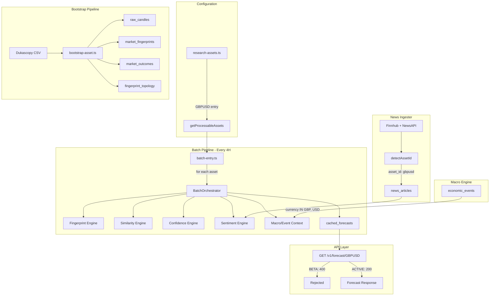

# Design Document: GBPUSD Asset Onboarding

## Overview

This design covers onboarding GBP/USD as the second currency pair on the Financial Intelligence Platform (Tier 6.1 of the Enhancement Plan). The platform was built with multi-asset support from day one — the batch pipeline iterates over `getProcessableAssets()`, the event context service derives currencies from the asset symbol, and the news ingester already maps `["GBP", "USD"]` to `assetId: "gbpusd"` in its `CURRENCY_PAIRS` array.

The work is primarily configuration and data-driven:
1. Add the GBPUSD entry to `RESEARCH_ASSETS`
2. Update the news ingester's `computeRelevanceScore` to handle GBP/USD direct pair references (currently hardcoded to EUR/USD only)
3. Update the NewsAPI search query to include GBP-related keywords
4. Run the bootstrap pipeline with ~5 years of historical Dukascopy 4H data
5. Validate end-to-end batch processing and API behaviour during BETA status

The macro engine (via `EventContextService.deriveCurrencies`) already correctly splits "GBPUSD" into `["GBP", "USD"]` and queries economic events for both currencies — no macro engine code changes are needed.

## Architecture



## Components and Interfaces

### 1. Asset Registry Entry (research-assets.ts)

A single new entry appended to the `RESEARCH_ASSETS` array:

```typescript
{
  id: 'gbpusd',
  symbol: 'GBPUSD',
  assetClass: AssetClass.FOREX,
  status: AssetStatus.BETA,
  processingPriority: 2,
  pipSize: 0.0001,
  pricePrecision: 5,
  marketHours: '24x5',
  supportedTimeframes: ['4H'],
  providers: { twelveData: 'GBP/USD' },
  engines: {
    fingerprint: true,
    similarity: true,
    confidence: true,
    tradeability: true,
    sentiment: true,
    macro: true,
  },
}
```

**Design decision**: `status: BETA` ensures the batch pipeline processes GBPUSD (generates forecasts, builds history) while the public API excludes it. This allows validation before exposing to consumers.

**Design decision**: `processingPriority: 2` places GBPUSD after EURUSD (priority 1) in the batch loop, ensuring the primary asset is always processed first.

### 2. News Ingester Updates (news-ingester.ts)

Two targeted changes:

#### 2a. `computeRelevanceScore` — direct pair detection

Currently hardcoded to check only `EUR/USD` and `EURUSD` for the 0.9 score. Needs to be generalised to all known pairs.

```typescript
// Before (line 91):
if (upperText.includes("EUR/USD") || upperText.includes("EURUSD")) return 0.9;

// After — detect any known pair:
for (const pair of CURRENCY_PAIRS) {
  const slashForm = `${pair.currencies[0]}/${pair.currencies[1]}`;
  const concatenatedForm = `${pair.currencies[0]}${pair.currencies[1]}`;
  if (upperText.includes(slashForm) || upperText.includes(concatenatedForm)) {
    return 0.9;
  }
}
```

This generalises the function to handle GBPUSD, USDJPY, and any future pairs without per-pair hardcoding.

#### 2b. NewsAPI query expansion

The NewsAPI search query is currently EUR/USD-centric:
```
q=(EUR+USD)+OR+(ECB+rate)+OR+(Fed+rate)+OR+(EURUSD)+OR+(forex+dollar+euro)
```

Expand to include GBP/USD terms:
```
q=(EUR+USD)+OR+(GBP+USD)+OR+(ECB+rate)+OR+(Fed+rate)+OR+(BoE+rate)+OR+(EURUSD)+OR+(GBPUSD)+OR+(forex+dollar+euro+pound+sterling)
```

**Design decision**: Keep the query as a single broad forex query rather than per-asset queries. This avoids doubling API calls and the `detectAssetId` function already correctly routes articles to the right asset_id.

#### 2c. `detectAssetId` — single-currency fallback fix

The existing code has a single-currency fallback that maps a lone "GBP" mention to `"gbpusd"` (via `CURRENCY_PAIRS` lookup for GBP+USD pair). This contradicts Requirement 5.5 which states that if only one of "GBP" or "USD" is mentioned (but not both), the article SHALL NOT be assigned `asset_id: "gbpusd"`.

Fix: Remove the single-currency-to-pair mapping and return `"forex"` when only one currency is detected:

```typescript
// Before:
if (mentioned.length === 1) {
  const currency = mentioned[0];
  if (currency === "USD") return "forex";
  const pairMatch = CURRENCY_PAIRS.find(
    (p) => p.currencies.includes(currency) && p.currencies.includes("USD")
  );
  return pairMatch?.assetId ?? "forex";
}

// After:
if (mentioned.length === 1) {
  return "forex";
}
```

**Design decision**: A single currency mention is too ambiguous to assign a specific pair. An article mentioning only "GBP" could be about GBP/JPY, GBP/EUR, or GBP/USD. Defaulting to `"forex"` is safer — the sentiment engine will still pick up these articles via the `asset_id IN ('gbpusd', 'forex')` query.

### 3. Macro Engine — No Changes Required

The `EventContextService.deriveCurrencies("GBPUSD")` already returns `["GBP", "USD"]`, and the Supabase query uses `.in('currency', currencies)` to match economic events for both currencies. GBP events (BoE rate decisions, UK CPI, UK employment) are already ingested into `economic_events` by the integrity job — they just haven't been queried until now because no asset with a GBP currency component existed.

The impact weighting logic uses the `impact` field (`high`, `medium`, `low`) from the economic events data source, which is currency-agnostic — high-impact GBP events receive the same weight factor as high-impact USD events of the same classification.

### 4. Batch Pipeline — No Changes Required

`batch-entry.ts` already:
1. Calls `getProcessableAssets()` which returns ACTIVE + BETA assets
2. Iterates over each asset in priority order
3. Passes `asset.providers.twelveData` (i.e. `"GBP/USD"`) to the data fetcher
4. Passes `asset.engines` to the orchestrator for stage gating
5. Uses `asset.pipSize` for all pip-denominated calculations

Adding GBPUSD to the registry is sufficient — the batch pipeline picks it up automatically.

### 5. Bootstrap Pipeline — No Changes Required

`scripts/bootstrap-asset.ts` is fully asset-agnostic:
1. Looks up the asset by symbol in the registry (`getAssetBySymbol`)
2. Uses `assetConfig.pipSize` for outcome computation
3. All DB writes are keyed on `(asset, timeframe, timestamp_utc)` with upsert semantics

Invocation: `npx tsx scripts/bootstrap-asset.ts --asset GBPUSD --csv ./data/gbpusd-4h.csv`

### 6. API Behaviour

| Status | `GET /v1/forecast/GBPUSD` | `getActiveSymbols()` | `getOpenApiAssetEnum()` |
|--------|---------------------------|---------------------|------------------------|
| BETA   | HTTP 400 `asset_not_supported` | Excludes GBPUSD | Excludes GBPUSD |
| ACTIVE | HTTP 200 with forecast | Includes GBPUSD | Includes GBPUSD |

Promotion to ACTIVE is a one-line change (`status: AssetStatus.ACTIVE`) followed by redeployment. No migration or additional configuration needed.

## Data Models

### Existing Tables (no schema changes required)

All tables already support multi-asset via the `asset` column:

| Table | Key Columns | GBPUSD Usage |
|-------|-------------|-------------|
| `raw_candles` | `(asset, timeframe, timestamp_utc)` | ~6,500 rows from 5yr bootstrap |
| `market_fingerprints` | `(asset, timeframe, timestamp_utc)` | 1:1 with candles |
| `market_outcomes` | `(fingerprint_id, horizon)` | n-1 (last candle has no forward data) |
| `fingerprint_topology` | `(fingerprint_id)` | n-30 (first 30 lack history) |
| `cached_forecasts` | `(asset, timeframe, created_at)` | Generated each 4H batch cycle |
| `news_articles` | `(source, url)` | Articles tagged `asset_id: 'gbpusd'` |
| `economic_events` | `(name, event_date, currency)` | GBP + USD events already present |

### GBPUSD Registry Entry Shape

```typescript
interface ResearchAsset {
  id: 'gbpusd';
  symbol: 'GBPUSD';
  assetClass: AssetClass.FOREX;
  status: AssetStatus.BETA;  // → ACTIVE after validation
  processingPriority: 2;
  pipSize: 0.0001;
  pricePrecision: 5;
  marketHours: '24x5';
  supportedTimeframes: readonly ['4H'];
  providers: { twelveData: 'GBP/USD' };
  engines: EngineParticipationMap; // all true
}
```

## Correctness Properties

*A property is a characteristic or behavior that should hold true across all valid executions of a system — essentially, a formal statement about what the system should do. Properties serve as the bridge between human-readable specifications and machine-verifiable correctness guarantees.*

### Property 1: Asset registry uniqueness invariant

*For any* valid `RESEARCH_ASSETS` array containing both EURUSD and GBPUSD entries, the `assertNoDuplicates` function SHALL pass without throwing, confirming all ids are unique and all symbols are unique.

**Validates: Requirements 1.5**

### Property 2: Processable assets ordering

*For any* set of ACTIVE and BETA assets in the registry, `getProcessableAssets()` SHALL return them sorted by `processingPriority` ascending, such that for every consecutive pair `(a, b)` in the result, `a.processingPriority <= b.processingPriority`.

**Validates: Requirements 1.6, 4.1**

### Property 3: BETA exclusion from active queries

*For any* asset with status `BETA`, the asset SHALL NOT appear in the output of `getActiveSymbols()` or `getOpenApiAssetEnum()`, while it SHALL appear in the output of `getProcessableAssets()`.

**Validates: Requirements 1.7, 7.1**

### Property 4: Asset detection for dual-currency mentions

*For any* text containing both "GBP" and "USD" (case-insensitive), the `detectAssetId` function SHALL return `"gbpusd"` (not `"forex"` or another asset_id).

**Validates: Requirements 5.1, 5.5**

### Property 5: Direct pair reference relevance scoring

*For any* text containing "GBP/USD" or "GBPUSD" (case-insensitive), the `computeRelevanceScore` function SHALL return 0.9.

**Validates: Requirements 5.2**

### Property 6: Confidence blending for sparse sentiment data

*For any* article count less than 3, the sentiment engine SHALL compute a `confidence_factor` of `article_count / 3` and blend each vector dimension as `(computed_value × confidence_factor) + (0.5 × (1 − confidence_factor))`, producing values strictly between the computed value and 0.5.

**Validates: Requirements 5.4**

### Property 7: Macro engine currency derivation

*For any* 6-character uppercase asset symbol, the `deriveCurrencies` function SHALL split the symbol into two 3-character currency codes `[symbol.slice(0,3), symbol.slice(3,6)]`, so that "GBPUSD" yields `["GBP", "USD"]`.

**Validates: Requirements 6.1**

### Property 8: Bootstrap idempotency

*For any* set of candle records already present in the database, re-running the bootstrap pipeline with the same CSV SHALL result in 0 new inserts across all tables (candles, fingerprints, outcomes, topology), with all upsert operations resolving as duplicates.

**Validates: Requirements 8.1, 8.4**

## Error Handling

| Scenario | Behaviour | Recovery |
|----------|-----------|----------|
| Bootstrap CSV not found or empty | Exit code 1, descriptive error message | Fix path, re-run |
| Bootstrap OHLC violation | Exit code 1, identifies row + constraint | Fix CSV data, re-run |
| Bootstrap non-numeric value | Exit code 1, identifies row + column | Fix CSV encoding, re-run |
| Bootstrap network failure mid-import | Partial data written | Re-run safely (idempotent) |
| Batch pipeline GBPUSD stage failure | Record failure in `batch_runs`, continue to next asset | Next cycle retries automatically |
| Batch pipeline GBPUSD timeout (>60s) | Terminate GBPUSD processing, proceed to next asset | Next cycle retries |
| Total batch timeout (>15 min) | TIMEOUT status, report which assets completed | Next cycle retries unprocessed |
| Sentiment: <3 articles for GBPUSD | Confidence blending applied, vector skews toward neutral | Accumulates naturally as article volume grows |
| Macro: no GBP events in window | Vector computed from USD events only (not neutral) | Expected during non-event periods |
| API: GBPUSD query while BETA | HTTP 400 with `asset_not_supported` code | Promote to ACTIVE when validated |
| API: GBPUSD query, no cached forecast | HTTP 404 with `forecast_unavailable` code | Wait for next batch cycle |

## Testing Strategy

### Unit Tests (Vitest)

| Test Area | What to Verify |
|-----------|---------------|
| Registry entry | GBPUSD fields match spec; `assertNoDuplicates` passes; `getProcessableAssets` includes both assets in order |
| `computeRelevanceScore` | Returns 0.9 for "GBP/USD" and "GBPUSD" text; 0.7 for "BoE" keyword; 0.8 for dual-currency mention |
| `detectAssetId` | Returns "gbpusd" for text with both GBP and USD; returns non-"gbpusd" for single-currency text |
| API route validation | BETA asset returns 400; ACTIVE asset returns 200 or 404 |
| `deriveCurrencies` | "GBPUSD" → ["GBP", "USD"] |

### Property-Based Tests (fast-check, minimum 100 iterations each)

The project uses `fast-check` (v4.8.0) with Vitest. Each property test maps to a correctness property above.

| Property | Generator Strategy |
|----------|-------------------|
| 1: Registry uniqueness | Generate random arrays of ResearchAsset with varying ids/symbols; verify assertNoDuplicates behaviour |
| 2: Processable ordering | Generate random asset arrays with various priorities and statuses; verify sort invariant |
| 3: BETA exclusion | Generate random status values; verify inclusion/exclusion from query utilities |
| 4: Asset detection | Generate arbitrary text with injected currency code combinations; verify detectAssetId output |
| 5: Direct pair relevance | Generate text with injected "GBP/USD" or "GBPUSD" at random positions; verify score = 0.9 |
| 6: Confidence blending | Generate random article counts (0-2) and computed sentiment values; verify blending formula |
| 7: Currency derivation | Generate random 6-char uppercase strings; verify split behaviour |
| 8: Idempotency | Generate random candle sets; verify double-insert produces same state (tested via mock DB layer) |

**Configuration**: Each test runs minimum 100 iterations. Each test is tagged:
```
// Feature: gbpusd-asset-onboarding, Property {N}: {property_text}
```

### Integration/Smoke Tests

| Test | Type | What to Verify |
|------|------|---------------|
| Bootstrap dry-run | Integration | Run bootstrap with a small (50-candle) test CSV against a test Supabase instance; verify all tables populated |
| Batch pipeline with 2 assets | Integration | Verify batch orchestrator processes both EURUSD and GBPUSD sequentially |
| NewsAPI GBP article routing | Integration | Submit an article mentioning "GBP/USD"; verify `asset_id = 'gbpusd'` in DB |
| Macro context for GBPUSD | Integration | Insert a GBP economic event; verify EventContextService queries it for GBPUSD |
| API BETA rejection | Smoke | Query `/v1/forecast/GBPUSD` while BETA; verify 400 response |
| ACTIVE promotion | Smoke | Change status to ACTIVE, restart; verify 200 response on next query |

### Manual Validation Checklist

- [ ] Export GBPUSD 4H data from Dukascopy (2020-01 to 2025-01, ~6,500 candles)
- [ ] Run bootstrap pipeline, verify summary matches expected counts
- [ ] Wait for next batch cycle, verify GBPUSD forecast appears in `cached_forecasts`
- [ ] Verify Twelve Data responds correctly for `GBP/USD` symbol
- [ ] Check news articles table has entries with `asset_id = 'gbpusd'` after ingestion
- [ ] Promote to ACTIVE, verify API returns forecast
