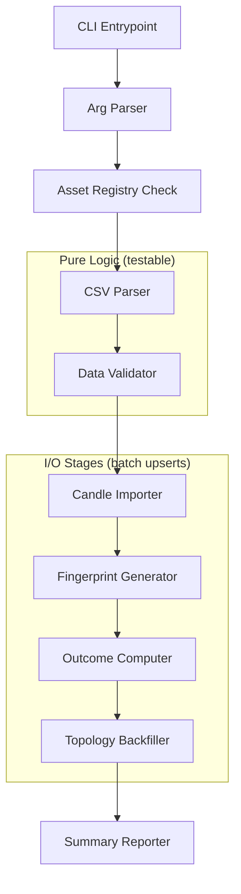
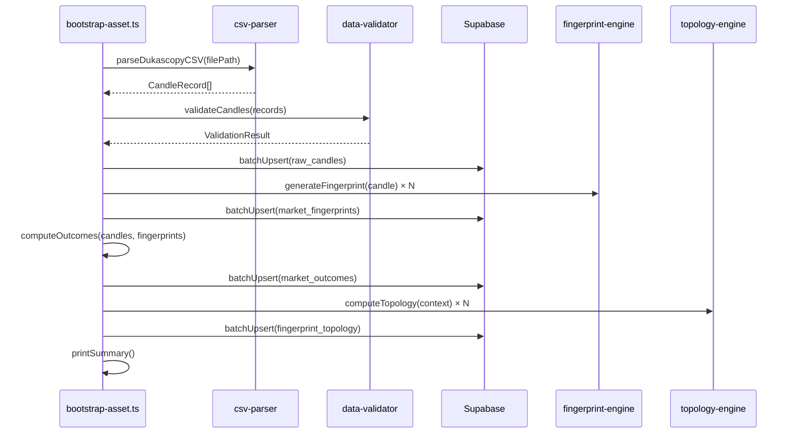

# Design Document: Historical Data Bootstrap

## Overview

The Historical Data Bootstrap feature provides a CLI pipeline (`scripts/bootstrap-asset.ts`) that onboards new currency pairs into the Financial Intelligence Platform. It reads a Dukascopy-exported CSV file, validates and imports the candle data, then runs the full derivation chain — fingerprints, forward outcomes, and topology vectors — so the similarity engine can produce forecasts for the new asset.

The pipeline is modelled as a sequential chain of pure-ish stages connected by typed interfaces, with each stage operating on batched database writes using upsert semantics to guarantee idempotency. The design reuses existing engine functions (`generateFingerprint`, `computeTopology`) and follows patterns established in `scripts/seed-historical-data.ts`.

### Design Goals

- **Idempotent**: re-running with the same inputs produces the same database state
- **Batch-safe**: all DB operations are chunked to avoid timeouts and memory exhaustion
- **Fail-forward**: non-critical errors (batch insert failures, gaps) warn and continue; only validation errors abort
- **Testable**: pure transformation logic is factored out from I/O for property-based testing

## Architecture



### Module Layout

```
scripts/
  bootstrap-asset.ts          # CLI entrypoint, orchestrates pipeline

src/bootstrap/
  csv-parser.ts               # Dukascopy CSV → CandleRecord[]
  data-validator.ts           # OHLC invariants, gap detection
  candle-importer.ts          # Batched upsert to raw_candles
  fingerprint-generator.ts    # Generates & stores fingerprints
  outcome-computer.ts         # Computes & stores forward outcomes
  topology-backfiller.ts      # Computes & stores topology vectors
  types.ts                    # Shared interfaces for the bootstrap pipeline
```

### Data Flow



## Components and Interfaces

### 1. CLI Entrypoint — `scripts/bootstrap-asset.ts`

Parses arguments, loads environment, orchestrates the pipeline stages in sequence, and prints the final summary report.

```typescript
// Argument shape
interface CliArgs {
  asset: string;   // e.g. "GBPUSD"
  csv: string;     // file path
}

function parseArgs(argv: string[]): CliArgs;
```

### 2. CSV Parser — `src/bootstrap/csv-parser.ts`

```typescript
export interface CandleRecord {
  timestamp_utc: string;  // ISO 8601
  open: number;
  high: number;
  low: number;
  close: number;
  volume: number;
}

/**
 * Parse a Dukascopy CSV file into structured candle records.
 * Handles both "DD.MM.YYYY HH:MM:SS.000" and ISO 8601 timestamp formats.
 * Auto-detects and skips header rows.
 * @throws if file missing, empty, or contains non-numeric OHLCV values
 */
export function parseDukascopyCSV(filePath: string): CandleRecord[];
```

Internal helpers:

```typescript
/** Parse "DD.MM.YYYY HH:MM:SS.000" → ISO 8601 string */
export function parseDukascopyTimestamp(raw: string): string;

/** Detect whether a row is a header (non-numeric OHLC columns) */
export function isHeaderRow(fields: string[]): boolean;

/** Format a CandleRecord back to CSV line (for round-trip testing) */
export function formatCandleToCSV(record: CandleRecord): string;
```

### 3. Data Validator — `src/bootstrap/data-validator.ts`

```typescript
export interface ValidationResult {
  valid: boolean;
  totalCandles: number;
  expectedCandles: number;
  ohlcViolations: OHLCViolation[];
  gaps: GapInfo[];
}

export interface OHLCViolation {
  rowNumber: number;
  timestamp: string;
  constraint: 'high < max(open,close)' | 'low > min(open,close)';
}

export interface GapInfo {
  expectedTimestamp: string;
  previousTimestamp: string;
}

/**
 * Validate an array of candle records.
 * - Checks OHLC invariants (aborts on violation)
 * - Detects gaps in expected 4H forex schedule (warns only)
 * - Reports expected vs actual candle count
 */
export function validateCandles(
  records: CandleRecord[],
  asset: string
): ValidationResult;

/** Check a single candle satisfies high >= max(open,close), low <= min(open,close) */
export function checkOHLCInvariant(candle: CandleRecord): boolean;

/** Compute expected 4H timestamps between two dates (forex hours) */
export function computeExpectedTimestamps(
  start: Date,
  end: Date
): string[];
```

### 4. Candle Importer — `src/bootstrap/candle-importer.ts`

```typescript
export interface ImportResult {
  inserted: number;
  skipped: number;
  errors: number;
}

export interface ImportOptions {
  batchSize?: number;  // default 500
}

/**
 * Batch-upsert candle records into raw_candles with deduplication.
 * Uses onConflict: 'asset,timeframe,timestamp_utc', ignoreDuplicates: true.
 */
export async function importCandles(
  supabase: SupabaseClient,
  records: CandleRecord[],
  asset: string,
  options?: ImportOptions
): Promise<ImportResult>;
```

### 5. Fingerprint Generator — `src/bootstrap/fingerprint-generator.ts`

```typescript
export interface FingerprintResult {
  generated: number;
  stored: number;
  errors: number;
}

/**
 * Generate and store fingerprints for all candles.
 * Processes in batches, logs progress every 1000 records.
 * Uses existing generateFingerprint() from fingerprint-engine.
 */
export async function generateAndStoreFingerprints(
  supabase: SupabaseClient,
  candles: CandleRecord[],
  asset: string,
  batchSize?: number
): Promise<FingerprintResult>;
```

### 6. Outcome Computer — `src/bootstrap/outcome-computer.ts`

```typescript
export interface OutcomeResult {
  computed: number;
  stored: number;
  errors: number;
}

export interface OutcomeRecord {
  fingerprint_id: string;
  asset: string;
  horizon: string;
  net_return_pips: number;
  max_favourable_excursion: number;
  max_adverse_excursion: number;
  realised_volatility: number;
  timestamp_utc: string;
  batch_id: string;
  engine_version: string;
}

/**
 * Compute forward 4H outcomes for consecutive candle pairs.
 * Uses asset-specific pip size from the registry.
 */
export function computeOutcomes(
  candles: CandleRecord[],
  fingerprintIds: string[],
  asset: string,
  pipSize: number
): OutcomeRecord[];

/**
 * Batch-insert outcomes into market_outcomes with deduplication.
 */
export async function storeOutcomes(
  supabase: SupabaseClient,
  outcomes: OutcomeRecord[],
  batchSize?: number
): Promise<OutcomeResult>;
```

### 7. Topology Backfiller — `src/bootstrap/topology-backfiller.ts`

```typescript
export interface TopologyResult {
  computed: number;
  stored: number;
  skipped: number;  // < 30 candles of history
  errors: number;
}

/**
 * Compute and store topology vectors for each fingerprint.
 * Requires at least 30 preceding candles; uses up to 120.
 * Uses existing computeTopology() from topology-engine.
 */
export async function backfillTopology(
  supabase: SupabaseClient,
  candles: CandleRecord[],
  fingerprintIds: string[],
  asset: string,
  batchSize?: number
): Promise<TopologyResult>;
```

### 8. Summary Reporter

```typescript
export interface PipelineSummary {
  asset: string;
  csvPath: string;
  totalCandlesParsed: number;
  candlesImported: number;
  candlesSkipped: number;
  fingerprintsGenerated: number;
  outcomesComputed: number;
  topologyVectorsCreated: number;
  topologyVectorsSkipped: number;
  gapsDetected: number;
  dateRange: { start: string; end: string };
  elapsedMs: number;
}

export function printSummary(summary: PipelineSummary): void;
```

## Data Models

### Database Tables Used

| Table | Primary Key | Unique Constraint | Columns Used |
|-------|------------|-------------------|--------------|
| `raw_candles` | auto | `(asset, timeframe, timestamp_utc)` | asset, timeframe, timestamp_utc, open, high, low, close, volume |
| `market_fingerprints` | fingerprint_id | `(asset, timeframe, timestamp_utc)` | fingerprint_id, asset, timeframe, timestamp_utc, ohlc, return_profile, regime, state vectors, batch_id |
| `market_outcomes` | auto | `(fingerprint_id, horizon)` | fingerprint_id, asset, horizon, net_return_pips, max_favourable_excursion, max_adverse_excursion, realised_volatility, timestamp_utc, batch_id, engine_version |
| `fingerprint_topology` | auto | `(fingerprint_id)` | fingerprint_id, asset, levels, topology_vector, insufficient_history, candle_count_used, engine_version |

### CandleRecord (Internal Pipeline Type)

```typescript
interface CandleRecord {
  timestamp_utc: string;  // ISO 8601 UTC, e.g. "2020-01-06T00:00:00.000Z"
  open: number;
  high: number;
  low: number;
  close: number;
  volume: number;
}
```

### Pipeline Constants

| Constant | Value | Source |
|----------|-------|--------|
| `BATCH_SIZE_CANDLES` | 500 | Configurable via ImportOptions |
| `BATCH_SIZE_FINGERPRINTS` | 200 | Matches seed-historical-data.ts |
| `BATCH_SIZE_OUTCOMES` | 200 | Matches seed-historical-data.ts |
| `BATCH_SIZE_TOPOLOGY` | 100 | Smaller due to larger payloads |
| `MIN_TOPOLOGY_CANDLES` | 30 | Topology engine requirement |
| `MAX_TOPOLOGY_CANDLES` | 120 | Topology engine window |
| `BOOTSTRAP_BATCH_ID` | UUID constant | Identifies bootstrap-inserted rows |
| `TIMEFRAME` | "4H" | Only supported timeframe |

## Correctness Properties

*A property is a characteristic or behavior that should hold true across all valid executions of a system — essentially, a formal statement about what the system should do. Properties serve as the bridge between human-readable specifications and machine-verifiable correctness guarantees.*

### Property 1: CSV Round-Trip

*For any* valid `CandleRecord`, formatting it to a Dukascopy CSV line and re-parsing that line SHALL produce an equivalent `CandleRecord` (same timestamp, same OHLCV values within floating-point precision).

**Validates: Requirements 1.1, 1.8**

### Property 2: Timestamp Parsing Correctness

*For any* valid date-time value, when formatted as a Dukascopy timestamp ("DD.MM.YYYY HH:MM:SS.000"), `parseDukascopyTimestamp` SHALL produce a valid ISO 8601 string representing the same instant. Additionally, *for any* valid ISO 8601 timestamp, passing it through the parser SHALL return the same string unchanged (idempotence).

**Validates: Requirements 1.2, 1.3**

### Property 3: Non-Numeric Value Rejection

*For any* CSV row where at least one OHLCV column contains a non-numeric string, the parser SHALL reject it with an error that correctly identifies the offending row number and column name.

**Validates: Requirements 1.5**

### Property 4: Header Row Detection

*For any* row where the OHLC columns contain non-numeric values matching common header patterns, `isHeaderRow` SHALL return true. *For any* row where all OHLC columns are valid numeric values, `isHeaderRow` SHALL return false.

**Validates: Requirements 1.7**

### Property 5: OHLC Invariant Validation

*For any* candle where `high >= max(open, close)` and `low <= min(open, close)`, `checkOHLCInvariant` SHALL return true. *For any* candle violating either constraint, the validator SHALL return false and correctly identify which constraint was violated (high-too-low or low-too-high).

**Validates: Requirements 2.1, 2.2**

### Property 6: Gap Detection Completeness

*For any* sequence of 4H forex timestamps where specific timestamps are removed, the gap detector SHALL identify exactly those removed timestamps as gaps. The set of detected gaps SHALL equal the set of removed timestamps (no false positives, no false negatives within forex trading hours).

**Validates: Requirements 2.3**

### Property 7: Expected Candle Count Formula

*For any* date range spanning complete forex trading weeks (Monday 00:00 to Friday 20:00 UTC), the expected candle count SHALL equal `weeks × 30` (6 candles/day × 5 days). For partial weeks, the count SHALL be proportional to the covered trading hours.

**Validates: Requirements 2.5**

### Property 8: Outcome Count Invariant

*For any* array of N candles (N ≥ 2), `computeOutcomes` SHALL produce exactly N-1 outcome records — one for each consecutive pair.

**Validates: Requirements 5.1**

### Property 9: Outcome Formula Correctness

*For any* pair of consecutive candles and a given pip size, the computed outcome metrics SHALL satisfy:
- `net_return_pips ≈ (next_close - current_close) / pipSize`
- `max_favourable_excursion ≈ (next_high - current_close) / pipSize`
- `max_adverse_excursion ≈ (current_close - next_low) / pipSize`
- `realised_volatility ≈ ((next_high - next_low) / pipSize) / 10000`

(within floating-point rounding tolerance of ±0.01)

**Validates: Requirements 5.2, 5.3, 5.4, 5.5**

### Property 10: Topology Window and Skip Logic

*For any* array of candles and *for any* index `i`:
- If `i < 30`, the topology backfiller SHALL skip this fingerprint
- If `i >= 30`, the topology backfiller SHALL provide `min(i, 120)` preceding candles as context to `computeTopology`

**Validates: Requirements 6.2, 6.3**

## Error Handling

### Error Categories

| Category | Severity | Behaviour | Examples |
|----------|----------|-----------|----------|
| **Fatal** | Critical | Abort immediately, exit code 1 | File not found, empty CSV, OHLC invariant violation, asset not registered |
| **Batch Error** | Warning | Log and continue with next batch | Single batch insert failure (DB timeout) |
| **Data Warning** | Info | Log and continue pipeline | Gaps detected, duplicate candles skipped |

### Error Handling Strategy

1. **Fail-fast on validation**: OHLC violations and missing asset registration abort before any DB writes. This prevents partial corrupted state.

2. **Continue on batch errors**: If one batch of 200 fingerprints fails to insert, the remaining batches continue. The summary report shows error counts.

3. **Warn on gaps**: Missing candles in the forex schedule are expected (holidays, data provider gaps). The pipeline warns but does not abort.

4. **Structured error messages**: All errors include context:
   ```
   [Bootstrap] ERROR: OHLC violation at row 1523 (2021-03-15T08:00:00.000Z): high (1.1920) < max(open, close) (1.1925)
   ```

5. **Exit codes**:
   - `0` — Pipeline completed (possibly with warnings)
   - `1` — Fatal error (validation failure, missing configuration)

### Recovery

Since all operations are idempotent (upsert with ignore-duplicates), the operator can simply re-run the command after fixing the issue. No cleanup or rollback is needed.

## Testing Strategy

### Property-Based Tests (fast-check + vitest)

Property-based testing is well-suited for this feature because the core logic consists of pure transformation functions (CSV parsing, timestamp conversion, OHLC validation, outcome computation, window slicing) where universal properties hold across a wide input space.

**Library**: `fast-check` (already in devDependencies)
**Runner**: `vitest` (already configured)
**Minimum iterations**: 100 per property

Each property test must be tagged with:
```
// Feature: historical-data-bootstrap, Property {N}: {title}
```

**Properties to implement:**

| # | Property | Module Under Test |
|---|----------|-------------------|
| 1 | CSV Round-Trip | `csv-parser.ts` |
| 2 | Timestamp Parsing Correctness | `csv-parser.ts` |
| 3 | Non-Numeric Value Rejection | `csv-parser.ts` |
| 4 | Header Row Detection | `csv-parser.ts` |
| 5 | OHLC Invariant Validation | `data-validator.ts` |
| 6 | Gap Detection Completeness | `data-validator.ts` |
| 7 | Expected Candle Count Formula | `data-validator.ts` |
| 8 | Outcome Count Invariant | `outcome-computer.ts` |
| 9 | Outcome Formula Correctness | `outcome-computer.ts` |
| 10 | Topology Window and Skip Logic | `topology-backfiller.ts` |

### Unit Tests (vitest)

Unit tests complement property tests for specific examples and edge cases:

- **CSV Parser**: empty file, BOM-prefixed file, various Dukascopy date formats, volume = 0
- **Validator**: exactly-at-boundary OHLC values (high == open), weekend timestamps excluded from gap detection
- **Outcome Computer**: single candle (no outcomes), JPY pairs with different pip sizes
- **CLI**: missing --asset, missing --csv, unknown asset, disabled asset
- **Summary Reporter**: formatting verification with known inputs

### Integration Tests

Integration tests verify the pipeline stages interact correctly with a test Supabase instance:

- Full pipeline run with small CSV (50 candles)
- Idempotency: run twice, verify identical DB state
- Batch error resilience: simulate DB failure mid-pipeline
- Deduplication: import overlapping date ranges

### Test File Structure

```
src/bootstrap/__tests__/
  csv-parser.property.test.ts        # Properties 1–4
  data-validator.property.test.ts    # Properties 5–7
  outcome-computer.property.test.ts  # Properties 8–9
  topology-backfiller.property.test.ts # Property 10
  csv-parser.test.ts                 # Unit tests
  data-validator.test.ts             # Unit tests
  candle-importer.test.ts            # Integration tests
  bootstrap-pipeline.integration.test.ts  # End-to-end
```

