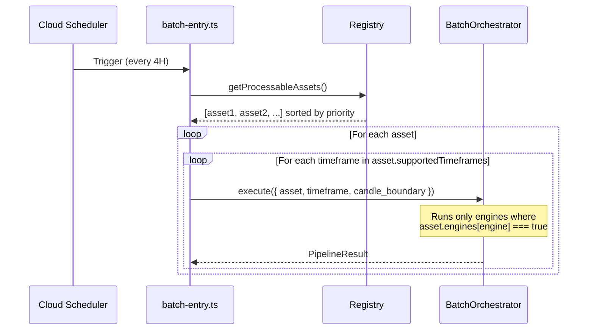
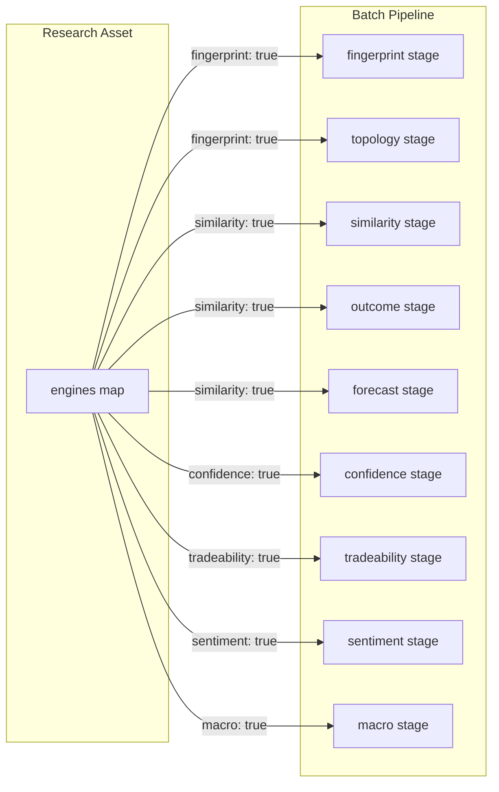

# Design Document: Research Asset Registry

## Overview

The Research Asset Registry introduces a centralised, compile-time TypeScript configuration module (`src/config/research-assets.ts`) that serves as the single source of truth for all tradeable research assets in the Financial Intelligence Platform. It replaces the scattered hardcoded asset references in `batch-entry.ts`, `forecast.ts`, and `openapi.yaml` with a typed, validated, query-friendly registry.

### Design Principles

1. **Compile-time safety** — TypeScript interfaces enforce property correctness; invalid configurations fail `tsc`
2. **Single source of truth** — One file governs which assets exist, which engines run, and which providers are used
3. **Configuration-as-code** — Adding a new market is a registry edit + deploy, not a code change across multiple files
4. **Runtime validation** — Duplicate IDs/symbols are caught at module initialization via assertions
5. **Zero conditional logic** — The batch pipeline routes engines per-asset via the `Engine_Participation_Map`, not `if (assetClass === ...)` statements

### What changes

| Component | Before | After |
|-----------|--------|-------|
| `batch-entry.ts` | Hardcoded `BATCH_ASSETS` array | Imports `getProcessableAssets()` from registry |
| `forecast.ts` route | Hardcoded `SUPPORTED_ASSETS` | Imports `getActiveSymbols()` from registry |
| `openapi.yaml` | Static `enum: [EURUSD]` | Generator reads `getOpenApiAssetEnum()` and injects dynamically |
| Engine selection | Implicit (all engines always run) | Explicit per-asset `engines` map drives execution |

---

## Architecture

```mermaid
graph TD
    subgraph "src/config/research-assets.ts"
        REG[Registry Array<br/>readonly ResearchAsset[]]
        VAL[Validation<br/>assertNoDuplicates()]
        QRY[Query Utilities<br/>getProcessableAssets()<br/>getActiveSymbols()<br/>getAssetById()<br/>getAssetBySymbol()<br/>getOpenApiAssetEnum()<br/>getAssetsByClass()]
    end

    subgraph Consumers
        BATCH[batch-entry.ts]
        API[API Routes<br/>forecast / similarity / state]
        GEN[scripts/generate-openapi.ts]
    end

    REG --> VAL
    REG --> QRY
    QRY --> BATCH
    QRY --> API
    QRY --> GEN
```



---

## Components and Interfaces

### Types and Enums

```typescript
// src/config/research-assets.ts

/** Asset class classification */
export enum AssetClass {
  FOREX = 'FOREX',
  INDICES = 'INDICES',
  CRYPTO = 'CRYPTO',
  COMMODITIES = 'COMMODITIES',
  BONDS = 'BONDS',
}

/** Asset lifecycle status */
export enum AssetStatus {
  ACTIVE = 'ACTIVE',
  BETA = 'BETA',
  DISABLED = 'DISABLED',
  DEPRECATED = 'DEPRECATED',
}

/** Provider symbol mapping — twelveData is always required */
export interface ProviderMap {
  readonly twelveData: string; // 3–15 chars, e.g. "EUR/USD"
  readonly massive?: string;
  readonly yahoo?: string;
}

/** Boolean map declaring which engines process this asset */
export interface EngineParticipationMap {
  readonly fingerprint: boolean;
  readonly similarity: boolean;
  readonly confidence: boolean;
  readonly tradeability: boolean;
  readonly sentiment: boolean;
  readonly macro: boolean;
}

/** Full asset definition */
export interface ResearchAsset {
  readonly id: string;                      // lowercase alphanumeric slug, unique
  readonly symbol: string;                  // 3–10 uppercase alphanumeric, unique
  readonly assetClass: AssetClass;
  readonly status: AssetStatus;
  readonly processingPriority: number;      // positive integer >= 1
  readonly pipSize: number;                 // 0.000001 – 1
  readonly pricePrecision: number;          // 0 – 10 (integer)
  readonly marketHours: string;             // e.g. "24x5", "24x7"
  readonly supportedTimeframes: readonly string[]; // non-empty
  readonly providers: ProviderMap;
  readonly engines: EngineParticipationMap;
}
```

### Registry Array

```typescript
/**
 * The registry — single source of truth for all research assets.
 * Add new assets here. That's it. No other file changes needed.
 */
export const RESEARCH_ASSETS: readonly ResearchAsset[] = [
  {
    id: 'eurusd',
    symbol: 'EURUSD',
    assetClass: AssetClass.FOREX,
    status: AssetStatus.ACTIVE,
    processingPriority: 1,
    pipSize: 0.0001,
    pricePrecision: 5,
    marketHours: '24x5',
    supportedTimeframes: ['4H'],
    providers: { twelveData: 'EUR/USD' },
    engines: {
      fingerprint: true,
      similarity: true,
      confidence: true,
      tradeability: true,
      sentiment: false,
      macro: true,
    },
  },
] as const;
```

### Validation (runs at module load)

```typescript
/**
 * Runtime assertion executed when the module is first imported.
 * Throws on duplicate id or symbol — fail-fast at startup.
 */
function assertNoDuplicates(assets: readonly ResearchAsset[]): void {
  const ids = new Set<string>();
  const symbols = new Set<string>();

  for (const asset of assets) {
    if (ids.has(asset.id)) {
      throw new Error(`[ResearchAssetRegistry] Duplicate id: "${asset.id}"`);
    }
    if (symbols.has(asset.symbol)) {
      throw new Error(`[ResearchAssetRegistry] Duplicate symbol: "${asset.symbol}"`);
    }
    if (asset.supportedTimeframes.length === 0) {
      throw new Error(`[ResearchAssetRegistry] Asset "${asset.id}" has empty supportedTimeframes`);
    }
    ids.add(asset.id);
    symbols.add(asset.symbol);
  }
}

// Execute validation at module initialization
assertNoDuplicates(RESEARCH_ASSETS);
```

### Query Utilities

```typescript
/**
 * Returns all ACTIVE and BETA assets sorted by processingPriority ascending.
 * Used by the batch pipeline to determine what to process.
 */
export function getProcessableAssets(): ResearchAsset[] {
  return RESEARCH_ASSETS
    .filter(a => a.status === AssetStatus.ACTIVE || a.status === AssetStatus.BETA)
    .sort((a, b) => a.processingPriority - b.processingPriority);
}

/**
 * Returns symbols of all ACTIVE assets sorted by processingPriority ascending.
 * Used by API routes for request validation.
 */
export function getActiveSymbols(): string[] {
  return RESEARCH_ASSETS
    .filter(a => a.status === AssetStatus.ACTIVE)
    .sort((a, b) => a.processingPriority - b.processingPriority)
    .map(a => a.symbol);
}

/**
 * Case-insensitive lookup by id. Searches ALL statuses.
 */
export function getAssetById(id: string): ResearchAsset | undefined {
  const lower = id.toLowerCase();
  return RESEARCH_ASSETS.find(a => a.id === lower);
}

/**
 * Case-insensitive lookup by symbol. Searches ALL statuses.
 */
export function getAssetBySymbol(symbol: string): ResearchAsset | undefined {
  const upper = symbol.toUpperCase();
  return RESEARCH_ASSETS.find(a => a.symbol === upper);
}

/**
 * Returns ACTIVE asset symbols in alphabetical order for OpenAPI enum injection.
 */
export function getOpenApiAssetEnum(): string[] {
  return RESEARCH_ASSETS
    .filter(a => a.status === AssetStatus.ACTIVE)
    .map(a => a.symbol)
    .sort(); // alphabetical
}

/**
 * Returns processable (ACTIVE + BETA) assets of a given class, sorted by priority.
 */
export function getAssetsByClass(assetClass: AssetClass): ResearchAsset[] {
  return getProcessableAssets().filter(a => a.assetClass === assetClass);
}
```

---

## Data Models

### ResearchAsset Field Constraints

| Field | Type | Constraints |
|-------|------|-------------|
| `id` | `string` | Lowercase, alphanumeric + hyphens, 2–20 chars, unique |
| `symbol` | `string` | Uppercase, 3–10 alphanumeric chars, unique |
| `assetClass` | `AssetClass` | One of 5 enum values |
| `status` | `AssetStatus` | One of 4 enum values |
| `processingPriority` | `number` | Integer, >= 1 |
| `pipSize` | `number` | 0.000001 ≤ x ≤ 1 |
| `pricePrecision` | `number` | Integer, 0 ≤ x ≤ 10 |
| `marketHours` | `string` | Non-empty |
| `supportedTimeframes` | `string[]` | Non-empty array |
| `providers.twelveData` | `string` | 3–15 chars, required |
| `providers.massive` | `string?` | Optional |
| `providers.yahoo` | `string?` | Optional |
| `engines.*` | `boolean` | All 6 flags required (no implicit defaults) |

### Query Utility Return Summary

| Function | Statuses Included | Sort Order | Returns |
|----------|-------------------|------------|---------|
| `getProcessableAssets()` | ACTIVE, BETA | processingPriority ASC | `ResearchAsset[]` |
| `getActiveSymbols()` | ACTIVE | processingPriority ASC | `string[]` |
| `getAssetById(id)` | ALL | N/A | `ResearchAsset \| undefined` |
| `getAssetBySymbol(sym)` | ALL | N/A | `ResearchAsset \| undefined` |
| `getOpenApiAssetEnum()` | ACTIVE | alphabetical | `string[]` |
| `getAssetsByClass(cls)` | ACTIVE, BETA | processingPriority ASC | `ResearchAsset[]` |

---

## Batch Pipeline Refactor

### Current (`batch-entry.ts`)

```typescript
const BATCH_ASSETS = [{ asset: 'EURUSD', timeframe: '4H' }];
// ... loops over BATCH_ASSETS
```

### Refactored

```typescript
import { getProcessableAssets } from './config/research-assets.js';

async function main(): Promise<void> {
  const assets = getProcessableAssets();

  if (assets.length === 0) {
    console.warn('[BatchEntry] No processable assets in registry — exiting');
    process.exit(0);
  }

  let hasFailure = false;

  for (const asset of assets) {
    // Determine provider symbol for the active data source
    const providerSymbol = asset.providers.twelveData; // primary provider

    for (const timeframe of asset.supportedTimeframes) {
      console.log(`[BatchEntry] Processing ${asset.symbol} (${timeframe})`);

      const result = await orchestrator.execute({
        asset: asset.symbol,
        timeframe,
        candle_boundary: candleBoundary,
        providerSymbol,         // passed to ingestion stage
        engineParticipation: asset.engines, // passed to orchestrator
      });

      if (result.status !== 'COMPLETED') {
        hasFailure = true;
      }
    }
  }

  if (hasFailure) {
    process.exit(1);
  }
  process.exit(0);
}
```

### Engine Participation in the Orchestrator

The `BatchOrchestrator.executePipeline()` method receives the `EngineParticipationMap` and conditionally invokes optional stages:

```typescript
// Stage 2.5: Topology — only if asset.engines.fingerprint is true (uses fingerprint output)
if (engineParticipation.fingerprint && this.handlers.topology) {
  await this.handlers.topology(fingerprint.fingerprint_id, input.asset);
}

// Stage 3: Similarity — only if asset.engines.similarity is true
if (engineParticipation.similarity) {
  similarityOutput = await this.handlers.similarity(similarityInput, batchId);
} else {
  // Skip downstream stages that depend on similarity
  return earlyCompleteResult;
}

// Stage 6: Confidence — only if asset.engines.confidence is true
if (engineParticipation.confidence) {
  confidenceOutput = await this.handlers.confidence(confidenceInput, fingerprintId);
}
```

**Key design decision:** No `if (asset.assetClass === AssetClass.CRYPTO)` anywhere. The engine map is the sole routing mechanism.

---

## API Route Refactor

### Current (`forecast.ts`)

```typescript
const SUPPORTED_ASSETS = ['EURUSD'] as const;
// ... validates against SUPPORTED_ASSETS
```

### Refactored

```typescript
import { getActiveSymbols, getAssetBySymbol } from '../config/research-assets.js';

router.get('/:asset', async (req, res) => {
  const upperAsset = req.params.asset.toUpperCase();
  const activeSymbols = getActiveSymbols();

  // Case-insensitive validation — BETA assets are excluded from API
  if (!activeSymbols.includes(upperAsset)) {
    return res.status(400).json(
      errorResponse(
        'asset_not_supported',
        `Asset "${upperAsset}" is not supported. Supported assets: ${activeSymbols.join(', ')}`,
        requestId
      )
    );
  }

  // Use pricePrecision for response formatting
  const assetConfig = getAssetBySymbol(upperAsset)!;
  // ... later when formatting prices:
  const formattedPrice = price.toFixed(assetConfig.pricePrecision);
});
```

**BETA exclusion:** `getActiveSymbols()` returns only ACTIVE status assets. BETA assets are processed by the batch pipeline but invisible to external API consumers, matching the "internal research" lifecycle stage.

---

## OpenAPI Generator Refactor

### Current (`scripts/generate-openapi.ts`)

Reads YAML → writes JSON. The asset enum is static in the YAML file.

### Refactored

```typescript
import { getOpenApiAssetEnum } from '../src/config/research-assets.js';

// Read YAML, parse to object
const spec = yaml.load(yamlContent) as Record<string, unknown>;

// Inject dynamic asset enum
const activeAssets = getOpenApiAssetEnum();

if (activeAssets.length === 0) {
  console.error('✗ No ACTIVE assets in registry — cannot generate OpenAPI spec');
  process.exit(1);
}

// Navigate to components.parameters.Asset.schema.enum and replace
const components = spec.components as Record<string, unknown>;
const parameters = components.parameters as Record<string, unknown>;
const assetParam = parameters.Asset as Record<string, unknown>;
const schema = assetParam.schema as Record<string, unknown>;

schema.enum = activeAssets;
assetParam.description = `The asset to query. Supported: ${activeAssets.join(', ')}`;

// Write JSON
const jsonContent = JSON.stringify(spec, null, 2);
fs.writeFileSync(OUTPUT, jsonContent, 'utf-8');
console.log(`✓ OpenAPI spec generated with assets: ${activeAssets.join(', ')}`);
```

This ensures the `openapi.yaml` can keep a placeholder enum (or no enum at all) and the build script injects the live values from the registry.

---

## Engine Participation Integration



### Engine Dependency Chain

Some engines have implicit dependencies:

| Engine | Requires |
|--------|----------|
| `similarity` | `fingerprint` output |
| `outcome` | `similarity` output |
| `forecast` | `outcome` output |
| `confidence` | `outcome` + `similarity` output |
| `tradeability` | `forecast` + `confidence` output |

**Design decision:** If `similarity` is `false`, the pipeline skips `outcome`, `forecast`, `confidence`, and `tradeability` regardless of their flags — there's no input data for them. The implementation should short-circuit the dependent chain. The `fingerprint` engine always runs first when enabled as it's the foundation for all downstream processing.

---

## Correctness Properties

*A property is a characteristic or behavior that should hold true across all valid executions of a system — essentially, a formal statement about what the system should do. Properties serve as the bridge between human-readable specifications and machine-verifiable correctness guarantees.*

### Property 1: Registry Schema Invariant

*For any* `ResearchAsset` in the registry, the following constraints hold: `id` is a non-empty lowercase alphanumeric slug, `symbol` is 3–10 uppercase alphanumeric characters, `pipSize` is between 0.000001 and 1, `pricePrecision` is an integer between 0 and 10, `processingPriority` is a positive integer ≥ 1, `supportedTimeframes` is non-empty, `providers.twelveData` is a string of 3–15 characters, and all six `engines` flags are explicitly boolean.

**Validates: Requirements 1.2, 2.1, 3.1, 4.1, 4.5, 11.3, 12.1**

### Property 2: Registry Uniqueness Invariant

*For any* registry array that passes validation, all `id` values are distinct and all `symbol` values are distinct. Conversely, for any registry array containing duplicate IDs or duplicate symbols, the validation function throws an error.

**Validates: Requirements 1.8, 1.9**

### Property 3: Processable Assets Filter and Sort

*For any* registry configuration, `getProcessableAssets()` returns only assets with status `ACTIVE` or `BETA`, never `DISABLED` or `DEPRECATED`, and the result is sorted in ascending `processingPriority` order (i.e., for consecutive elements a[i] and a[i+1], `a[i].processingPriority <= a[i+1].processingPriority`).

**Validates: Requirements 5.1, 6.4, 10.1, 10.4, 11.1**

### Property 4: Active Symbols Filter

*For any* registry configuration, `getActiveSymbols()` returns only symbols of assets with status `ACTIVE` (excluding `BETA`), sorted by `processingPriority` ascending, and the result is a subset of all symbols in the registry.

**Validates: Requirements 5.2, 10.5**

### Property 5: Case-Insensitive Lookup

*For any* `ResearchAsset` in the registry and *for any* case variation of its `id` (mixed case, all upper, all lower), `getAssetById(variation)` returns that asset. Similarly, *for any* case variation of its `symbol`, `getAssetBySymbol(variation)` returns that asset.

**Validates: Requirements 5.3, 7.1**

### Property 6: OpenAPI Enum Generation

*For any* registry configuration with at least one ACTIVE asset, `getOpenApiAssetEnum()` returns only ACTIVE asset symbols in strict alphabetical order, excluding BETA/DISABLED/DEPRECATED symbols.

**Validates: Requirements 5.4, 8.2, 8.3, 10.3**

### Property 7: Class-Based Filtering

*For any* `AssetClass` value, `getAssetsByClass(cls)` returns only processable (ACTIVE or BETA) assets whose `assetClass` matches `cls`, sorted by `processingPriority` ascending.

**Validates: Requirements 5.5**

### Property 8: Price Precision Formatting

*For any* `ResearchAsset` and *for any* numeric price value, formatting that price with `toFixed(asset.pricePrecision)` produces a string with exactly `asset.pricePrecision` decimal places.

**Validates: Requirements 7.4**

---

## Error Handling

### Module Initialization Errors

| Condition | Behaviour |
|-----------|-----------|
| Duplicate `id` in registry | `assertNoDuplicates()` throws `Error` at import time → process crashes before serving requests |
| Duplicate `symbol` in registry | Same as above |
| Empty `supportedTimeframes` | Same as above |

These are **fatal configuration errors** that prevent the application from starting. This is intentional — better to fail deploy than serve incorrect data.

### Batch Pipeline Errors

| Condition | Behaviour |
|-----------|-----------|
| Zero processable assets | Log warning, exit with code 0 (graceful no-op) |
| Individual asset failure | Log error, continue processing remaining assets, exit code 1 at end |
| Provider key missing for active source | Skip that provider, log info-level message |
| Engine participation skips all downstream | Pipeline completes with partial stage list, still marked COMPLETED for that asset |

### API Route Errors

| Condition | Behaviour |
|-----------|-----------|
| Non-ACTIVE symbol requested | HTTP 400, error code `asset_not_supported`, includes ACTIVE list |
| BETA symbol requested | Same as above (BETA is not publicly visible) |
| Asset found but no cached data | HTTP 404, `forecast_unavailable` |

### OpenAPI Generator Errors

| Condition | Behaviour |
|-----------|-----------|
| Zero ACTIVE assets | Exit code 1 with error message (build fails) |

---

## Testing Strategy

### Property-Based Tests (fast-check + Vitest)

The project uses `fast-check@4.8.0` with `vitest@3.2.4`. Each correctness property maps to a single property-based test with ≥100 iterations.

**Test file:** `src/config/__tests__/research-assets.property.test.ts`

**Generators needed:**
- `arbResearchAsset()` — generates a valid `ResearchAsset` with randomised but schema-conforming fields
- `arbRegistry(minSize?, maxSize?)` — generates an array of unique `ResearchAsset` objects (no duplicate ids/symbols)
- `arbAssetClass()` — picks a random `AssetClass` enum value
- `arbAssetStatus()` — picks a random `AssetStatus` enum value

**Tag format:** Each test includes a comment referencing the design property:
```typescript
// Feature: research-asset-registry, Property 1: Registry Schema Invariant
```

**Configuration:** Minimum 100 iterations per property (`{ numRuns: 100 }`).

### Unit Tests (example-based)

**Test file:** `src/config/__tests__/research-assets.test.ts`

- Seed entry exists with exact expected values (Req 1.3)
- Enum members match spec (Req 1.6, 1.7)
- Duplicate id throws (Req 1.8 — specific example)
- Duplicate symbol throws (Req 1.9 — specific example)
- Empty supportedTimeframes throws (Req 3.4)
- `getOpenApiAssetEnum()` with no ACTIVE assets returns empty array (Req 8.5 — generator handles exit)

### Integration Tests

- Batch pipeline calls `getProcessableAssets()` and processes in correct order
- Batch pipeline uses provider symbol from registry for data fetch
- Batch pipeline skips engines with `false` flags
- API route rejects non-ACTIVE symbols with correct error format
- OpenAPI generator produces JSON with dynamic enum

### Test Execution

```bash
# Run all tests (single pass, no watch)
npm test

# Run only registry property tests
npx vitest --run src/config/__tests__/research-assets.property.test.ts
```
