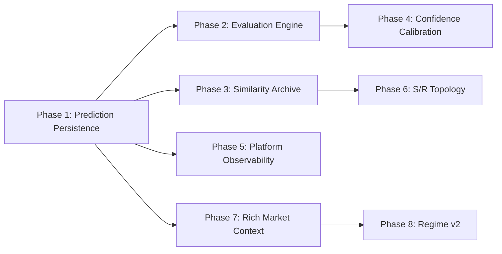
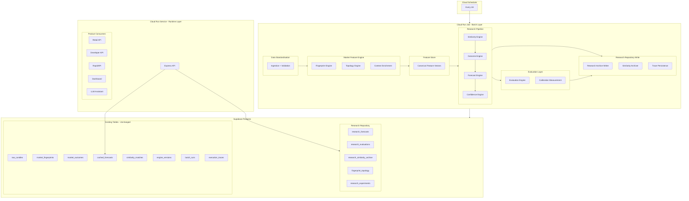
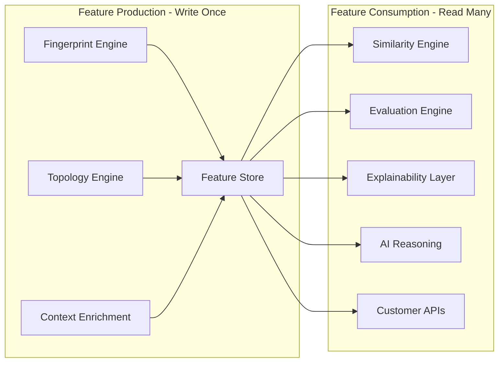
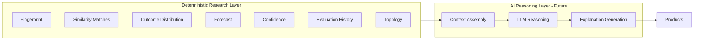
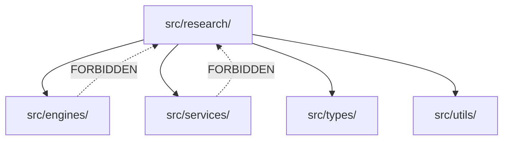

# Design Document: Research Platform Evolution

## Overview

### Philosophy: Research First, Forecasting Second

This is a **Financial Intelligence Platform**, not a forecast platform. Every engine in the system produces *research* — deterministic, reproducible, explainable observations about market behaviour. Forecasting is merely one consumer of that research. The platform's purpose is to observe, measure, archive, and explain financial markets through mathematical rigour.

The distinction matters architecturally. A forecast platform optimises for prediction accuracy. A research platform optimises for:

1. **Reproducibility** — Any historical output can be regenerated bit-identically
2. **Explainability** — Every conclusion traces back to specific observations
3. **Permanence** — All research is immutable, forming a growing corpus of financial intelligence
4. **Trustworthiness** — The Evaluation Engine measures everything, making both predictions and research independently verifiable

The platform produces two products: **Research** (the complete archive of market observations, similarities, and evaluations) and **Predictions** (probabilistic forecasts derived from that research). The Evaluation Engine makes both trustworthy by continuously measuring prediction accuracy against realised outcomes.

### Design Principles

1. **Research Identity** — Every engine produces research. Forecasting consumes research.
2. **Additive Only** — No existing tables, columns, or APIs are modified. New tables and nullable columns only.
3. **Deterministic by Default** — Every computation produces bit-identical output given identical inputs.
4. **Batch Layer Only** — All computation runs in the scheduled Cloud Run Job. The Runtime Layer serves cached data.
5. **Immutable Archive** — Once written, research records are permanent. No UPDATE, no DELETE, no TTL.
6. **Budget Constrained** — All additions must fit within Supabase 500MB free tier and £50/month total.
7. **Explain Everything** — Every prediction answers: why this prediction, which analogues, which features aligned, what reduced confidence.

### The Master Pipeline

The platform's intelligence flows through a single deterministic pipeline. Each stage produces research; downstream stages consume it:

```
Market Data (External Providers)
        │
        ▼
Data Standardisation (Ingestion + Validation)
        │
        ▼
Market Feature Engine (Fingerprint + Topology + Context)
        │
        ▼
Feature Store (Canonical feature vectors, written once)
        │
        ▼
Similarity Engine (Historical analogue retrieval)
        │
        ▼
Outcome Engine (Empirical distribution from analogues)
        │
        ▼
Forecast Engine (Probabilistic prediction)
        │
        ▼
Confidence Engine (Statistical reliability scoring)
        │
        ▼
Evaluation Engine (Accuracy measurement against reality)
        │
        ▼
Research Repository (Permanent, immutable archive)
        │
        ├──────────────────┐
        ▼                  ▼
AI Reasoning Layer    Customer APIs
        │                  │
        └────────┬─────────┘
                 ▼
Financial Intelligence Platform (Products)
```

### Product Architecture (Multi-Consumer)

The platform is fundamentally a **data platform** serving multiple consumers from a single Research Repository:

| Consumer | Access Pattern | Data Consumed |
|----------|---------------|---------------|
| Retail API | REST, cached responses | Forecasts + tradeability + explanations |
| Developer API | REST, authenticated | Full research archive, similarity data, evaluations |
| RapidAPI | REST, marketplace | Forecasts + confidence + basic explanations |
| Dashboard | HTTP, browser | Visualisations of forecasts, calibration, topology |
| Internal Analytics | Direct DB queries | Full research corpus for development |
| LLM Assistant | Structured context | Research summaries, explanations, evaluation data |
| Institutional API (future) | REST, SLA-bound | Raw research data, topology, regime analysis |

All consumers read from the same Research Repository. No consumer modifies research data. The separation between research production (Batch Layer) and research consumption (Runtime Layer + APIs) is absolute.

### Phase Dependency Chain



## Architecture

### High-Level Architecture



### The Fingerprint as Digital Twin of Market State

The fingerprint is not merely "vectors". It is a **digital twin** of market state at a moment in time — a rich, multi-dimensional representation capturing everything the platform knows about the market at that instant. Each dimension exists for a specific reason:

| Feature Domain | What It Captures | Why It Exists |
|----------------|------------------|---------------|
| **Market Geometry** (L1) | Price structure, swing patterns, body/shadow ratios | Markets repeat geometric patterns; structure drives similarity |
| **Volatility Memory** (L2) | ATR percentiles, expansion/contraction, dispersion | Volatility clusters; regime context determines which analogues are relevant |
| **Liquidity / S&R Topology** (L3 + Topology) | Support/resistance density, price rejection zones | Price behaviour changes at structural levels; topology gates prediction confidence |
| **Macro Context** (L4) | DXY, VIX, SPX, US10Y, Gold alignment | Cross-market forces drive FX; macro context distinguishes otherwise-identical price structures |
| **Sentiment Pressure** (L5) | Fear index, risk appetite, bond stress | Market sentiment shifts behaviour; identical structures behave differently under different sentiment |
| **Cross-Market Behaviour** | Correlated instrument alignment scores | Currency pairs respond to cross-market flows; isolation misses systematic forces |
| **Trend Memory** | Rolling trend from 50 candles | Current structure only makes sense in trending vs ranging context |
| **Session Behaviour** | Per-session statistics (candle count, avg range) | London, NY, and Asia sessions exhibit systematically different behaviour |
| **Market Structure** | Regime classification (vol + trend + session) | The regime determines which weight matrix the Similarity Engine applies |
| **Feature Provenance** | Schema version, quantile table, normalisation method | Every feature must be reproducible; provenance guarantees bit-identical reconstruction |

Each feature domain is independently computed with no cross-layer leakage, independently normalised to [0, 1], and independently versioned. The Feature Store writes them once; every downstream component consumes the same canonical feature set.

### Feature Store Concept

The fingerprint is fundamentally a **feature vector**. The platform implements an explicit Feature Store pattern:



**Key principles:**
- Features are computed once during the batch pipeline and persisted immutably
- Every downstream consumer reads the same canonical feature set — no recomputation
- Feature provenance (schema version, quantile table, normalisation method) is recorded per-feature
- The Feature Store is the `market_fingerprints` table (L1-L5 vectors + extended_state JSONB) combined with `fingerprint_topology` (structural levels)

### Evaluation Engine: Making Research Trustworthy

The Evaluation Engine is not an afterthought — it is the component that makes both Predictions and Research trustworthy. It appears prominently in the architecture because:

1. **Every prediction is evaluated** — No forecast escapes measurement against reality
2. **Calibration is continuous** — The platform knows whether its confidence scores are honest
3. **Evidence feeds back** — Evaluation data informs Confidence Engine v2 calibration parameters
4. **Trust is measurable** — Consumers can see historical accuracy rates per regime, per confidence bucket

The Evaluation Engine runs after the main pipeline and produces:
- Per-forecast accuracy metrics (direction accuracy, move error, Brier score)
- Calibration measurement (confidence vs observed accuracy per bucket)
- Tradeability success (was the prediction actionable?)
- Longitudinal research data for confidence model improvement

### Topology Engine as First-Class Pipeline Stage

Support & Resistance is promoted to its own engine — not a derived feature within the fingerprint, but a complete subsystem:

```
Fingerprint Engine → Topology Engine → Feature Store → Similarity Engine
```

**Why a separate engine:**
- S/R topology is a distinct computational domain requiring its own versioning, configuration, and evolution
- Future asset classes (equities, crypto, commodities) will have fundamentally different S/R characteristics
- The topology vector (40 dimensions) feeds the Similarity Engine as a weighted layer independently of L1-L5
- Topology enriches the Explainability Layer: "price is 5 pips from strong resistance with 7 touches"

The Topology Engine consumes historical price data (up to 120 candles) and produces:
- Up to 20 structural levels with type, strength, touch/rejection/breakout counts
- A fixed-length normalised vector for similarity comparison
- Distance-from-price measurements for each level

### AI Reasoning Architecture

The AI does not predict prices. The AI **explains markets**. It consumes deterministic research rather than raw prices, which makes hallucinations less likely and gives the AI grounded evidence to reason from.



**Pipeline position:** AI Reasoning sits after Evaluation, consuming fully-validated research:
```
Raw Market → Fingerprint → Similarity → Outcome → Forecast → Confidence → Evaluation → AI Reasoning → Products
```

**Why this ordering matters:**
- The AI never touches raw market data — it reasons over structured, deterministic research
- Every fact the AI references has been computed deterministically and is independently verifiable
- The AI can explain "why" because it has access to the full reasoning chain (similar markets, outcomes, confidence factors)
- Hallucination risk is minimised: the AI cites specific fingerprint matches, not vague patterns

**AI Reasoning is NOT in the current implementation scope** — Gemini 2.5 Flash is connected but unused. The architecture reserves this position for when the AI is activated as an explanation consumer, not a prediction producer.

### Explainability Layer

Every prediction must answer these questions. The Explainability Layer is the contract between the Research Repository and all consumers:

| Question | Data Source | Available To |
|----------|-------------|--------------|
| Why this prediction? | Outcome distribution from matched analogues | All APIs, Dashboard, AI |
| Which historical analogues? | Similarity archive (up to 50 matches with scores) | Developer API, AI |
| Which features aligned? | Per-layer similarity breakdown (L1-L5 + topology) | Developer API, AI |
| Which features differed? | match_explanation.mismatched_layers | Developer API, AI |
| Why is confidence high/low? | Confidence factors (raw, sample_weight, regime_stability) | All APIs, Dashboard |
| What reduced confidence? | Low sample size, regime diversity, distribution spread | All APIs, Dashboard |

This explanation contract is fulfilled by the data already persisted in the Research Repository. No additional computation is needed at query time — explanations are pre-computed during the batch pipeline and stored alongside predictions.

### Namespace Architecture

```
src/
├── engines/              # Pure computation (unchanged)
├── services/             # Side-effect services (unchanged)
├── api/                  # Runtime API (unchanged)
├── research/             # NEW: Research namespace
│   ├── index.ts          # Barrel file — single public export surface
│   ├── persistence/      # Phase 1: Forecast record persistence
│   │   ├── index.ts
│   │   ├── research-archive-writer.ts
│   │   └── types.ts
│   ├── evaluation/       # Phase 2: Evaluation engine
│   │   ├── index.ts
│   │   ├── evaluation-engine.ts
│   │   ├── calibration.ts
│   │   └── types.ts
│   ├── archival/         # Phase 3: Similarity archive persistence
│   │   ├── index.ts
│   │   ├── similarity-archiver.ts
│   │   └── types.ts
│   └── experimentation/  # Phase 5: A/B engine testing
│       ├── index.ts
│       ├── experiment-runner.ts
│       └── types.ts
├── types/
└── config/
```

### Dependency Direction (One-Way)



The batch-entry.ts orchestrator imports from `src/research/` to wire research stages into the post-pipeline flow. This is the only external consumer of the research namespace.

## Components and Interfaces

### Market Feature Engine (Fingerprint + Topology + Context)

The Market Feature Engine is the collective term for three components that produce the complete feature set for each market state observation:

#### Fingerprint Engine

**Location:** `src/engines/fingerprint-engine.ts` (existing, extended)

Produces the core 5-layer feature vector:
- **L1: Market Structure** (16 dims) — Price geometry, swing structure, candlestick morphology
- **L2: Volatility Profile** (12 dims) — ATR percentiles, expansion/contraction, dispersion
- **L3: Liquidity Field** (20 dims) — S/R pressure density, price rejection zones
- **L4: Macro Context** (8 dims) — Cross-asset alignment (DXY, VIX, SPX, US10Y, Gold)
- **L5: Sentiment Pressure** (6 dims) — Fear index, risk appetite, bond stress

Plus `extended_state` JSONB for Phase 7 enrichment features.

#### Topology Engine (Phase 6 — First-Class Pipeline Stage)

**Location:** `src/engines/topology-engine.ts`

```typescript
export interface TopologyLevel {
  price: number;
  type: 'support' | 'resistance' | 'flip_zone';
  strength: number;                     // [0, 1] normalised rejection frequency
  touch_count: number;
  rejection_count: number;
  breakout_count: number;
  age_in_candles: number;
  distance_from_current_price_pips: number;
  relative_importance: number;          // normalised to sum to 1.0
}

export interface TopologyOutput {
  fingerprint_id: string;
  asset: string;
  levels: TopologyLevel[];              // max 20
  insufficient_history: boolean;
  candle_count_used: number;
  engine_version: string;
}
```

**Behaviour:**
- Uses most recent 120 candles (480H) of price history
- If < 30 candles available → empty topology, `insufficient_history = true`
- Stored in separate `fingerprint_topology` table (FK to market_fingerprints)
- Produces a 40-dimensional normalised vector for similarity layer comparison
- Similarity Engine weight for topology layer = 0.0 initially (research-only until activated)
- Deterministic: identical ordered price history → identical output
- Future-proofed: topology computation logic is asset-class aware (FX patterns differ from equities)

#### Context Enrichment (Phase 7 — Extended Features)

**Location:** `src/engines/fingerprint-engine.ts` (extended_state additions)

```typescript
export interface ExtendedMarketFeatures {
  rolling_trend?: number;                // normalised [0, 1], from 50 candles
  atr_percentile?: number;               // normalised [0, 1]
  volatility_regime_score?: number;      // normalised [0, 1]
  session_statistics?: {
    asia: { count: number; avg_range: number };
    london: { count: number; avg_range: number };
    ny: { count: number; avg_range: number };
  };
  correlated_markets?: Record<string, number>;  // instrument → alignment [0, 1]
  economic_calendar_summary?: {
    high_impact_event: boolean;
    hours_to_next_event: number;
  };
  macro_state?: number;                  // composite normalised [0, 1]
  sentiment_summary?: number;            // composite normalised [0, 1]
}
```

**Behaviour:**
- Each feature independently enableable via `engine_versions.config`
- Missing data → substitute 0.5 (neutral default)
- Fewer than 50 candles for rolling_trend → compute with available, record actual count
- All values rounded to 6 decimal places
- Increments `fingerprint_schema_version` when new features added

### Evaluation Engine (Phase 2 — Research Integrity)

**Location:** `src/research/evaluation/evaluation-engine.ts`

The Evaluation Engine is the component that makes the platform's research trustworthy. It continuously measures prediction accuracy against realised market outcomes.

```typescript
export interface EvaluationInput {
  forecast: ResearchForecastRecord;
  realised_outcome: {
    net_return_pips: number;
    timestamp_utc: string;
  };
}

export interface EvaluationRecord {
  evaluation_id: string;
  forecast_id: string;
  outcome_id: string;
  batch_id: string;
  engine_version: string;
  direction_accuracy: 0 | 1;
  forecast_success: boolean;
  tradeability_success: boolean;
  expected_move_error: number;
  absolute_error: number;
  rmse_contribution: number;
  brier_score: number;
  confidence_calibration_score: number;
  calibration_bucket: string;
  created_at: string;
}

export interface EvaluationEngine {
  evaluateMaturedForecasts(batchId: string): Promise<EvaluationRecord[]>;
}
```

**Behaviour:**
- Runs as post-pipeline batch stage, after the 7-stage pipeline completes
- Queries `research_forecasts` for records where `forecast_expiry < NOW()`
- Joins against `market_outcomes` for realised return
- If outcome unavailable after 2 cycles (8h) → mark as `outcome_unavailable`
- Deterministic: same forecast + same outcome = identical evaluation record
- FLAT_THRESHOLD = 2 pips (imported from constants)
- Produces calibration data that feeds Confidence Engine v2

### Research Archive Writer (Phase 1)

**Location:** `src/research/persistence/research-archive-writer.ts`

```typescript
export interface ResearchForecastRecord {
  fingerprint_id: string;
  batch_id: string;
  asset: string;
  timeframe: string;
  forecast_timestamp: string;           // ISO-8601 UTC
  forecast_expiry: string;              // ISO-8601 UTC (mirrors cached_forecasts.valid_until)
  direction_probabilities: { up: number; down: number; flat: number };
  expected_move_pips: number;
  confidence_raw: number;
  confidence_final: number;
  tradeability_placeholder: null;
  engine_versions: Record<string, string>;
  quantile_table_version: string;
  regime: { volatility_regime: string; trend_regime: string; session: string };
  sample_size: number;
  created_at: string;
}

export interface ResearchArchiveWriter {
  persistForecast(record: ResearchForecastRecord): Promise<void>;
}
```

**Behaviour:**
- Called after the cache_write stage succeeds (within 30 seconds)
- Single INSERT to `research_forecasts` table
- On duplicate key (fingerprint_id, batch_id) → reject silently, log warning
- On failure → log error with batch_id + fingerprint_id, do NOT retry, do NOT halt batch

### Similarity Archiver (Phase 3)

**Location:** `src/research/archival/similarity-archiver.ts`

```typescript
export interface SimilarityArchiveRecord {
  fingerprint_id: string;
  match_fingerprint_id: string;
  similarity_score: number;           // NUMERIC(8,6)
  layer_breakdown: {
    market_structure: number;
    volatility: number;
    liquidity: number;
    macro: number;
    sentiment: number;
  };
  match_explanation: {
    matched_layers: string[];
    mismatched_layers: string[];
    primary_match_reason: string;
  };
  rank: number;
  batch_id: string;
  engine_versions: Record<string, string>;
  created_at: string;
}

export interface SimilarityArchiver {
  persistMatches(records: SimilarityArchiveRecord[]): Promise<void>;
}
```

**Behaviour:**
- Called within the similarity stage, BEFORE outcome stage begins
- Persists all matches (up to 50 per query fingerprint)
- On failure → HALT downstream, mark batch as failed (critical data for explainability)
- Unique constraint on (fingerprint_id, match_fingerprint_id, batch_id)

### Confidence Engine v2 (Phase 4 — Evidence-Based)

**Location:** `src/engines/confidence-engine-v2.ts` (loaded via VersionService)

```typescript
export interface CalibrationParameters {
  regime_accuracy: Record<string, number>;     // regime → observed accuracy
  bucket_success_rates: Record<string, number>; // bucket → observed success rate
  sample_density_curve: number[];              // sample_size → accuracy curve
  global_fallback: {
    base_score: number;
    regime_modifier: number;
    sample_modifier: number;
  };
}

export interface ConfidenceV2Output {
  calibration_adjusted_base: number;    // [0.0, 1.0]
  regime_accuracy_modifier: number;     // [0.0, 1.0]
  sample_density_modifier: number;      // [0.0, 1.0]
  confidence_final: number;             // [0.0, 1.0], 6 decimal places
  using_fallback: boolean;
}
```

**Behaviour:**
- Calibration parameters frozen per engine version (stored in engine_versions.config)
- Requires minimum 30 evaluated forecasts per grouping (regime or bucket)
- Falls back to global parameters when insufficient data
- Same formula as v1 (multiplicative composition) but with empirical inputs from Evaluation Engine
- Both v1 and v2 loadable via VersionService for comparison

### Structured Trace Emitter (Phase 5 — Enhanced)

**Location:** `src/services/observability/trace-emitter.ts` (extended)

The existing `TraceEmitter` already implements the required interface. Phase 5 wires it into all batch stage handlers and ensures persistence to `execution_traces` within 5 seconds.

**Changes:**
- Wire `traceEngineExecution` wrapper around each stage handler in `batch-entry.ts`
- No new interfaces needed — existing `EmitTraceParams` covers all fields
- Storage budget: ~100 MB/month (6 runs/day × 7 traces × 30 days × ~700 bytes/trace ≈ 880 KB)

### Regime Engine v2 (Phase 8)

**Location:** `src/engines/regime-engine-v2.ts`

```typescript
export interface RegimeV2Output {
  primary_regime: string;               // one of 9 regime types
  secondary_regimes: Array<{
    regime: string;
    relevance_score: number;            // [0, 1]
  }>;                                    // max 2
  explanation: {
    rules_fired: string[];
    features_evaluated: Record<string, number>;
    threshold_conditions: Record<string, { threshold: number; actual: number; passed: boolean }>;
    unavailable_features: string[];
  };
  engine_version: string;
}
```

**Behaviour:**
- Deterministic rule-based classification (no ML, no black-box)
- 9 regime types: trend, ranging, expansion, contraction, macro_driven, breakout, reversal, accumulation, distribution
- Uses state_layers + extended_state features from Phase 7
- Both v1 and v2 persist classifications concurrently until v1 deactivated
- Structured explanation for every classification decision

### Experimentation Engine (Phase 5)

**Location:** `src/research/experimentation/experiment-runner.ts`

Supports A/B engine testing and offline experimentation with production isolation:
- Experiment outputs written exclusively to experiment-namespaced records
- Never read by the live Batch_Layer or Runtime_Layer
- Side-by-side comparison of outputs from different engine versions
- Executed within the same 15-minute Cloud Run timeout limit

## Data Models

### New Database Tables

#### `research_forecasts` (Phase 1)

```sql
CREATE TABLE research_forecasts (
    id UUID PRIMARY KEY DEFAULT gen_random_uuid(),
    fingerprint_id UUID NOT NULL,
    batch_id UUID NOT NULL,
    asset VARCHAR(10) NOT NULL,
    timeframe VARCHAR(4) NOT NULL DEFAULT '4H',
    forecast_timestamp TIMESTAMPTZ NOT NULL DEFAULT NOW(),
    forecast_expiry TIMESTAMPTZ NOT NULL,
    direction_probabilities JSONB NOT NULL,
    expected_move_pips NUMERIC(8, 2) NOT NULL,
    confidence_raw NUMERIC(7, 6) NOT NULL,
    confidence_final NUMERIC(7, 6) NOT NULL,
    tradeability_placeholder NUMERIC(5, 4),
    engine_versions JSONB NOT NULL,
    quantile_table_version VARCHAR(10) NOT NULL,
    regime JSONB NOT NULL,
    sample_size INTEGER NOT NULL,
    created_at TIMESTAMPTZ NOT NULL DEFAULT NOW(),
    CONSTRAINT uq_research_forecast UNIQUE (fingerprint_id, batch_id)
);

CREATE INDEX idx_rf_batch ON research_forecasts (batch_id);
CREATE INDEX idx_rf_asset_time ON research_forecasts (asset, timeframe, forecast_timestamp DESC);
CREATE INDEX idx_rf_expiry ON research_forecasts (forecast_expiry) WHERE forecast_expiry > NOW();
CREATE INDEX idx_rf_regime ON research_forecasts (asset, (regime->>'volatility_regime'), (regime->>'trend_regime'));
```

#### `research_evaluations` (Phase 2)

```sql
CREATE TABLE research_evaluations (
    id UUID PRIMARY KEY DEFAULT gen_random_uuid(),
    forecast_id UUID NOT NULL REFERENCES research_forecasts(id),
    outcome_id UUID NOT NULL REFERENCES market_outcomes(outcome_id),
    batch_id UUID NOT NULL,
    engine_version VARCHAR(10) NOT NULL,
    direction_accuracy SMALLINT NOT NULL CHECK (direction_accuracy IN (0, 1)),
    forecast_success BOOLEAN NOT NULL,
    tradeability_success BOOLEAN NOT NULL,
    expected_move_error NUMERIC(10, 2) NOT NULL,
    absolute_error NUMERIC(10, 2) NOT NULL,
    rmse_contribution NUMERIC(12, 4) NOT NULL,
    brier_score NUMERIC(7, 6) NOT NULL,
    confidence_calibration_score NUMERIC(7, 6) NOT NULL,
    calibration_bucket VARCHAR(10) NOT NULL,
    status VARCHAR(20) NOT NULL DEFAULT 'evaluated',
    created_at TIMESTAMPTZ NOT NULL DEFAULT NOW(),
    CONSTRAINT uq_research_eval UNIQUE (forecast_id, batch_id)
);

CREATE INDEX idx_re_batch ON research_evaluations (batch_id);
CREATE INDEX idx_re_bucket ON research_evaluations (calibration_bucket, direction_accuracy);
CREATE INDEX idx_re_engine ON research_evaluations (engine_version);
```

#### `research_similarity_archive` (Phase 3)

```sql
CREATE TABLE research_similarity_archive (
    id UUID PRIMARY KEY DEFAULT gen_random_uuid(),
    fingerprint_id UUID NOT NULL,
    match_fingerprint_id UUID NOT NULL,
    similarity_score NUMERIC(8, 6) NOT NULL,
    layer_breakdown JSONB NOT NULL,
    match_explanation JSONB NOT NULL,
    rank SMALLINT NOT NULL,
    batch_id UUID NOT NULL,
    engine_versions JSONB NOT NULL,
    created_at TIMESTAMPTZ NOT NULL DEFAULT NOW(),
    CONSTRAINT uq_sim_archive UNIQUE (fingerprint_id, match_fingerprint_id, batch_id)
);

CREATE INDEX idx_rsa_fp_batch ON research_similarity_archive (fingerprint_id, batch_id);
CREATE INDEX idx_rsa_batch ON research_similarity_archive (batch_id);
```

#### `fingerprint_topology` (Phase 6)

```sql
CREATE TABLE fingerprint_topology (
    id UUID PRIMARY KEY DEFAULT gen_random_uuid(),
    fingerprint_id UUID NOT NULL,
    asset VARCHAR(10) NOT NULL,
    levels JSONB NOT NULL,
    topology_vector vector(40),          -- fixed-length normalised for similarity
    insufficient_history BOOLEAN NOT NULL DEFAULT false,
    candle_count_used INTEGER NOT NULL,
    engine_version VARCHAR(10) NOT NULL,
    created_at TIMESTAMPTZ NOT NULL DEFAULT NOW(),
    CONSTRAINT uq_topo UNIQUE (fingerprint_id, asset),
    CONSTRAINT fk_topo_fp FOREIGN KEY (fingerprint_id, asset)
        REFERENCES market_fingerprints(fingerprint_id, asset)
);

CREATE INDEX idx_topo_asset ON fingerprint_topology (asset, fingerprint_id);
```

#### `research_experiments` (Phase 5)

```sql
CREATE TABLE research_experiments (
    id UUID PRIMARY KEY DEFAULT gen_random_uuid(),
    experiment_id UUID NOT NULL,
    engine_versions JSONB NOT NULL,
    original_batch_id UUID,
    input_fingerprint_id UUID,
    output JSONB,
    status VARCHAR(20) NOT NULL DEFAULT 'running',
    failure_detail TEXT,
    created_at TIMESTAMPTZ NOT NULL DEFAULT NOW(),
    CONSTRAINT uq_experiment UNIQUE (experiment_id, input_fingerprint_id)
);

CREATE INDEX idx_exp_id ON research_experiments (experiment_id);
```

### Storage Budget Estimation

| Table | Growth Rate | Est. 12-month Size |
|-------|-------------|-------------------|
| research_forecasts | 6 rows/day (~1KB each) | ~2.2 MB |
| research_evaluations | 6 rows/day (~500B each) | ~1.1 MB |
| research_similarity_archive | 300 rows/day (~400B each) | ~43 MB |
| fingerprint_topology | 6 rows/day (~2KB each) | ~4.4 MB |
| execution_traces | 42 rows/day (~700B each) | ~10.7 MB |
| **Total new storage** | | **~61 MB/year** |

Combined with existing tables (~60 MB), total stays well under the 400 MB threshold (80% of 500 MB free tier).

### Immutability Enforcement

All research tables enforce immutability via:
1. **Application-level** — No UPDATE/DELETE in any code path
2. **Database-level** — Row-level security policies or trigger-based denial:

```sql
-- Example RLS policy for research_forecasts (applied per table)
CREATE POLICY no_modify_research_forecasts ON research_forecasts
    FOR UPDATE USING (false);
CREATE POLICY no_delete_research_forecasts ON research_forecasts
    FOR DELETE USING (false);
```


## Correctness Properties

*A property is a characteristic or behavior that should hold true across all valid executions of a system — essentially, a formal statement about what the system should do. Properties serve as the bridge between human-readable specifications and machine-verifiable correctness guarantees.*

### Property 1: Universal Engine Determinism

*For any* engine (Evaluation, Confidence v2, Topology, Regime v2, extended Fingerprint), invoking the engine twice with bit-identical inputs SHALL produce bit-identical outputs — including all numeric fields, ordering of collections, and hash values.

**Validates: Requirements 2.1, 2.3, 2.5, 7.8, 11.2, 13.5, 14.6, 15.2, 15.5**

### Property 2: Empirical Distribution Purity

*For any* array of N forward returns (N ≥ 1), the computed outcome distribution SHALL satisfy: `up_probability = count(r > 2) / N`, `down_probability = count(r < -2) / N`, `flat_probability = count(|r| ≤ 2) / N`, and `up + down + flat = 1.0` — with no additional synthetic observations, weighting, or smoothing applied.

**Validates: Requirements 1.1, 1.2, 1.5**

### Property 3: Evaluation Metrics Correctness

*For any* forecast record with direction_probabilities and expected_move_pips, and any realised outcome with net_return_pips, the Evaluation Engine SHALL produce: `direction_accuracy = 1` iff the highest-probability direction matches the realised direction (using FLAT_THRESHOLD=2), `expected_move_error = expected_move_pips - net_return_pips`, `absolute_error = |expected_move_error|`, `brier_score = mean((predicted_vector - one_hot_realised)²)`, `forecast_success = (direction_accuracy == 1)`, and `tradeability_success = forecast_success AND (absolute_error ≤ 0.5 * |net_return_pips|)`.

**Validates: Requirements 7.4, 7.5, 7.6**

### Property 4: Confidence Output Bounds

*For any* valid ConfidenceInput (all components in [0, 1], sample_size ≥ 1), both Confidence Engine v1 and v2 SHALL produce outputs where every named component (calibration_adjusted_base, regime_accuracy_modifier, sample_density_modifier, confidence_final, confidence_raw, sample_weight, regime_stability) is individually bounded to [0.0, 1.0] with at most 6 decimal places of precision.

**Validates: Requirements 11.5, 11.7, 6.3**


### Property 5: Record Provenance Completeness

*For any* record persisted to research_forecasts, research_evaluations, or research_similarity_archive, the record SHALL contain non-null values for: batch_id (valid UUID), engine_versions (non-empty JSON object mapping engine names to version strings), and created_at (valid ISO-8601 UTC timestamp).

**Validates: Requirements 3.3, 7.11, 9.1, 10.2**

### Property 6: Calibration Bucket Assignment

*For any* confidence_final value in [0.0, 1.0], the assigned calibration_bucket SHALL be deterministic and fall into exactly one of the 10 uniform buckets: [0.0–0.1), [0.1–0.2), ..., [0.8–0.9), [0.9–1.0], where the boundaries are fixed constants independent of data distribution.

**Validates: Requirements 8.1, 8.4**

### Property 7: Calibration Accuracy Computation

*For any* set of evaluated forecasts grouped by calibration_bucket, the per-bucket calibration accuracy SHALL equal `|bucket_midpoint - (forecast_success_count / total_count)|`, and the overall calibration score SHALL equal the mean of per-bucket deviations across all buckets with ≥ 10 forecasts.

**Validates: Requirements 8.2, 8.6**

### Property 8: OHLC Validation Invariant

*For any* OHLC candle data, the Platform SHALL accept the candle if and only if: `high >= max(open, close)`, `low <= min(open, close)`, `high >= low`, and all prices are positive (> 0). Any candle violating these constraints SHALL be rejected before database persistence.

**Validates: Requirements 17.1, 17.6**

### Property 9: Topology Output Invariants

*For any* price history of ≥ 30 candles (up to 120), the computed Support_Resistance_Topology SHALL have: at most 20 levels, each with strength in [0, 1], and the sum of all relative_importance values SHALL equal 1.0 (within floating-point tolerance of 1e-6).

**Validates: Requirements 13.1**

### Property 10: Deterministic Tie-Breaking

*For any* set of similarity candidates where two or more candidates have identical similarity_score values, the ranking SHALL be determined by fingerprint_id in ascending lexicographic order, producing identical ordering across all executions.

**Validates: Requirements 2.4**


### Property 11: Duplicate Rejection Idempotence

*For any* research record already persisted with a given (fingerprint_id, batch_id) key, attempting to persist an identical or different record with the same key SHALL be rejected without modifying the existing record — the archive state after the rejected write SHALL be bit-identical to the state before.

**Validates: Requirements 3.7, 9.6**

### Property 12: Trace Schema Completeness

*For any* engine execution (success or error), the emitted trace SHALL contain: batch_id (UUID), engine_name (non-empty string), engine_version (semver string), input_hash (64-char hex SHA-256 of JSON-serialised input), output_hash (64-char hex SHA-256 of JSON-serialised output, or SHA-256 of empty string on error), execution_time_ms (non-negative integer), status ("success" or "error"), and timestamp_utc (valid ISO-8601). When status is "error", error_detail SHALL be a non-empty string.

**Validates: Requirements 12.1, 12.7, 1.7**

### Property 13: Trace Failure Isolation

*For any* engine execution, if trace emission or persistence fails, the engine's return value SHALL be unaffected — the calling code SHALL receive the same output (or same error) regardless of whether the trace was successfully persisted.

**Validates: Requirements 12.3**

### Property 14: Experiment Production Isolation

*For any* experiment-tagged record in research_experiments, the live Batch_Layer pipeline queries (similarity retrieval, outcome computation, forecast generation) SHALL never read from or be influenced by experiment-namespaced records.

**Validates: Requirements 5.2**

### Property 15: Regime v2 Output Structure

*For any* valid fingerprint input (with state_layers and optionally extended_state), the Regime Engine v2 SHALL produce exactly one primary_regime from the set {trend, ranging, expansion, contraction, macro_driven, breakout, reversal, accumulation, distribution}, at most 2 secondary_regimes each with a relevance_score in [0.0, 1.0], and a non-empty explanation containing rules_fired, features_evaluated, and threshold_conditions.

**Validates: Requirements 15.1, 15.6**

### Property 16: Extended Feature Bounds and Defaults

*For any* fingerprint computation with extended features enabled, each computed feature value SHALL be in [0.0, 1.0] rounded to 6 decimal places. If the data provider for a feature is unavailable, the feature SHALL be set to 0.5 (scalar) or mid-range neutral (vector).

**Validates: Requirements 14.1, 14.3**

### Property 17: Feature Enablement via Config

*For any* Fingerprint_Engine version configuration where a feature key is set to false, that feature SHALL NOT appear in the extended_state output. Only features with their key set to true in the active configuration SHALL be computed and included.

**Validates: Requirements 14.2**

### Property 18: Point-in-Time Correctness

*For any* fingerprint with timestamp T, all input data used in its construction (OHLC candles, macro context, historical candles for rolling computations) SHALL have a timestamp_utc ≤ T. No data point with timestamp > T SHALL contribute to the fingerprint, similarity matching, or outcome computation.

**Validates: Requirements 1.4**

### Property 19: Gap Detection Completeness

*For any* sequence of ingested candle timestamps for an asset/timeframe, the gap detector SHALL identify every missing 4H boundary (from the set {0, 4, 8, 12, 16, 20} UTC hours) between the earliest and latest timestamps in the sequence, with zero false negatives.

**Validates: Requirements 17.3**


## Error Handling

### Error Handling Strategy by Phase

| Phase | Component | Failure Mode | Response |
|-------|-----------|-------------|----------|
| 1 | Research Archive Write | DB write fails | Log error (batch_id, fingerprint_id, reason). Continue batch. Do NOT retry. |
| 1 | Research Archive Write | Duplicate key conflict | Log warning. Continue batch. Existing record preserved. |
| 2 | Evaluation Engine | Outcome unavailable | After 2 batch cycles (8h), mark forecast as `outcome_unavailable`. Continue. |
| 2 | Evaluation Engine | Computation error | Log error. Skip that forecast evaluation. Continue with remaining. |
| 3 | Similarity Archiver | DB write fails | **HALT downstream stages**. Mark batch as FAILED. Discard partial output. |
| 4 | Confidence v2 | Insufficient calibration data (<30) | Fall back to global calibration parameters. Flag output as `using_fallback`. |
| 5 | Trace Emitter | Persistence fails | Log to console.error. **Never halt pipeline**. Engine output unaffected. |
| 6 | Topology Engine | Insufficient history (<30 candles) | Store empty topology. Set `insufficient_history = true`. Continue. |
| 7 | Extended Features | Provider unavailable | Substitute neutral default (0.5). Log warning in trace. Continue. |
| 7 | Extended Features | <50 candles for rolling_trend | Compute with available candles (min 1). Record actual count. Continue. |
| 8 | Regime v2 | Neutral default features present | Classify using available non-default features. List excluded features in explanation. |

### Error Severity Classification

```
CRITICAL (halt batch):
  - Similarity archive write failure (explainability chain broken)
  - Missing active engine version at batch start
  - All data providers return invalid OHLC for same candle

WARNING (log and continue):
  - Research forecast archive write failure
  - Trace persistence failure
  - Single evaluation outcome unavailable
  - Data provider returns invalid OHLC (fallback to next provider)
  - Extended feature data provider unavailable

INFO (normal operation):
  - Duplicate key rejection on research tables
  - Insufficient history for topology (< 30 candles)
  - Calibration fallback to global parameters
```

### Error Propagation Rules

1. **Research writes (Phase 1, 2)** — Failures are isolated. The serving layer (cached_forecasts) is unaffected. The batch run completes successfully.
2. **Similarity archive (Phase 3)** — Failure is critical because the explainability chain would be incomplete. Downstream stages cannot proceed without archived match data.
3. **Traces (Phase 5)** — The trace emitter already implements try/catch with console.error fallback. This pattern is preserved.
4. **Engines (Phase 4, 6, 7, 8)** — New engines follow existing engine error patterns: throw on invalid input, let the BatchOrchestrator handle stage failure.


## Testing Strategy

### Testing Framework

- **Unit & Integration:** Vitest (existing)
- **Property-Based Testing:** fast-check 4.8.0 (existing)
- **Minimum PBT iterations:** 100 per property
- **Tag format:** `Feature: research-platform-evolution, Property {N}: {title}`

### Dual Testing Approach

| Test Type | Purpose | Count Target |
|-----------|---------|--------------|
| Unit tests | Specific examples, edge cases, error paths | 1+ per public function |
| Property tests | Universal invariants across all valid inputs | 1 per correctness property |
| Integration tests | Module boundaries, DB interactions, pipeline flow | 1+ per service boundary |
| Migration tests | Schema additive-only, data preservation | 1 per migration file |
| Regression tests | Existing behaviour unchanged | All existing 671 tests pass |

### Property Test Plan

Each correctness property maps to a single property-based test file:

| Property | Test File | Generator Strategy |
|----------|-----------|-------------------|
| 1: Universal Determinism | `tests/research/determinism.property.test.ts` | Generate random valid inputs per engine, run twice, compare |
| 2: Empirical Distribution Purity | `tests/research/empirical-purity.property.test.ts` | Generate random float arrays (forward returns), verify formula |
| 3: Evaluation Metrics | `tests/research/evaluation-metrics.property.test.ts` | Generate random forecast+outcome pairs, verify all metric formulas |
| 4: Confidence Output Bounds | `tests/research/confidence-bounds.property.test.ts` | Generate random ConfidenceInput values in [0,1], verify output bounds |
| 5: Record Provenance | `tests/research/record-provenance.property.test.ts` | Generate random records, verify metadata fields non-null |
| 6: Calibration Bucket Assignment | `tests/research/calibration-bucket.property.test.ts` | Generate random confidence_final in [0,1], verify bucket assignment |
| 7: Calibration Accuracy | `tests/research/calibration-accuracy.property.test.ts` | Generate random evaluation sets per bucket, verify formula |
| 8: OHLC Validation | `tests/research/ohlc-validation.property.test.ts` | Generate random OHLC (valid+invalid), verify acceptance/rejection |
| 9: Topology Invariants | `tests/research/topology-invariants.property.test.ts` | Generate random price histories (30-120 candles), verify constraints |
| 10: Deterministic Tie-Breaking | `tests/research/tie-breaking.property.test.ts` | Generate candidate sets with duplicate scores, verify ordering |
| 11: Duplicate Rejection | `tests/research/duplicate-rejection.property.test.ts` | Generate records, persist twice, verify idempotence |
| 12: Trace Schema | `tests/research/trace-schema.property.test.ts` | Generate random engine executions, verify trace field completeness |
| 13: Trace Failure Isolation | `tests/research/trace-isolation.property.test.ts` | Generate executions with failing trace, verify return value unchanged |
| 14: Experiment Isolation | `tests/research/experiment-isolation.property.test.ts` | Generate experiment records, verify pipeline excludes them |
| 15: Regime v2 Structure | `tests/research/regime-v2-structure.property.test.ts` | Generate random fingerprints, verify output structure constraints |
| 16: Feature Bounds/Defaults | `tests/research/feature-bounds.property.test.ts` | Generate random/missing inputs, verify [0,1] bounds and 0.5 defaults |
| 17: Feature Enablement | `tests/research/feature-enablement.property.test.ts` | Generate configs with random enabled/disabled features, verify output |
| 18: Point-in-Time | `tests/research/point-in-time.property.test.ts` | Generate timestamped data, verify no future data used |
| 19: Gap Detection | `tests/research/gap-detection.property.test.ts` | Generate timestamp sequences with random gaps, verify all detected |

### Integration Test Plan

| Phase | Test File | Coverage |
|-------|-----------|----------|
| 1 | `tests/integration/research-archive.integration.test.ts` | End-to-end persist + query |
| 2 | `tests/integration/evaluation-pipeline.integration.test.ts` | Matured forecast evaluation lifecycle |
| 3 | `tests/integration/similarity-archive.integration.test.ts` | Archive write + failure halting |
| 5 | `tests/integration/trace-wiring.integration.test.ts` | All stages emit traces |
| All | `tests/integration/immutability.integration.test.ts` | RLS policies reject UPDATE/DELETE |

### Migration Test Plan

Each new migration file gets a corresponding test verifying:
1. Migration applies without errors on seeded database
2. Pre-existing table row counts unchanged
3. Pre-existing columns accessible with original types
4. New tables created with correct schema

### Test Execution

```bash
# Full suite (including new research tests)
vitest --run

# Property tests only
vitest --run tests/research/*.property.test.ts

# Integration tests only
vitest --run tests/integration/*.integration.test.ts
```

### Coverage Requirements

- Line coverage SHALL not decrease from current baseline
- All new public functions SHALL have ≥1 unit test
- All new engines SHALL have ≥1 property test
- All new migrations SHALL have ≥1 migration test
