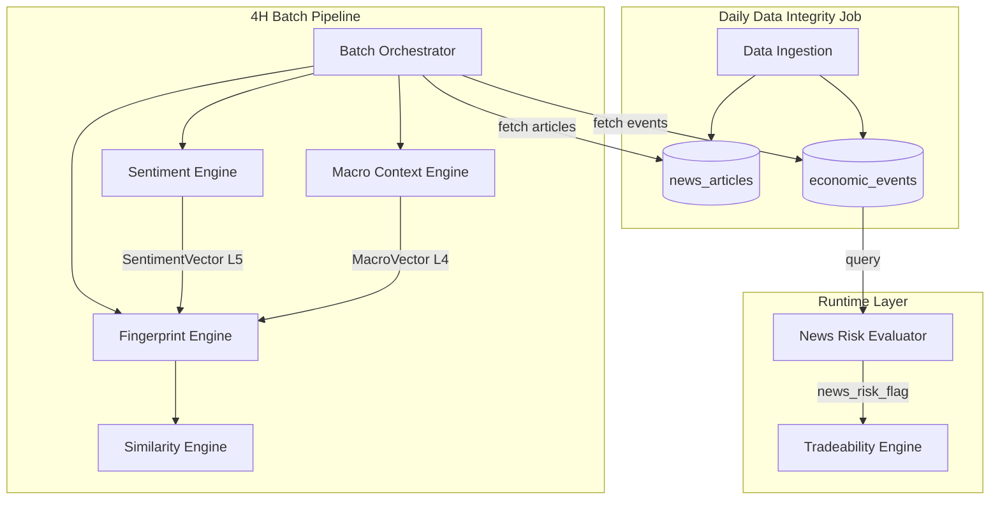
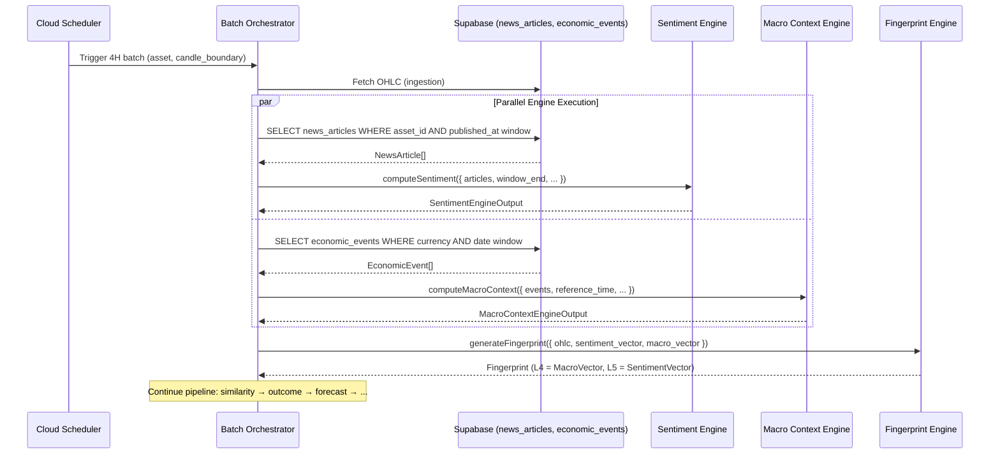
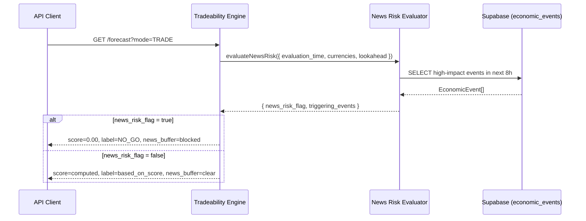

# Design Document: Sentiment & Macro Context Engines

## Overview

This design introduces three computational components into the existing batch pipeline:

1. **Sentiment Engine** — Consumes news articles from the `news_articles` table and produces a 6-dimensional sentiment vector (L5 fingerprint layer) plus a scalar `sentiment_score`.
2. **Macro Context Engine** — Consumes economic calendar events from the `economic_events` table and produces an 8-dimensional macro vector (L4 fingerprint layer) plus a scalar `macro_state`.
3. **News Risk Evaluator** — Queries upcoming high-impact events and produces a boolean `news_risk_flag` consumed by the tradeability engine at runtime.

All three are pure, deterministic functions: given identical inputs they produce bit-identical outputs. They slot into the existing pipeline between ingestion and fingerprint generation, replacing the current hardcoded neutral placeholders.

### Design Decisions

| Decision | Rationale |
|----------|-----------|
| Pure functions, no I/O inside engines | Enables property-based testing, determinism guarantee |
| Engines receive pre-fetched data arrays | Data fetching is the orchestrator's responsibility; engines are stateless |
| Exponential decay with 8h half-life | Balances recency bias with sufficient historical context for 4H windows |
| Weighted mean aggregation (not median) | Preserves signal from high-relevance articles while respecting decay |
| Neutral fallback (0.5) for missing data | Pipeline never fails; downstream engines see a "no information" signal |
| Confidence blending for sparse data | Prevents 1–2 articles from dominating the signal |
| 6 decimal places rounding | Ensures cross-platform bit-identical reproducibility |

## Architecture

### System Context



### Pipeline Stage Insertion

The engines execute as a new **Stage 1.5** between ingestion (Stage 1) and fingerprint (Stage 2):

```
Stage 1: Ingestion → OHLC data
Stage 1.5a: Sentiment Engine (parallel) → SentimentVector
Stage 1.5b: Macro Context Engine (parallel) → MacroVector  
Stage 2: Fingerprint Engine (receives SentimentVector + MacroVector)
Stage 3+: Similarity → Outcome → Forecast → Confidence → Cache Write
```

Both engines run in parallel (no data dependency between them). The orchestrator awaits both before passing results to the fingerprint engine.

The News Risk Evaluator runs at **API request time** (runtime layer), not during batch processing. It queries the `economic_events` table directly when the tradeability engine is invoked.

## Components and Interfaces

### Module Layout

```
src/engines/
├── sentiment-engine.ts          # Sentiment Engine (pure computation)
├── macro-context-engine.ts      # Macro Context Engine (pure computation)
├── news-risk-evaluator.ts       # News Risk Evaluator (DB query + logic)
└── __tests__/
    ├── sentiment-engine.test.ts
    ├── sentiment-engine.property.test.ts
    ├── macro-context-engine.test.ts
    ├── macro-context-engine.property.test.ts
    └── news-risk-evaluator.test.ts

src/types/
├── sentiment.ts                 # Sentiment-specific types
├── macro.ts                     # Macro-specific types
└── index.ts                     # Re-exports (updated)
```

### TypeScript Interfaces

#### Input Types

```typescript
/** A news article record from the news_articles table. */
export interface NewsArticle {
  readonly id: string;
  readonly asset_id: string;
  readonly headline: string;
  readonly summary: string | null;
  readonly published_at: string;           // ISO-8601 UTC
  readonly sentiment_hint: number | null;  // [-1, 1] or null
  readonly relevance_score: number;        // [0, 1]
  readonly source: string;
}

/** An economic calendar event from the economic_events table. */
export interface EconomicEvent {
  readonly id: string;
  readonly name: string;
  readonly event_date: string;             // ISO-8601 UTC
  readonly impact: 'high' | 'medium' | 'low';
  readonly actual: number | null;
  readonly estimate: number | null;
  readonly previous: number | null;
  readonly currency: string;               // e.g. "USD", "EUR"
}

/** Input to the Sentiment Engine. */
export interface SentimentEngineInput {
  readonly articles: readonly NewsArticle[];
  readonly window_end: string;             // ISO-8601 UTC (4H candle boundary)
  readonly window_hours: number;           // default 24, minimum 4
  readonly previous_aggregate_sentiment: number | null; // previous window's score for momentum
}

/** Input to the Macro Context Engine. */
export interface MacroContextEngineInput {
  readonly events: readonly EconomicEvent[];
  readonly reference_time: string;         // ISO-8601 UTC (4H candle boundary)
  readonly lookback_hours: number;         // default 72 (backward)
  readonly lookahead_hours: number;        // default 24 (forward)
}

/** Input to the News Risk Evaluator. */
export interface NewsRiskEvaluatorInput {
  readonly evaluation_time: string;        // ISO-8601 UTC
  readonly asset_currencies: readonly string[]; // e.g. ["USD", "EUR"]
  readonly lookahead_hours: number;        // default 8
}
```

#### Output Types

```typescript
/** 6-dimensional sentiment vector for L5 fingerprint layer. */
export interface SentimentVector {
  /** Composite sentiment score mapped to [0, 1]. */
  readonly aggregate_sentiment: number;
  /** Proportion of positive articles (sentiment_hint > 0.2). */
  readonly bullish_pressure: number;
  /** Proportion of negative articles (sentiment_hint < -0.2). */
  readonly bearish_pressure: number;
  /** Normalised article count: min(count / 50, 1). */
  readonly article_volume: number;
  /** Normalised variance of article scores. */
  readonly sentiment_dispersion: number;
  /** Change rate from previous window, mapped [0, 1]. */
  readonly momentum: number;
}

/** Output from the Sentiment Engine. */
export interface SentimentEngineOutput {
  readonly vector: SentimentVector;
  readonly sentiment_score: number;        // [0, 1], 6 decimal places
  readonly article_count: number;
  readonly confidence_factor: number;      // min(article_count / 3, 1)
  readonly engine_version: string;
}

/** 8-dimensional macro vector for L4 fingerprint layer. */
export interface MacroVector {
  /** Proximity pressure from nearest high-impact event. */
  readonly event_proximity_pressure: number;
  /** Weighted mean of surprise factors from recent events. */
  readonly aggregate_surprise_factor: number;
  /** Rate differential from recent rate decisions. */
  readonly rate_differential: number;
  /** High-impact event count normalised (count / 5, clamped [0,1]). */
  readonly high_impact_event_count: number;
  /** Medium-impact event count normalised (count / 10, clamped [0,1]). */
  readonly medium_impact_event_count: number;
  /** Total event density normalised (count / 20, clamped [0,1]). */
  readonly event_density: number;
  /** Weighted upcoming event intensity (next 24h). */
  readonly upcoming_event_intensity: number;
  /** Weighted average of all dimensions. */
  readonly composite_macro_state: number;
}

/** Output from the Macro Context Engine. */
export interface MacroContextEngineOutput {
  readonly vector: MacroVector;
  readonly macro_state: number;            // [0, 1], 6 decimal places
  readonly event_count: number;
  readonly engine_version: string;
}

/** Output from the News Risk Evaluator. */
export interface NewsRiskEvaluatorOutput {
  readonly news_risk_flag: boolean;
  readonly triggering_events: readonly string[]; // event names that triggered flag
  readonly hours_to_nearest: number | null;
}
```

#### Engine Function Signatures

```typescript
// ─── Sentiment Engine ───────────────────────────────────────────────────────

/**
 * Computes the sentiment vector and scalar score from news articles.
 * Pure function: no I/O, no randomness, deterministic.
 */
export function computeSentiment(input: SentimentEngineInput): SentimentEngineOutput;

/**
 * Computes exponential decay weight for an article based on age.
 * weight = 2^(-elapsed_hours / half_life)
 */
export function computeDecayWeight(
  published_at: string,
  window_end: string,
  half_life_hours: number,
): number;

/**
 * Maps a value from [-1, 1] to [0, 1] using (value + 1) / 2.
 */
export function mapToUnitInterval(value: number): number;

/**
 * Rounds a number to 6 decimal places for bit-identical reproducibility.
 */
export function roundTo6(value: number): number;

// ─── Macro Context Engine ───────────────────────────────────────────────────

/**
 * Computes the macro context vector and scalar state from economic events.
 * Pure function: no I/O, no randomness, deterministic.
 */
export function computeMacroContext(input: MacroContextEngineInput): MacroContextEngineOutput;

/**
 * Computes event proximity pressure for the nearest high-impact event.
 * Formula: 1 - (hours_to_event / 24), clamped [0, 1].
 */
export function computeEventProximity(
  hours_to_event: number,
): number;

/**
 * Computes surprise factor for a single event.
 * Formula: (actual - estimate) / |estimate|, clamped [-1, 1], mapped to [0, 1].
 * Special case: if estimate === 0, uses (actual - estimate) clamped [-1, 1].
 */
export function computeSurpriseFactor(
  actual: number,
  estimate: number,
): number;

// ─── News Risk Evaluator ────────────────────────────────────────────────────

/**
 * Evaluates whether a high-impact event is within the risk window.
 * Unlike the engines, this performs a database query.
 */
export function evaluateNewsRisk(
  input: NewsRiskEvaluatorInput,
  supabase: SupabaseClient,
): Promise<NewsRiskEvaluatorOutput>;
```

### Integration with Batch Orchestrator

The `StageHandlers` interface will be extended:

```typescript
export interface StageHandlers {
  // ... existing handlers ...
  
  /** Sentiment engine handler. Runs in parallel with macro before fingerprint. */
  sentiment?: (input: SentimentEngineInput) => Promise<SentimentEngineOutput>;
  
  /** Macro context engine handler. Runs in parallel with sentiment before fingerprint. */
  macro_context?: (input: MacroContextEngineInput) => Promise<MacroContextEngineOutput>;
}
```

The `FingerprintInput` interface will be extended:

```typescript
export interface FingerprintInput {
  asset: string;
  timestamp_utc: string;
  ohlc: OHLC;
  market_context?: MacroContext;
  /** New: real sentiment vector from Sentiment Engine (replaces placeholder). */
  sentiment_vector?: SentimentVector;
  /** New: real macro vector from Macro Context Engine (replaces placeholder). */
  macro_vector?: MacroVector;
}
```

## Data Models

### news_articles Table Schema

| Column | Type | Constraints | Description |
|--------|------|-------------|-------------|
| id | uuid | PK, default gen_random_uuid() | Primary key |
| asset_id | text | NOT NULL, FK → research_assets.id | Asset this article is relevant to |
| headline | text | NOT NULL | Article headline |
| summary | text | NULLABLE | Article summary/body excerpt |
| published_at | timestamptz | NOT NULL | Publication timestamp |
| sentiment_hint | numeric(4,3) | NULLABLE, CHECK [-1, 1] | Provider sentiment score |
| relevance_score | numeric(4,3) | NOT NULL, CHECK [0, 1] | Relevance to asset |
| source | text | NOT NULL | News source identifier |
| ingested_at | timestamptz | NOT NULL, default now() | When record was created |
| run_date | date | NOT NULL | Daily ingestion run date |

**Indexes:**
- `idx_news_articles_asset_published` on (asset_id, published_at DESC)
- `idx_news_articles_run_date` on (run_date)

### economic_events Table Schema

| Column | Type | Constraints | Description |
|--------|------|-------------|-------------|
| id | uuid | PK, default gen_random_uuid() | Primary key |
| name | text | NOT NULL | Event name (e.g. "US CPI") |
| event_date | timestamptz | NOT NULL | Scheduled event time |
| impact | text | NOT NULL, CHECK IN ('high','medium','low') | Impact classification |
| actual | numeric | NULLABLE | Released actual value |
| estimate | numeric | NULLABLE | Consensus estimate |
| previous | numeric | NULLABLE | Previous period value |
| currency | text | NOT NULL | Affected currency code |
| ingested_at | timestamptz | NOT NULL, default now() | When record was created |
| run_date | date | NOT NULL | Daily ingestion run date |

**Indexes:**
- `idx_economic_events_currency_date` on (currency, event_date DESC)
- `idx_economic_events_impact_date` on (impact, event_date DESC) WHERE impact = 'high'
- `idx_economic_events_run_date` on (run_date)

### Impact Classification Rules

| Classification | Event Types |
|---------------|-------------|
| high | NFP, CPI, GDP, Rate Decisions, Employment Change |
| medium | PMI, Retail Sales, Trade Balance, Housing Data |
| low | All other calendar events |

### Data Flow Queries

**Sentiment Engine data fetch (by orchestrator):**
```sql
SELECT id, asset_id, headline, summary, published_at, sentiment_hint, relevance_score, source
FROM news_articles
WHERE asset_id = $1
  AND published_at >= $2::timestamptz - interval '24 hours'
  AND published_at <= $2::timestamptz
ORDER BY published_at DESC;
```

**Macro Context Engine data fetch (by orchestrator):**
```sql
SELECT id, name, event_date, impact, actual, estimate, previous, currency
FROM economic_events
WHERE currency = ANY($1)
  AND event_date >= $2::timestamptz - interval '72 hours'
  AND event_date <= $2::timestamptz + interval '24 hours'
ORDER BY event_date DESC;
```

**News Risk Evaluator query:**
```sql
SELECT name, event_date
FROM economic_events
WHERE impact = 'high'
  AND currency = ANY($1)
  AND event_date > $2::timestamptz
  AND event_date <= $2::timestamptz + interval '8 hours'
ORDER BY event_date ASC;
```

## Algorithm Details

### Sentiment Scoring Algorithm

```
FUNCTION computeSentiment(input):
  articles = filter(input.articles, a => age(a) <= window_hours)
  
  IF articles.length == 0:
    RETURN neutral_vector (all dimensions = 0.5)
  
  // Step 1: Compute per-article weighted scores
  FOR EACH article IN articles:
    base_score = article.sentiment_hint ?? 0.0
    elapsed_hours = (window_end - article.published_at) / 3600000
    decay_weight = 2^(-elapsed_hours / 8)  // half-life = 8 hours
    combined_weight = article.relevance_score * decay_weight
    weighted_scores.push({ score: base_score, weight: combined_weight })
  
  // Step 2: Weighted mean → aggregate sentiment
  total_weight = sum(weighted_scores.map(w => w.weight))
  raw_aggregate = sum(weighted_scores.map(w => w.score * w.weight)) / total_weight
  aggregate_sentiment = (raw_aggregate + 1) / 2  // map [-1,1] → [0,1]
  
  // Step 3: Directional pressure
  positive_count = count(articles where sentiment_hint > 0.2)
  negative_count = count(articles where sentiment_hint < -0.2)
  bullish_pressure = positive_count / articles.length
  bearish_pressure = negative_count / articles.length
  
  // Step 4: Volume
  article_volume = min(articles.length / 50, 1.0)
  
  // Step 5: Dispersion (normalised variance)
  mapped_scores = articles.map(a => ((a.sentiment_hint ?? 0) + 1) / 2)
  mean = average(mapped_scores)
  variance = average(mapped_scores.map(s => (s - mean)^2))
  sentiment_dispersion = min(variance / 0.25, 1.0)  // max theoretical variance = 0.25
  
  // Step 6: Momentum
  prev_sentiment = input.previous_aggregate_sentiment ?? 0.5
  diff = aggregate_sentiment - prev_sentiment
  momentum = (diff + 1) / 2  // map [-1,1] → [0,1]
  
  // Step 7: Confidence blending for sparse data
  confidence_factor = min(articles.length / 3, 1.0)
  IF confidence_factor < 1.0:
    blend(vector, neutral=0.5, confidence_factor)
  
  // Step 8: Round all values to 6 decimal places
  RETURN roundAll(vector, 6)
```

### Exponential Decay Function

```
decay_weight(elapsed_hours, half_life=8) = 2^(-elapsed_hours / half_life)

Examples:
  0 hours ago  → weight = 1.000
  4 hours ago  → weight = 0.707
  8 hours ago  → weight = 0.500
  16 hours ago → weight = 0.250
  24 hours ago → weight = 0.125
```

### Macro Context Computation Algorithm

```
FUNCTION computeMacroContext(input):
  events = input.events (pre-filtered by orchestrator)
  
  IF events.length == 0:
    RETURN neutral_vector (all dimensions = 0.5)
  
  // Dimension 1: Event Proximity Pressure
  future_high = events.filter(e => e.impact == 'high' && e.event_date > reference_time)
  IF future_high.length > 0:
    nearest = min(future_high, by: event_date)
    hours_to = (nearest.event_date - reference_time) / 3600000
    event_proximity_pressure = clamp(1 - hours_to / 24, 0, 1)
  ELSE:
    event_proximity_pressure = 0.0
  
  // Dimension 2: Aggregate Surprise Factor
  surprise_events = events.filter(e => e.actual != null && e.estimate != null)
  IF surprise_events.length > 0:
    FOR EACH event IN surprise_events:
      IF event.estimate == 0:
        raw_surprise = clamp(event.actual - event.estimate, -1, 1)
      ELSE:
        raw_surprise = clamp((event.actual - event.estimate) / |event.estimate|, -1, 1)
      mapped_surprise = (raw_surprise + 1) / 2
      impact_weight = { high: 3, medium: 2, low: 1 }[event.impact]
      accumulate(mapped_surprise, impact_weight)
    aggregate_surprise_factor = weighted_mean(surprises, weights)
  ELSE:
    aggregate_surprise_factor = 0.5  // neutral
  
  // Dimension 3: Rate Differential
  rate_events = events.filter(e => name matches "rate decision" or "interest rate")
                      .filter(e => e.actual != null && e.previous != null)
                      .sort(by: event_date DESC)
  IF rate_events.length > 0:
    latest = rate_events[0]
    raw_diff = clamp((latest.actual - latest.previous) / 1.0, -1, 1)
    rate_differential = (raw_diff + 1) / 2
  ELSE:
    rate_differential = 0.5
  
  // Dimensions 4-7: Event counts and density
  high_impact_event_count = clamp(count(events where impact == 'high') / 5, 0, 1)
  medium_impact_event_count = clamp(count(events where impact == 'medium') / 10, 0, 1)
  event_density = clamp(events.length / 20, 0, 1)
  
  upcoming_24h = events.filter(e => e.event_date > reference_time 
                                  && e.event_date <= reference_time + 24h)
  intensity_sum = sum(upcoming_24h.map(e => { high: 3, medium: 2, low: 1 }[e.impact]))
  upcoming_event_intensity = clamp(intensity_sum / 15, 0, 1)
  
  // Dimension 8: Composite (weighted average of dims 1-7)
  composite_macro_state = 
    0.25 * event_proximity_pressure +
    0.20 * aggregate_surprise_factor +
    0.15 * rate_differential +
    0.15 * high_impact_event_count +
    0.05 * medium_impact_event_count +
    0.05 * event_density +
    0.15 * upcoming_event_intensity
  
  RETURN roundAll(vector, 6)
```

### News Risk Evaluation Algorithm

```
FUNCTION evaluateNewsRisk(input):
  high_impact_events = query economic_events WHERE
    impact = 'high'
    AND currency IN input.asset_currencies
    AND event_date > input.evaluation_time
    AND event_date <= input.evaluation_time + 8 hours
  
  news_risk_flag = high_impact_events.length > 0
  triggering_events = high_impact_events.map(e => e.name)
  hours_to_nearest = high_impact_events.length > 0 
    ? min(hours_between(evaluation_time, event_date))
    : null
  
  RETURN { news_risk_flag, triggering_events, hours_to_nearest }
```

### Tradeability Integration

When `news_risk_flag` is `true`:
```
news_factor = 0.0
dynamic_score = spread_factor * session_factor * liquidity_factor * news_factor
// → dynamic_score = 0 → tradeability_score = 0 → label = NO_GO
```

When `news_risk_flag` is `false`:
```
news_factor = 1.0
dynamic_score unchanged
```

## Data Flow Diagram






## Correctness Properties

*A property is a characteristic or behavior that should hold true across all valid executions of a system — essentially, a formal statement about what the system should do. Properties serve as the bridge between human-readable specifications and machine-verifiable correctness guarantees.*

### Property 1: Sentiment output vector invariant

*For any* valid `SentimentEngineInput` (including empty article arrays), the `SentimentEngineOutput` SHALL have a `vector` with exactly 6 dimensions where every dimension value is in [0, 1] and rounded to exactly 6 decimal places, the `sentiment_score` is in [0, 1] rounded to 6 decimal places, and `bullish_pressure + bearish_pressure <= 1.0`.

**Validates: Requirements 1.4, 1.5, 3.1, 3.2, 3.3, 3.4, 12.5**

### Property 2: Exponential decay formula correctness

*For any* non-negative `elapsed_hours` value, `computeDecayWeight(elapsed_hours, half_life=8)` SHALL return `2^(-elapsed_hours / 8)`, which is monotonically decreasing (older articles get less weight) and satisfies `computeDecayWeight(8, 8) === 0.5` exactly.

**Validates: Requirements 2.4, 2.5**

### Property 3: Sentiment order-independence

*For any* set of `NewsArticle` records and any two permutations of that set, `computeSentiment` SHALL produce bit-identical output. Equivalently, the weighted mean aggregation is commutative — the order articles appear in the input array does not affect any output dimension.

**Validates: Requirements 2.3, 2.6, 12.1**

### Property 4: Sparse data confidence blending

*For any* `SentimentEngineInput` with 1 or 2 articles, every dimension `d` of the output vector SHALL satisfy `d = computed_d * (count/3) + 0.5 * (1 - count/3)`, where `computed_d` is what the dimension would be without blending and `count` is the article count. When count >= 3, no blending is applied (output equals computed value).

**Validates: Requirements 4.3**

### Property 5: Macro output vector invariant

*For any* valid `MacroContextEngineInput` (including empty event arrays), the `MacroContextEngineOutput` SHALL have a `vector` with exactly 8 dimensions where every dimension value is in [0, 1] and rounded to exactly 6 decimal places, the `macro_state` is in [0, 1] rounded to 6 decimal places, and `composite_macro_state` equals the weighted average of the first 7 dimensions with weights [0.25, 0.20, 0.15, 0.15, 0.05, 0.05, 0.15] (which sum to 1.0).

**Validates: Requirements 5.4, 5.5, 7.1, 7.2, 7.3, 7.4, 7.5, 7.6, 12.6**

### Property 6: Event proximity is bounded and monotonically decreasing

*For any* non-negative `hours_to_event`, `computeEventProximity(hours_to_event)` SHALL return a value in [0, 1], and for any two values `h1 < h2`, `computeEventProximity(h1) >= computeEventProximity(h2)` (closer events produce higher pressure). Events more than 24 hours away SHALL always return 0.

**Validates: Requirements 6.1**

### Property 7: Surprise factor is bounded

*For any* `actual` and `estimate` values (including estimate = 0), `computeSurpriseFactor(actual, estimate)` SHALL return a value in [0, 1]. When estimate ≠ 0, the result equals `((actual - estimate) / |estimate|, clamped [-1, 1], + 1) / 2`. When estimate = 0, the result equals `(clamp(actual - estimate, -1, 1) + 1) / 2`.

**Validates: Requirements 6.2, 8.5**

### Property 8: Macro order-independence

*For any* set of `EconomicEvent` records and any two permutations of that set, `computeMacroContext` SHALL produce bit-identical output. The weighted aggregation of surprise factors and all count-based dimensions are commutative.

**Validates: Requirements 6.3, 12.2**

### Property 9: News risk flag correctness

*For any* set of `EconomicEvent` records filtered by high-impact and currency relevance within the 8-hour lookahead window, `news_risk_flag` SHALL equal `true` if and only if the set is non-empty, and `false` if and only if the set is empty.

**Validates: Requirements 9.2, 9.3**

## Error Handling

### Strategy

All error handling follows the **"fail gracefully with neutral output"** principle. The engines never throw exceptions that would halt the pipeline. Instead, they degrade to known-safe neutral values.

### Sentiment Engine Error Handling

| Scenario | Behaviour |
|----------|-----------|
| Empty article array | Return neutral vector (all 0.5), log warning |
| Article with invalid `published_at` | Skip article, log warning |
| Article with `relevance_score` outside [0, 1] | Clamp to [0, 1], log warning |
| Article with `sentiment_hint` outside [-1, 1] | Clamp to [-1, 1], log warning |
| All articles outside window | Treat as empty (neutral vector) |
| `window_hours` < 4 | Throw `ConfigurationError` (startup validation, not runtime) |
| Floating point edge case (NaN, Infinity) | Replace with 0.5 (neutral), log error |

### Macro Context Engine Error Handling

| Scenario | Behaviour |
|----------|-----------|
| Empty event array | Return neutral vector (all 0.5), log warning |
| Event with invalid `event_date` | Skip event, log warning |
| Event with `estimate = 0` | Use absolute difference formula (no division) |
| Event with null `actual` or `estimate` | Exclude from surprise, include in counts |
| No rate decision events | Use 0.5 for rate_differential |
| No upcoming high-impact events | Use 0.0 for event_proximity_pressure |
| Floating point edge case (NaN, Infinity) | Replace with 0.5 (neutral), log error |

### News Risk Evaluator Error Handling

| Scenario | Behaviour |
|----------|-----------|
| Database query fails | Return `{ news_risk_flag: true, ... }` (conservative — block trading) |
| Query timeout (> 1s) | Return `{ news_risk_flag: true, ... }` (conservative) |
| Empty currency list | Return `{ news_risk_flag: false, ... }` (no currencies to check) |

### Logging Standards

All warnings and errors use structured logging with:
- `engine_name`: 'sentiment' | 'macro_context' | 'news_risk'
- `asset_id`: the asset being processed
- `batch_id`: the current batch identifier
- `severity`: 'warn' | 'error'
- `detail`: human-readable explanation

## Testing Strategy

### Overview

Testing follows a dual approach:
1. **Property-based tests** (fast-check): Verify universal mathematical properties and invariants
2. **Unit tests** (vitest): Verify specific examples, edge cases, and integration behavior

Property-based tests validate that the mathematical foundations are correct across millions of random inputs. Unit tests verify specific business rules, edge cases, and integration wiring.

### Property-Based Testing Configuration

- **Library**: fast-check 4.8.0 (already in devDependencies)
- **Runner**: vitest 3.2.4 (already configured)
- **Iterations**: Minimum 100 per property (default fast-check behaviour)
- **Tagging**: Each test is annotated with the design property it validates

```typescript
// Example tag format:
// Feature: sentiment-macro-engines, Property 1: Sentiment output vector invariant
```

### Test File Structure

```
src/engines/__tests__/
├── sentiment-engine.property.test.ts    # Properties 1, 2, 3, 4
├── macro-context-engine.property.test.ts # Properties 5, 6, 7, 8
├── news-risk-evaluator.property.test.ts  # Property 9
├── sentiment-engine.test.ts             # Unit tests (edge cases, examples)
├── macro-context-engine.test.ts         # Unit tests (edge cases, examples)
└── news-risk-evaluator.test.ts          # Unit tests + integration
```

### Property Test Plan

| Property | Test File | Generator Strategy |
|----------|-----------|-------------------|
| 1: Sentiment output invariant | sentiment-engine.property.test.ts | Generate random arrays of NewsArticle (0-100 items), random window_end, random previous_aggregate |
| 2: Decay formula | sentiment-engine.property.test.ts | Generate random non-negative floats for elapsed_hours |
| 3: Sentiment order-independence | sentiment-engine.property.test.ts | Generate random article array, create shuffled copy, compare outputs |
| 4: Sparse data blending | sentiment-engine.property.test.ts | Generate 1-2 random articles, verify blending formula |
| 5: Macro output invariant | macro-context-engine.property.test.ts | Generate random arrays of EconomicEvent (0-50 items), random reference_time |
| 6: Event proximity bounds | macro-context-engine.property.test.ts | Generate random non-negative floats for hours_to_event |
| 7: Surprise factor bounds | macro-context-engine.property.test.ts | Generate random actual/estimate pairs (including estimate=0) |
| 8: Macro order-independence | macro-context-engine.property.test.ts | Generate random event array, create shuffled copy, compare outputs |
| 9: News risk flag | news-risk-evaluator.property.test.ts | Generate random event arrays with varying impact levels and dates |

### Unit Test Coverage

**Sentiment Engine unit tests:**
- Empty articles → neutral vector (Req 4.1, 4.2)
- Null sentiment_hint → treated as 0.0 (Req 2.2)
- Previous aggregate null → momentum uses 0.5 (Req 3.5)
- Single article with hint=1.0 → maximum bullish signal
- Articles all expired (outside window) → neutral
- Performance: 100 articles completes < 5s (Req 13.1)

**Macro Context Engine unit tests:**
- Empty events → neutral vector (Req 8.1, 8.2)
- Null actual → excluded from surprise (Req 8.3)
- Null estimate → excluded from surprise (Req 8.4)
- Estimate = 0 → absolute difference formula (Req 8.5)
- No rate decisions → rate_differential = 0.5 (Req 6.5)
- Performance: 50 events completes < 2s (Req 13.2)

**News Risk Evaluator unit tests:**
- High-impact event in 4 hours → flag = true (Req 9.2)
- No high-impact events → flag = false (Req 9.3)
- Medium-impact event in 4 hours → flag = false (only high triggers)
- Currency filtering: USD event not flagged for GBPJPY (Req 9.6)
- Database error → conservative flag = true
- Performance: < 1s (Req 13.5)

### Integration Test Coverage

- Orchestrator invokes sentiment engine when `engines.sentiment = true` (Req 10.1)
- Orchestrator invokes macro engine when `engines.macro = true` (Req 10.2)
- Both engines execute in parallel (Req 13.6)
- Fingerprint L4 layer populated from MacroVector (Req 10.4)
- Fingerprint L5 layer populated from SentimentVector (Req 10.3)
- Tradeability engine applies news_factor = 0 when flag is true (Req 9.4)
- Similarity engine uses real sentiment vector for cosine distance (Req 11.1)
